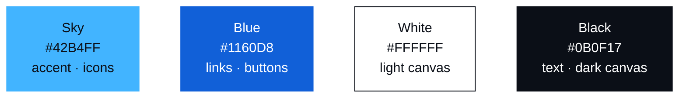

# ASBG UOS Web

[한국어](README.md)

The official website of AWS Student Builder Groups at University of Seoul, ASBG UOS for short. ASBG is the official student community that AWS runs at universities, and ASBG UOS is its group at the University of Seoul. The site introduces what the club does and gathers each cohort's talks, members and official channels in one place.

Site: https://asbg.uos.ac.kr

## Why it is built this way

This site exists to introduce ASBG UOS. Before building it, we settled on three conditions.

1. It must cost nothing to run.
2. It must stay easy to maintain when the organizers change.
3. Members who do not know web development must still be able to contribute.

The implementation is kept as simple as those conditions allow. There is no database and no admin page. All content lives in this repository as Markdown and YAML files, which are read at build time and turned into static pages. With no server, database or login to operate, both the running cost and the points of failure disappear. Nothing depends on an external CMS, storage or API key, so the repository is self-contained and moving to another host needs no code changes. Publishing content is nothing more than adding files, so a member with no web experience can take part through a Pull Request.

## Stack

Built with Next.js, TypeScript and Tailwind CSS, deployed on Vercel.

Next.js was chosen mainly for search and sharing. Every page is generated as complete HTML at build time, and each carries its own title, description, canonical URL, alternate-language links and Open Graph image, so it reads well to search engines and shows a proper preview when a link is shared. File-based routing, the metadata API and OG image generation come with the framework, which made localized routes and share images possible without extra libraries, and a push to Git is all Vercel needs to build and deploy.

| Area | Used |
| --- | --- |
| Framework | Next.js 16 (App Router), React 19, TypeScript |
| Styling | Tailwind CSS 4. Design tokens live in one place, `src/app/globals.css` |
| Content | Markdown + YAML frontmatter, react-markdown, remark-gfm |
| Content validation | zod, schema-checked at build time |
| Localization | `app/[locale]` routes with Korean and English dictionaries |
| Theme | next-themes, light and dark |
| Share images | next/og and sharp, rendering talk thumbnails from SVG to PNG |
| Fonts | Pretendard, Geist Mono |
| Hosting | Vercel |

## Design

It starts from two things: the University of Seoul and the cloud. The blue that people associate with the university sets the palette, and the way the cloud assembles small parts into one service became the imagery of pixels and circuit boards. We wanted the site to look made by students rather than polished like a corporate page. Pixel art gives it that handmade feel, and its rules are simple enough that anyone can add a drawing in the same style.

### Color



There are only four colors. The university's blue goes where people are meant to click, such as links and buttons, and the color of a sky with clouds in it goes where the eye should land first, such as icons and accents. White and black complete the set, and every grey and translucent surface is one of the four at a different opacity. Light and dark mode only swap the roles of the same four colors. Keeping the palette this small means the look holds together no matter who adds a page.

### Pixels

Every icon is pixel art on a 16×16 grid, and the code defines it exactly as it looks, as a grid of characters. On the left is the logo as written in `src/components/icons.tsx`; on the right is what appears on screen.

```
...##..##..##...          ████    ████    ████
...##..##..##...          ████    ████    ████
..############..        ████████████████████████
####........####    ████████                ████████
####........####    ████████                ████████
..##........##..        ████                ████
..##........##..        ████                ████
####........####    ████████                ████████
####........####    ████████                ████████
..##........##..        ████                ████
..##........##..        ████                ████
####........####    ████████                ████████
####........####    ████████                ████████
..############..        ████████████████████████
...##..##..##...          ████    ████    ████
...##..##..##...          ████    ████    ████
```

A single pixel is just a square, but together they become a lock or a server. It is the same principle as the cloud, where small services such as instances, functions and queues are wired into one product. The logo, the channel icons and the session thumbnails are all drawn on this one grid.

### Circuit board

All the graphics speak the language of a circuit board. The dot grid in the background is a perfboard before any part is placed, the diagrams drawn on it with chips and traces are the closed loop and the request path on the home page, and the small squares at card corners are solder pads. Numbers, dates and keywords, the information closest to code, are set in a monospace font (Geist Mono), a nod to sessions that mostly happen in everyone's own console.

Talk thumbnails use the same language: a dark dot grid with three keywords on the left and, on the right, one pixel icon that represents the talk inside a dashed frame. The guide, prompt and validation script are in `template/session-thumbnail/`.

```
┌────────────────────────────────────────────────────────┐
│  · · · · · · · · · · · · · · · · · · · · · · · · · · · │
│    ASBG UOS · COHORT 01                                │
│                                                        │
│    COMMUNITY                     ╭ ─ ─ ─ ─ ─ ─ ─ ╮     │
│    HANDS-ON                          ██   ██           │
│    CURRICULUM                    │   ██   ██     │     │
│                                     ████ ████          │
│                                  ╰ ─ ─ ─ ─ ─ ─ ─ ╯     │
│    SESSION 01 · PRESENTATION 01                        │
│  · · · · · · · · · · · · · · · · · · · · · · · · · · · │
└────────────────────────────────────────────────────────┘
```

## Development and contributing

Requires Node.js 20 or later.

```bash
npm install
npm run dev      # http://localhost:3000
npm run build    # static build, including content validation
npm run lint
```

Content lives under `cohort-NN/` at the repository root, one folder per cohort. Talks go in `session-NN/presentation-NN/index.md` and members in `members/*.yaml`, with photos and PDFs kept in the same folders. `src/lib/content/schema.ts` is the reference for every field, and copying an existing file is the fastest way to start. Send changes as a Pull Request.
