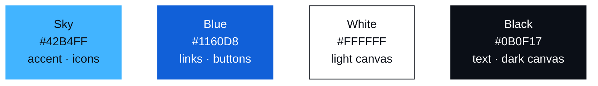

# ASBG UOS Web

[한국어](README.md)

The official website of AWS Student Builder Groups at University of Seoul, ASBG UOS for short. ASBG is the official student community that AWS runs at universities, and ASBG UOS is its group at the University of Seoul. The site introduces what the club does and gathers each cohort's activity records, members and official channels in one place.

Site: https://asbg.uos.ac.kr

## Why it is built this way

This site exists to introduce ASBG UOS. Before building it, we settled on three conditions.

1. It must cost nothing to run.
2. It must stay easy to maintain when the organizers change.
3. Members who do not know web development must still be able to contribute.

The implementation is kept as simple as those conditions allow. There is no database and no admin page. All content lives in this repository as Markdown and YAML files, which are read at build time and turned into static pages. With no server, database or login to operate, both the running cost and the points of failure disappear. Nothing depends on an external CMS, storage or API key, so the repository is self-contained and moving to another host needs no code changes. Publishing content is nothing more than adding files, so a member with no web experience can take part through a Pull Request.

## Stack

Built with Next.js, TypeScript and Tailwind CSS, deployed on Vercel.

Next.js was chosen mainly for search and sharing. Every page is generated as complete HTML at build time, and each carries its own title, description, canonical URL, alternate-language links and Open Graph image, so it reads well to search engines and shows a proper preview when a link is shared. File-based routing, the metadata API and OG image generation come with the framework, which made localized routes and share images possible without extra libraries, and a push to Git is all Vercel needs to build and deploy.

| Area | Used |
| --- | --- |
| Framework | Next.js (App Router), React, TypeScript |
| Styling | Tailwind CSS, shared design tokens |
| Content | Markdown + YAML frontmatter, react-markdown, remark-gfm |
| Content validation | zod, schema-checked at build time |
| Localization | Korean and English |
| Theme | next-themes, light and dark |
| Share images | next/og and sharp, rendering activity thumbnails from SVG to PNG |
| Fonts | Pretendard, Geist Mono |
| Hosting | Vercel |

## Design

It starts from two things: the University of Seoul and the cloud. The blue that people associate with the university sets the palette, and the way the cloud assembles small parts into one service became the imagery of pixels and circuit boards. We wanted the site to look made by students rather than polished like a corporate page. Pixel art gives it that handmade feel, and its rules are simple enough that anyone can add a drawing in the same style.

### Color


```mermaid
flowchart LR
  c1["Sky<br/>#42B4FF<br/>accent · icons"] ~~~ c2["Blue<br/>#1160D8<br/>links · buttons"] ~~~ c3["White<br/>#FFFFFF<br/>light canvas"] ~~~ c4["Black<br/>#0B0F17<br/>text · dark canvas"]
  classDef sky fill:#42B4FF,stroke:#42B4FF,color:#0B0F17
  classDef blue fill:#1160D8,stroke:#1160D8,color:#FFFFFF
  classDef white fill:#FFFFFF,stroke:#0B0F17,color:#0B0F17
  classDef black fill:#0B0F17,stroke:#0B0F17,color:#FFFFFF
  class c1 sky
  class c2 blue
  class c3 white
  class c4 black
```

The site UI uses four base colors. The university's blue goes where people are meant to click, such as links and buttons, and the color of a sky with clouds in it goes where the eye should land first, such as icons and accents. White and black complete the set, and every grey and translucent surface is one of the four at a different opacity. Light and dark mode only swap the roles of the same four colors. Keeping the palette this small means the look holds together no matter who adds a page.

### Pixels

Every icon is pixel art on a 16×16 grid, and the code defines it exactly as it looks, as a grid of characters. On the left is the grid that defines the logo; on the right is what appears on screen.

```
...##..##..##...          ████    ████    ████
...##..##..##...          ████    ████    ████
..############..        ████████████████████████
####........####    ████████                ████████
####........####    ████████                ████████
..##........##..        ████                ████
..##........##..        ████                ████
####........####    ████████                ████████
####........####    ████████                ████████
..##........##..        ████                ████
..##........##..        ████                ████
####........####    ████████                ████████
####........####    ████████                ████████
..############..        ████████████████████████
...##..##..##...          ████    ████    ████
...##..##..##...          ████    ████    ████
```

A single pixel is just a square, but together they become a lock or a server. It is the same principle as the cloud, where small services such as instances, functions and queues are wired into one product. The logo, the channel icons and the activity thumbnails are all drawn on this one grid.

### Circuit board

The background dot grid evokes a perfboard before components are placed, while chips and traces depict connected systems. The small squares at card corners come from solder pads. Just as connected components form a working circuit, these shapes express a community that learns and builds together.

Numbers, dates and keywords use a monospace font to evoke a terminal. Repeating simple dots, lines and squares makes the pages feel like parts of the same board.

## Contributing

Send content updates and design or code improvements as a Pull Request. Follow the existing writing style and design principles, and keep the Korean and English versions in sync.

To run locally, install Node.js, then run `npm install` and `npm run dev`. Check your changes with `npm run lint` and `npm run build` before submitting.
