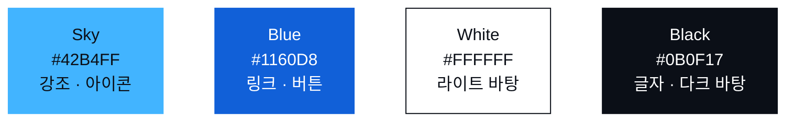

# ASBG UOS Web

[English](README.en.md)

AWS Student Builder Groups at University of Seoul, 줄여서 ASBG UOS의 공식 웹사이트입니다. ASBG는 AWS가 대학 단위로 운영하는 공식 학생 커뮤니티이고, ASBG UOS는 그 서울시립대 그룹입니다. 이 사이트는 동아리가 무엇을 하는지 소개하고, 기수별 활동 기록과 멤버, 공식 채널을 한곳에 모아 보여 줍니다.

사이트: https://asbg.uos.ac.kr

## 왜 이렇게 만들었는지

이 사이트는 ASBG UOS를 알리기 위한 홍보용 페이지입니다. 만들기 전에 세 가지를 정했습니다.

1. 운영 비용이 들지 않을 것
2. 운영진이 바뀌어도 유지보수가 쉬울 것
3. 웹 개발을 모르는 멤버도 기여할 수 있을 것

구현은 이 세 조건에 맞춰 최대한 단순하게 가져갔습니다. 데이터베이스와 관리자 페이지는 두지 않았습니다. 모든 콘텐츠는 이 저장소 안의 마크다운과 YAML 파일이고, 빌드할 때 읽어 정적 페이지로 만듭니다. 서버와 DB, 로그인을 운영하지 않으니 비용과 장애 지점이 함께 사라집니다. 콘텐츠를 올리는 일도 파일을 추가하는 것이 전부라, 웹 개발을 모르는 멤버도 Pull Request로 참여할 수 있습니다.

## 기술 스택

Next.js와 TypeScript, Tailwind CSS로 만들고 Vercel에 배포합니다.

Next.js를 고른 가장 큰 이유는 검색과 공유입니다. 모든 페이지가 빌드 시점에 완성된 HTML로 만들어지고, 페이지마다 제목과 설명, 대표 URL, 언어별 대체 링크, Open Graph 이미지가 붙습니다. 검색 엔진에도, 링크를 공유했을 때의 미리보기에도 잘 잡힙니다. 파일 기반 라우팅과 메타데이터 API, OG 이미지 생성이 프레임워크에 들어 있어 다국어 경로와 공유 이미지를 별도 라이브러리 없이 만들 수 있었고, Git에 push하면 Vercel이 그대로 빌드해 배포합니다.

| 영역 | 사용 |
| --- | --- |
| 프레임워크 | Next.js (App Router), React, TypeScript |
| 스타일 | Tailwind CSS, 공통 디자인 토큰 |
| 콘텐츠 | Markdown + YAML frontmatter, react-markdown, remark-gfm |
| 콘텐츠 검증 | zod. 빌드 시 스키마 검사 |
| 다국어 | 한국어 · 영어 |
| 테마 | next-themes. 라이트 · 다크 |
| 공유 이미지 | next/og, sharp. 활동 썸네일 SVG를 PNG로 변환 |
| Instagram 피드 | Behold JSON 피드. 서버에서 받아 1시간 캐시 |
| 글꼴 | Pretendard, Geist Mono |
| 배포 | Vercel |

## 디자인

서울시립대와 클라우드, 두 가지에서 출발했습니다. 시립대 하면 떠오르는 파랑을 색의 기준으로 삼고, 작은 부품을 엮어 하나의 서비스를 만드는 클라우드의 방식을 픽셀과 회로 기판이라는 그림으로 옮겼습니다. 매끈한 기업 사이트보다 학생들이 직접 만든 티가 나길 바랐고, 픽셀 아트는 그 손맛을 주면서도 규칙이 단순해 누구나 같은 스타일로 그림을 더할 수 있습니다.

### 색


```mermaid
flowchart LR
  c1["Sky<br/>#42B4FF<br/>강조 · 아이콘"] ~~~ c2["Blue<br/>#1160D8<br/>링크 · 버튼"] ~~~ c3["White<br/>#FFFFFF<br/>라이트 바탕"] ~~~ c4["Black<br/>#0B0F17<br/>글자 · 다크 바탕"]
  classDef sky fill:#42B4FF,stroke:#42B4FF,color:#0B0F17
  classDef blue fill:#1160D8,stroke:#1160D8,color:#FFFFFF
  classDef white fill:#FFFFFF,stroke:#0B0F17,color:#0B0F17
  classDef black fill:#0B0F17,stroke:#0B0F17,color:#FFFFFF
  class c1 sky
  class c2 blue
  class c3 white
  class c4 black
```

사이트 UI의 기본색은 네 가지입니다. 시립대의 파랑은 링크와 버튼처럼 눌러 보게 하는 곳에, 구름이 떠 있는 하늘의 색은 아이콘과 강조처럼 눈길이 먼저 가는 곳에 씁니다. 여기에 흰색과 검정을 더하고, 회색과 반투명 배경은 네 색의 불투명도를 달리해 만듭니다. 라이트 모드와 다크 모드도 네 색의 역할만 바꿉니다. 색이 적어야 누가 페이지를 더해도 분위기가 흐트러지지 않습니다.

### 픽셀

아이콘은 모두 16×16 격자에 찍은 픽셀 아트이고, 코드에서도 그림 그대로 문자열 격자로 정의합니다. 왼쪽이 로고를 구성하는 격자, 오른쪽이 화면에 그려지는 모양입니다.

```
...##..##..##...          ████    ████    ████
...##..##..##...          ████    ████    ████
..############..        ████████████████████████
####........####    ████████                ████████
####........####    ████████                ████████
..##........##..        ████                ████
..##........##..        ████                ████
####........####    ████████                ████████
####........####    ████████                ████████
..##........##..        ████                ████
..##........##..        ████                ████
####........####    ████████                ████████
####........####    ████████                ████████
..############..        ████████████████████████
...##..##..##...          ████    ████    ████
...##..##..##...          ████    ████    ████
```

픽셀 하나는 네모일 뿐이지만 모이면 자물쇠도 되고 서버도 됩니다. 인스턴스와 함수, 큐 같은 작은 서비스를 엮어 하나의 서비스를 만드는 클라우드와 같은 원리입니다. 로고부터 채널 아이콘, 활동 썸네일까지 모두 이 격자 하나로 그립니다.

### 회로 기판

배경의 점 격자는 부품을 꽂기 전의 만능기판을, 칩과 배선으로 이어진 도식은 서로 연결된 시스템을 표현합니다. 카드 모서리의 작은 네모는 납땜 패드에서 가져왔습니다. 작은 부품이 연결되어 하나의 기능을 만드는 회로처럼, 함께 배우고 만드는 커뮤니티의 모습을 담았습니다.

번호와 날짜, 키워드는 모노스페이스 글꼴로 표시해 터미널의 인상을 더합니다. 점과 선, 네모라는 단순한 요소를 반복해 페이지 전체가 같은 기판 위에 놓인 듯한 일관성을 만듭니다.

## 기여

콘텐츠 수정과 디자인·코드 개선은 Pull Request로 보내 주세요. 기존 콘텐츠의 작성 방식과 디자인 원칙을 따르고, 한글과 영어에 함께 반영해 주세요.

로컬에서는 Node.js를 설치한 뒤 `npm install`, `npm run dev`로 실행합니다. 제출 전 `npm run lint`와 `npm run build`로 확인해 주세요.

Resources 페이지의 Instagram 게시물까지 보려면 저장소 루트의 `.env.local`에 `BEHOLD_FEED_URL`을 넣어 주세요. 주소는 운영진에게 받을 수 있고, 없으면 그 목록만 빠진 채로 나머지 화면은 그대로 동작합니다.
