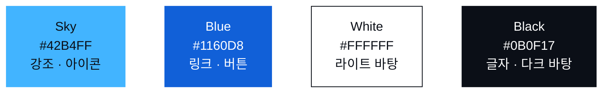

# ASBG UOS Web

[English](README.en.md)

AWS Student Builder Groups at University of Seoul, 줄여서 ASBG UOS의 공식 웹사이트입니다. ASBG는 AWS가 대학 단위로 운영하는 공식 학생 커뮤니티이고, ASBG UOS는 그 서울시립대 그룹입니다. 이 사이트는 동아리가 무엇을 하는지 소개하고, 기수별 활동 기록과 멤버, 공식 채널을 한곳에 모아 보여 줍니다.

사이트: https://asbg.uos.ac.kr

## 왜 이렇게 만들었는지

이 사이트는 ASBG UOS를 알리기 위한 홍보용 페이지입니다. 만들기 전에 세 가지를 정했습니다.

1. 운영 비용이 들지 않을 것
2. 운영진이 바뀌어도 유지보수가 쉬울 것
3. 웹 개발을 모르는 멤버도 기여할 수 있을 것

구현은 이 세 조건에 맞춰 최대한 단순하게 가져갔습니다. 데이터베이스와 관리자 페이지는 두지 않았습니다. 모든 콘텐츠는 이 저장소 안의 마크다운과 YAML 파일이고, 빌드할 때 읽어 정적 페이지로 만듭니다. 서버와 DB, 로그인을 운영하지 않으니 비용과 장애 지점이 함께 사라집니다. 외부 CMS나 스토리지, API 키에도 기대지 않아 저장소 하나로 완결되고, 호스팅을 옮겨도 코드를 고칠 일이 없습니다. 콘텐츠를 올리는 일도 파일을 추가하는 것이 전부라, 웹 개발을 모르는 멤버도 Pull Request로 참여할 수 있습니다.

## 기술 스택

Next.js와 TypeScript, Tailwind CSS로 만들고 Vercel에 배포합니다.

Next.js를 고른 가장 큰 이유는 검색과 공유입니다. 모든 페이지가 빌드 시점에 완성된 HTML로 만들어지고, 페이지마다 제목과 설명, 대표 URL, 언어별 대체 링크, Open Graph 이미지가 붙습니다. 검색 엔진에도, 링크를 공유했을 때의 미리보기에도 잘 잡힙니다. 파일 기반 라우팅과 메타데이터 API, OG 이미지 생성이 프레임워크에 들어 있어 다국어 경로와 공유 이미지를 별도 라이브러리 없이 만들 수 있었고, Git에 push하면 Vercel이 그대로 빌드해 배포합니다.

| 영역 | 사용 |
| --- | --- |
| 프레임워크 | Next.js 16 (App Router), React 19, TypeScript |
| 스타일 | Tailwind CSS 4. 디자인 토큰은 `src/app/globals.css` 한 곳 |
| 콘텐츠 | Markdown + YAML frontmatter, react-markdown, remark-gfm |
| 콘텐츠 검증 | zod. 빌드 시 스키마 검사 |
| 다국어 | `app/[locale]` 라우트, 한국어 · 영어 사전 파일 |
| 테마 | next-themes. 라이트 · 다크 |
| 공유 이미지 | next/og, sharp. 활동 썸네일 SVG를 PNG로 변환 |
| 글꼴 | Pretendard, Geist Mono |
| 배포 | Vercel |

## 디자인

서울시립대와 클라우드, 두 가지에서 출발했습니다. 시립대 하면 떠오르는 파랑을 색의 기준으로 삼고, 작은 부품을 엮어 하나의 서비스를 만드는 클라우드의 방식을 픽셀과 회로 기판이라는 그림으로 옮겼습니다. 매끈한 기업 사이트보다 학생들이 직접 만든 티가 나길 바랐고, 픽셀 아트는 그 손맛을 주면서도 규칙이 단순해 누구나 같은 스타일로 그림을 더할 수 있습니다.

### 색


```mermaid
flowchart LR
  c1["Sky<br/>#42B4FF<br/>강조 · 아이콘"] ~~~ c2["Blue<br/>#1160D8<br/>링크 · 버튼"] ~~~ c3["White<br/>#FFFFFF<br/>라이트 바탕"] ~~~ c4["Black<br/>#0B0F17<br/>글자 · 다크 바탕"]
  classDef sky fill:#42B4FF,stroke:#42B4FF,color:#0B0F17
  classDef blue fill:#1160D8,stroke:#1160D8,color:#FFFFFF
  classDef white fill:#FFFFFF,stroke:#0B0F17,color:#0B0F17
  classDef black fill:#0B0F17,stroke:#0B0F17,color:#FFFFFF
  class c1 sky
  class c2 blue
  class c3 white
  class c4 black
```

색은 네 가지뿐입니다. 시립대의 파랑은 링크와 버튼처럼 눌러 보게 하는 곳에, 구름이 떠 있는 하늘의 색은 아이콘과 강조처럼 눈길이 먼저 가는 곳에 씁니다. 여기에 흰색과 검정을 더하고, 회색과 반투명 배경은 네 색의 불투명도를 달리해 만듭니다. 라이트 모드와 다크 모드도 네 색의 역할만 바꿉니다. 색이 적어야 누가 페이지를 더해도 분위기가 흐트러지지 않습니다.

### 픽셀

아이콘은 모두 16×16 격자에 찍은 픽셀 아트이고, 코드에서도 그림 그대로 문자열 격자로 정의합니다. 왼쪽이 `src/components/icons.tsx`에 적힌 로고의 정의, 오른쪽이 화면에 그려지는 모양입니다.

```
...##..##..##...          ████    ████    ████
...##..##..##...          ████    ████    ████
..############..        ████████████████████████
####........####    ████████                ████████
####........####    ████████                ████████
..##........##..        ████                ████
..##........##..        ████                ████
####........####    ████████                ████████
####........####    ████████                ████████
..##........##..        ████                ████
..##........##..        ████                ████
####........####    ████████                ████████
####........####    ████████                ████████
..############..        ████████████████████████
...##..##..##...          ████    ████    ████
...##..##..##...          ████    ████    ████
```

픽셀 하나는 네모일 뿐이지만 모이면 자물쇠도 되고 서버도 됩니다. 인스턴스와 함수, 큐 같은 작은 서비스를 엮어 하나의 서비스를 만드는 클라우드와 같은 원리입니다. 로고부터 채널 아이콘, 활동 썸네일까지 모두 이 격자 하나로 그립니다.

### 회로 기판

그림은 모두 회로 기판의 언어로 그렸습니다. 배경의 점 격자는 부품을 꽂기 전의 만능기판이고, 그 위에 칩과 배선으로 그린 도식이 홈의 폐루프와 요청 경로이며, 카드 모서리의 작은 네모는 납땜 패드입니다. 번호와 날짜, 키워드처럼 코드에 가까운 정보는 모노스페이스 글꼴(Geist Mono)로 써서 각자의 콘솔에서 이루어지는 세션의 인상을 남겼습니다.

발표 썸네일도 같은 언어로 만듭니다. 어두운 바탕의 점 격자 위에 왼쪽은 키워드 세 개, 오른쪽은 점선 프레임 안에 발표를 대표하는 픽셀 아이콘 하나를 놓는 구성입니다. 가이드와 프롬프트, 검증 스크립트는 `template/presentation-thumbnail/`에 있습니다.

```
┌────────────────────────────────────────────────────────┐
│  · · · · · · · · · · · · · · · · · · · · · · · · · · · │
│    ASBG UOS · COHORT 01                                │
│                                                        │
│    COMMUNITY                     ╭ ─ ─ ─ ─ ─ ─ ─ ╮     │
│    HANDS-ON                          ██   ██           │
│    CURRICULUM                    │   ██   ██     │     │
│                                     ████ ████          │
│                                  ╰ ─ ─ ─ ─ ─ ─ ─ ╯     │
│    SESSION 01 · PRESENTATION 01                        │
│  · · · · · · · · · · · · · · · · · · · · · · · · · · · │
└────────────────────────────────────────────────────────┘
```

회고 썸네일은 흰 기록지와 파란 책등, `RECAP` 표제와 세 줄의 키워드로 구성합니다. 어두운 점 격자를 쓰는 발표와 바탕색과 배치를 달리하면서 같은 브랜드 색과 픽셀 아이콘을 공유합니다. 회고끼리는 이 틀을 유지하며, 세션과 연결되지 않은 프로젝트나 기수 전체 회고도 번호 없이 사용할 수 있습니다. 가이드와 프롬프트, 생성기, 검증기는 `template/retrospective-thumbnail/`에 있습니다.

발표 본문의 도식은 썸네일과 달리 흰 바탕에 회색 선과 파랑 하나만 쓰는 차분한 그림입니다. 규칙과 프롬프트, 생성 스크립트는 `template/session-diagram/`에 있습니다.

## 개발과 기여

Node.js 20 이상에서 다음 명령으로 실행합니다.

```bash
npm install
npm run dev      # http://localhost:3000
npm run build    # 정적 빌드. 콘텐츠 형식 검사 포함
npm run lint
```

콘텐츠는 저장소 루트의 `cohort-NN/` 폴더에 기수별로 들어 있습니다. 멤버는 `members/*.yaml`에 쓰고 사진은 같은 폴더에 둡니다. 필드 규칙은 `src/lib/content/schema.ts`가 기준이며, 기존 파일을 복사해 고치는 것이 가장 빠릅니다. 변경은 Pull Request로 보내 주세요.

### 활동 기록

Activities는 기수별로 발표와 활동 회고를 하나의 목록에 보여 줍니다. 세션별 폴더나 중간 목록으로 나누지 않고 글마다 작은 유형 표기를 붙입니다. 과제는 활동의 한 가지일 뿐이며, 다음 기수가 프로젝트나 스터디를 운영해도 같은 구조에 기록할 수 있습니다.

```text
cohort-01/
  activities/
    session-01-presentation-01/
      index.md
      index.en.md
      img/
      files/
  members/
```

활동 하나가 `activities/{slug}/` 폴더 하나입니다. slug는 소문자와 숫자, 하이픈으로 짓고 게시 후에는 유지합니다. 발표는 `session-01-presentation-01`처럼 기존 번호를 이름에 남기지만, 세션과 관계없는 글은 `cohort-retrospective`처럼 내용에 맞춰 지으면 됩니다. 영어 본문은 `index.en.md`에 씁니다. 이미지와 PDF는 각각 같은 글의 `img/`, `files/`에 두고 본문에서는 상대 경로로 연결합니다.

| 필드 | 규칙 |
| --- | --- |
| `type` | `presentation` 또는 `retrospective`. 발표와 활동 회고를 구분 |
| `date` | `"YYYY-MM-DD"`. 발행일이며 예정 글은 예정일 |
| `status` | `done` 또는 `upcoming`. 생략하면 `done` |
| `title`, `description` | 제목과 선택 설명. 문자열 또는 `{ ko, en }` |
| `keywords` | 세 개. 썸네일을 만들 때는 각 1~28자의 영어 키워드 |
| `session`, `presentation` | 관련 세션과 발표 번호. 필요한 글에만 양의 정수로 지정 |
| `speakers` | 발표자의 멤버 ID 목록. 생략 가능 |
| `author` | 문자열 또는 `{ ko, en }`. 코어팀은 `{ group: core }`로 지정하면 `@core`가 해당 기수 Members의 Core 섹션으로 연결됨. 생략 가능 |
| `thumbnail` | 선택 이미지 경로. 템플릿 사용 시 `img/thumbnail.svg` |

회고의 frontmatter는 아래처럼 작성합니다. 세션과 연결된 회고만 `session`을 넣으며 `presentation`은 필요하지 않습니다. 본문 구성은 [Session 02 회고](cohort-01/activities/session-02-retrospective/index.md)를 참고할 수 있습니다.

```yaml
---
type: retrospective
date: "2026-10-15"
title:
  ko: 함께 배우는 방식을 돌아보며
  en: Reflecting on how we learn together
author:
  group: core
keywords: [Community, Feedback, Iteration]
thumbnail: img/thumbnail.svg
---
```

회고 본문에는 활동의 의도, 실제 결과, 피드백과 변화, 다음 운영에서 바꿀 점을 글로 정리하고 원본 자료를 연결합니다. 특정 기수의 과제나 제출 형식을 모든 회고에 요구하지 않습니다.

### 목록과 URL

기수는 `/ko/activities/cohort-01`처럼 경로로 선택하고, 상세 주소는 `/ko/activities/cohort-01/{slug}`입니다. 기존 발표 주소인 `/ko/sessions/cohort-01/session-01/presentation-01`도 새 상세 주소로 이동합니다.

검색과 필터는 URL에 저장되어 새로고침하거나 링크를 공유해도 같은 목록을 볼 수 있습니다. 데스크톱에서는 짧은 검색창과 선택 버튼을 한 줄에 배치하고, 모바일에서는 검색과 유형을 바로 보여 주되 상태와 정렬은 필터 버튼으로 펼칩니다. 기기별 기본 드롭다운을 쓰지 않습니다.

`session 02`, `session 2`, `session-02`, `세션 02`는 모두 `session: 2`인 발표와 회고를 찾습니다. 검색어와 유형·상태 필터는 함께 적용됩니다. 오래된순은 날짜, 세션 번호, 글 유형, 발표 번호, slug 순서이며, 최신순은 그 순서를 정확히 뒤집습니다. 같은 날짜와 세션에서는 발표 다음에 회고를 놓습니다.

| 파라미터 | 값 | 생략했을 때 |
| --- | --- | --- |
| `q` | 검색어 | 검색 없음 |
| `type` | `presentation`, `retrospective` | 모든 유형 |
| `status` | `done`, `upcoming` | 모든 상태 |
| `sort` | `newest`, `oldest` | 최신 날짜순 |

예: `/ko/activities/cohort-01?type=presentation&q=vpc&sort=oldest`.

### 썸네일과 도식

- 발표 썸네일: `template/presentation-thumbnail/prompt.md`. 기존 발표의 배경과 레이아웃을 유지합니다.
- 회고 썸네일: `template/retrospective-thumbnail/prompt.md`. 기본 notebook 아이콘은 아래 생성기로 바로 만들 수 있습니다.
- 본문 도식: `template/session-diagram/README.md`. 생성 코드도 `diagrams/cohort-NN/activities/{slug}.py`에 둡니다.

```bash
node template/presentation-thumbnail/validate.mjs cohort-01/activities/session-01-presentation-01/img/thumbnail.svg
node template/retrospective-thumbnail/build.mjs cohort-01/activities/cohort-retrospective
node template/retrospective-thumbnail/validate.mjs cohort-01/activities/cohort-retrospective/img/thumbnail.svg
python template/session-diagram/build.py --check
```

회고 명령은 해당 글의 `index.md`와 메타데이터를 작성한 뒤 실행합니다. 검토를 위해 임시 글이나 자산을 만들었다면 실제 게시할 콘텐츠와 함께 남기지 않습니다.
