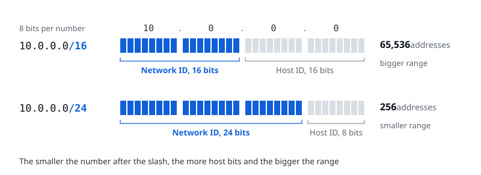
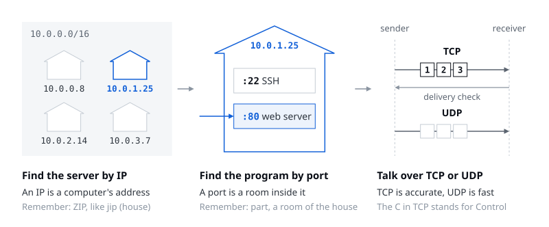
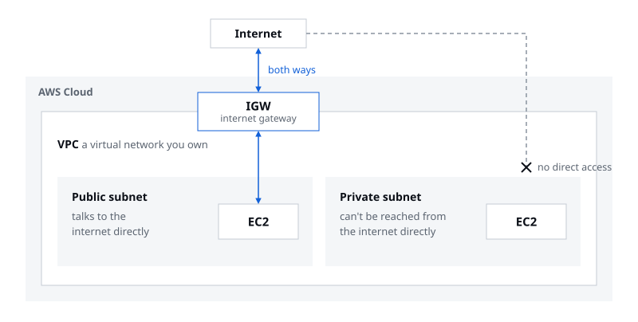
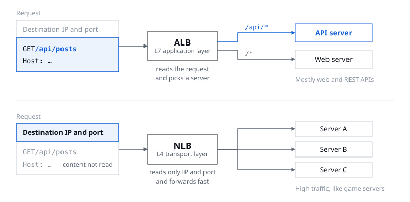
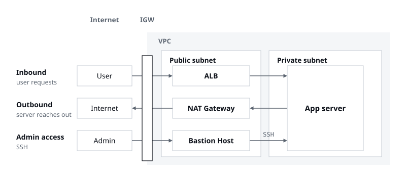
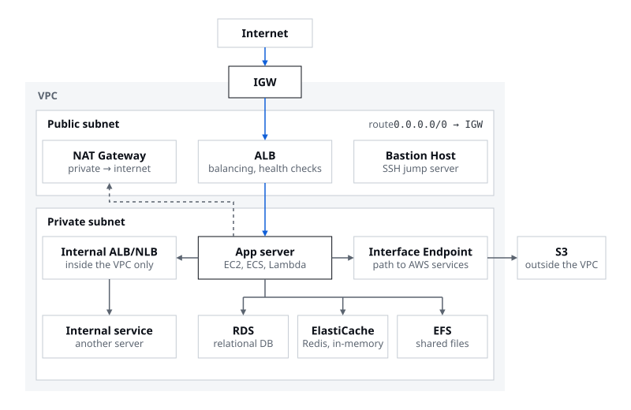
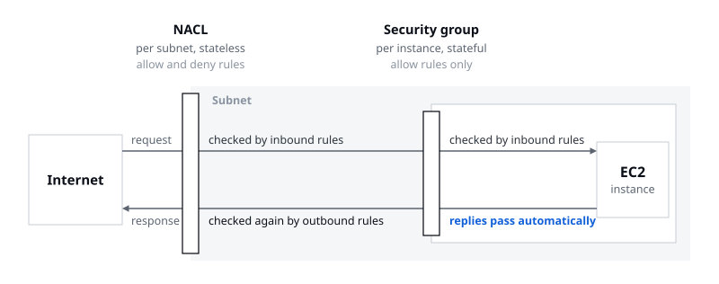

> A VPC inside AWS, subnets inside the VPC, EC2 inside the subnets

I gave the first talk of Session 02. From this session on, we get properly into networking inside AWS. Networking itself is something you'll study in depth in classes like data communications, and you could explain it forever, so I ran quickly through only the terms you really need and then moved on to AWS services. Along the way I also shared ways to make new terms stick by tying them to concepts you already know.

## 01. Where to? IP and ports

Networking is about delivering things, so imagine we're couriers. The first thing we want to know is "where am I going?" The concepts that answer that "where" are IP addresses and ports. **An IP is a computer's address, and a port is a particular room inside that computer.**

A lot of terms are coming, so you need your own way of making them stick. I remembered IP through ZIP, which looks almost the same and sounds like *jip*, the Korean word for house. I remembered port through part, which looks similar too: a part of the house, a room. I used to think I disliked my data communications class because there was so much to memorize, but looking back, it was because I never even tried to make any of it my own. If you lock in the basics like this now, whatever gets built on top of them won't confuse you.

## 02. How? TCP and UDP

Once you know where you're going, you have to decide how to get there: by motorbike if you have one, on foot if you don't. The concepts for that "how" are TCP and UDP.

I really dislike exam questions that make you memorize what an acronym stands for, but on the slides I spelled out the ones that genuinely help you remember, so at least take those with you. TCP is short for Transmission Control Protocol, and just remembering that the C in the middle is Control gets you halfway there. TCP is the side that *controls* delivery, so getting things there accurately comes first: it keeps everything in order and checks that it arrived. TCP and UDP always show up as a pair, so it's enough to remember UDP in contrast to TCP. UDP is what you use where speed matters more than accuracy.

| | TCP | UDP |
|---|---|---|
| In one line | Delivers accurately | Delivers fast |
| Traits | Keeps order, confirms delivery | Puts speed ahead of order and delivery |
| Typical uses | HTTP/HTTPS web traffic, DB connections | Real-time games, live video and voice streaming |

## 03. CIDR: how to write a range of IP addresses

CIDR is a way of expressing a range of IP addresses. Take 10.0.0.0/16. Each of the numbers separated by dots is 8 bits, so an IPv4 address is 32 bits in all. The 10.0.0.0 in front is the network address, and the 16 after the slash is the number of bits used for the network ID. If the first 16 bits go to the network ID, the remaining 16 bits automatically become the host ID.

People usually talk about CIDR ranges as "big" or "small." A big range means more bits for the host ID, so **the smaller the number after the slash, the bigger the range.** A /16 leaves 16 bits for the host ID, which is 65,536 addresses; a /24 leaves 8 bits, which is 256.

## 04. Everything so far, in one line

With networking, it helps to keep connecting each new concept to where it's used and how it ties into what you already know. So I put together the flow using only the terms we've covered so far. **CIDR and IP find the server, the port finds the program, and TCP or UDP carries the data back and forth.**

## 05. Inside AWS, inside a VPC, inside a subnet: EC2

Now on to AWS services. A lot of terms show up from here, and it's much easier if you first picture what sits inside what. The starting point is one line: inside AWS there's a VPC, inside the VPC there are subnets, and inside a subnet there's EC2.

Every ASBG member should be able to explain VPC even if a stranger stops them on the street to ask. It's that basic: say "AWS," and VPC should be the first thing that comes to mind. It stands for Virtual Private Cloud, and it's exactly what the name says: **a virtual network space inside AWS that you own.**

A subnet is that VPC's address range split into smaller ranges, such as a 10.0.1.0/24 subnet inside a 10.0.0.0/16 VPC. Subnets come in two kinds, depending on how they connect to the internet. A public subnet can talk to the outside internet directly; a private subnet can't be reached from the outside internet directly.

## 06. Public subnets: where there's a way out to the internet

There's a clear test for calling a subnet public. A route table lists, for each destination, where traffic leaving the subnet should go, and the test is **whether that table has a 0.0.0.0/0 route pointing to an internet gateway (IGW).** 0.0.0.0/0 means every IPv4 address. Traffic bound for somewhere inside the VPC takes the separate local route first, so in the end, a subnet is public if it has a route that says "anything outside the VPC, send it to the IGW." That's why this route is also called the IGW route.

Infrastructure is full of abbreviations, and gateway is usually shortened to GW, so an internet gateway is an IGW. An IGW is the AWS resource that connects a VPC to the internet. You can attach one IGW to a VPC, and it supports traffic in both directions. Two words that will keep coming up are worth pinning down here: inbound is the direction from outside into the VPC, and outbound is the direction from the VPC out.

Three kinds of resources usually live in a public subnet.

**Load balancers.** A load balancer takes traffic at a single endpoint and spreads it across several servers. That makes it the single entry point and the thing that distributes traffic, and with health checks it confirms which servers behind it are alive and sends requests only to healthy ones. There are several kinds, and the two main ones are ALB and NLB. An ALB, as the name Application Load Balancer says, works at the application layer (L7). An NLB has Network in its name, but watch out: it works at the transport layer (L4), not the network layer (L3). L7 and L4 are layer numbers from the OSI model, which splits networking into seven layers.

| | ALB (Application Load Balancer) | NLB (Network Load Balancer) |
|---|---|---|
| Layer | L7, the application layer | L4, the transport layer |
| Routes by | The content of the HTTP/HTTPS request (method, path, headers) | IP and port alone, without reading the request, so it's fast |
| Typical uses | Web and REST API services | Handling heavy traffic fast, as with game servers |

**NAT Gateway and NAT Instance.** Both let resources in a private subnet make outbound connections. Nothing can come into a private subnet directly from outside, but things inside still need to reach out now and then. A NAT Gateway is a managed service that AWS runs for you; a NAT Instance is an EC2 instance you set up yourself to act as a NAT, so you manage it. It takes the effort of managing it yourself, but you only pay for the instance, which is why people sometimes call NAT Instance the budget version of NAT Gateway. In one sentence: **resources in a private subnet go out to the internet through the NAT Gateway in the public subnet and then the IGW.**

**Bastion Host.** This is the intermediate server you pass through to SSH from the internet into a server in a private subnet. You come in from the internet through the IGW to the bastion host in the public subnet, and from there you reach the server in the private subnet. In reality there are many steps in between that I'm skipping, but using only the terms so far, that's the shape of it.

## 07. Private subnets: out of direct reach

At the center of a private subnet is the **app server**, the server that handles the actual business logic, and inbound and outbound come up here too. A user's request comes in through the IGW, passes the ALB in the public subnet, and reaches the app server in the private subnet. In the other direction, when the app server is the one reaching out first, say to install a package or call an external API, it goes through the NAT Gateway in the public subnet and then the IGW out to the internet. Responses to user requests don't go back through the NAT Gateway; they return the way the request came in, through the ALB. Add the bastion host path from before, and the three paths look like this.

There are three main ways to run the app server. **EC2** (Elastic Compute Cloud) means renting a virtual computer. **ECS** (Elastic Container Service) means handing off management in units of Docker containers. **Lambda** means uploading a function that runs only when a request comes in. Compute and Container are right there in the names, so you can remember them by name. Going from EC2 to ECS to Lambda feels like things getting lighter and lighter, and that's the kind of thing to make your own in whatever way works for you.

Besides the app server, a few other things live in a private subnet.

- **RDS** (Relational Database Service): an AWS service that manages relational databases like MySQL and PostgreSQL for you. Data can be a one-line note or a key-value pair; a relational database is the kind that handles data in table form. Usually a security group lets in only traffic from the app server.
- **ElastiCache**: an AWS service that manages in-memory data stores like Redis. Redis is a database that keeps data in RAM as key-value pairs, so you can read it back faster than from RDS, which stores data on disk.
- **Interface Endpoint**: a path for reaching AWS services from a private subnet without going through a NAT Gateway or the internet. The app server goes through the interface endpoint to AWS services such as S3.
- **Internal ALB/NLB**: the ALB and NLB from earlier with Internal in front, and, as the name says, load balancers you can reach only from inside the VPC. An outside request comes through the IGW and the public ALB to the front-end or the API server. The front-end can return a result right away, but sometimes the API server has to call yet another internal service. That call goes through the internal ALB to the internal service.
- **EFS** (Elastic File System): an AWS service for storing shared files. Several EC2 instances can use the same files, reaching them through a mount target, an access point you create in a subnet. It's tangled up with other concepts like regions and gets fairly hard if you dig deep, but for now all you need to take away is that it's storage several servers can share.

Put every resource so far on one page, and you get this.

## 08. Network security: NACLs and security groups

Everything so far provides the core functionality; we also need something to protect it. The main tools are the network ACL (NACL) and the security group (SG). Both are bodyguards, but they guard different units and work in different ways.

| | NACL | Security group (SG) |
|---|---|---|
| What it guards | A subnet, applied to every instance in it | An instance (any resource with a security group attached, like EC2 or an ALB), one level further in than a NACL |
| State | Stateless: inbound and outbound each have to be spelled out | Stateful: allow the inbound request and the response is allowed automatically |
| Rules | Both allow and deny | Allow only |

## 09. A quiz to review

I closed the talk with a quiz instead of a Q&A, since a quiz seemed easier to join in on than taking questions.

**Q1. Which of these is a better fit for UDP?** ① A KakaoTalk message ② A file download ③ A video call ④ A login

The answer is ③, the video call. For a video call, getting things there fast in real time matters more, even if it stutters a little. The others are data where nothing can go missing or arrive out of order, so TCP is the right fit.

**Q2. You have an image-resizing job that runs only a few times a day, and you don't want to pay anything when there are no requests. What should you use?**

The answer is Lambda. You upload a function and it runs only when a request comes in, so while there are no requests you're not paying for a server that sits running. This is also a job I've actually built. Image work gets really expensive, so a setup that costs nothing when there are no requests matters a lot.

Networking tends to float away when all you hear is theory, so I really wanted this session to include hands-on work. Now it's time to build a server yourself and see how the VPCs, subnets, and security groups we covered today look in the console. Over to the great Sujin Hwang for the hands-on!
