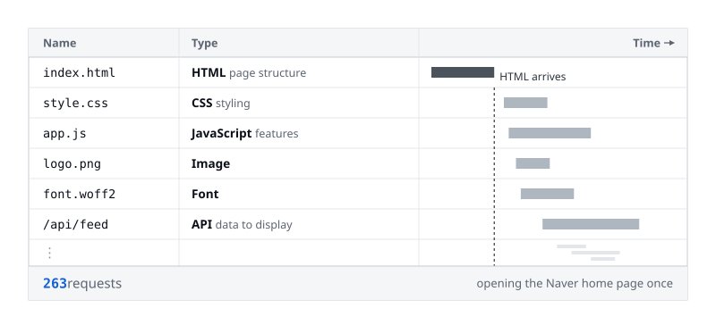
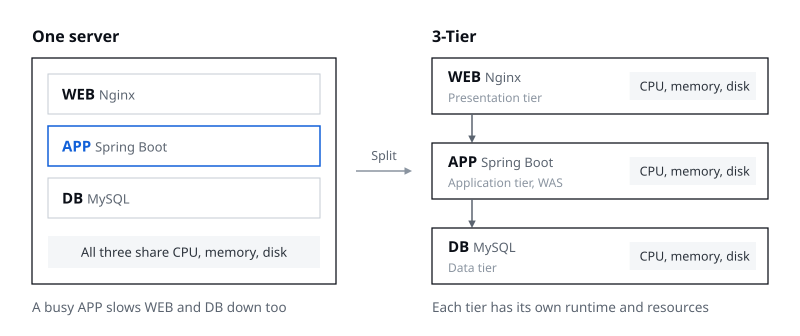
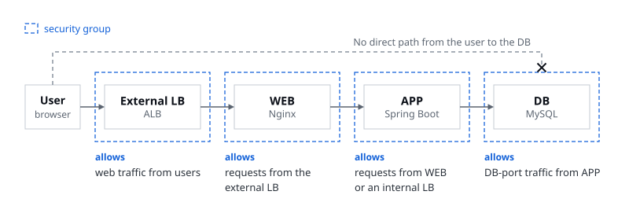
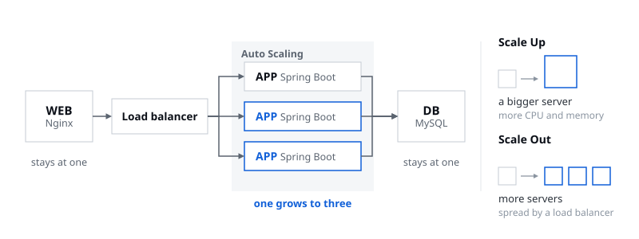
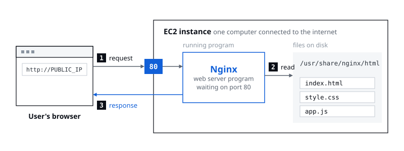
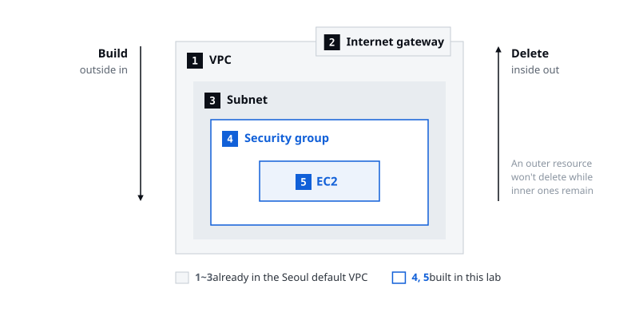
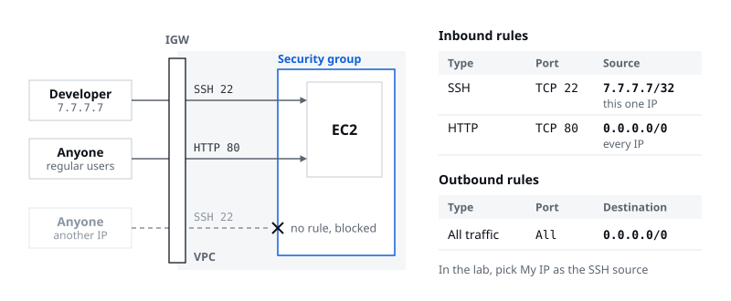
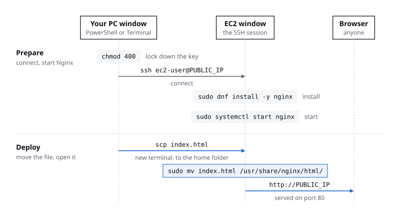

> One server can run it all, but once each role needs different things, you split them

In Session 02 I gave the talk on 3-tier architecture and led the EC2 hands-on. The previous talk covered network building blocks like VPCs, subnets, and security groups, so I picked up from there: how you split a service across them, and then all the way to actually creating a server and putting a web page on it. Even if you've done some development, a lot of it probably ended with building locally and checking it on localhost. The goal was to get a feel for what it means to run a program on a server, what's usually called deployment.

## 01. A website works on a single server

Say we're building a message board. Install a web server (Nginx), the application (Spring Boot), and a database (MySQL) all on one server, and the site runs just fine. WEB takes the browser's requests and either serves static files or passes the request on to APP; APP handles the service's features, like reading and writing posts and logging in; DB stores the posts and member information. It's easiest to think of WEB as what's usually called the front-end and APP as the back-end.

Putting it all on one machine has clear upsides, too. With fewer servers to manage, the setup stays simple, and it keeps costs down when you're starting a small service.

## 02. One page, many requests

But when a user opens one page, the server doesn't get just one request. After the browser receives the HTML, it asks for the other resources it needs: CSS to style the page, JavaScript to run its features, images and fonts, and API requests for the data to show on screen. When I opened the home page of Naver, Korea's biggest web portal, and captured the Network tab in the developer tools, it had logged **263** requests.



Of course, not all 263 go to a single server. Images go one place, data another, split up across many destinations. Still, one user opening one page generates this many requests, and the requests WEB receives lead to requests to APP, which in turn lead to requests to the DB. Picture one server absorbing all of that, and it's quite a load.

## 03. When one server's resources are shared

Put everything on one server and WEB, APP, and DB share the same CPU, memory, and disk. The t3.micro we create in the hands-on has 2 vCPUs and 1 GiB of memory, so three independent applications end up competing for those resources. In practice, when APP starts doing a lot of computation, even DB processing slows down noticeably.

| Situation | What can go wrong |
|---|---|
| APP uses more CPU and memory | WEB and DB on the same server are affected too |
| DB does more disk work | It competes with everything else using the same disk |
| Only APP needs more resources | You may have to upgrade the whole server that APP shares with DB |
| The server fails or reboots | WEB, APP, and DB all go down together |

As the service grows, **each role starts to need different resources and different operating conditions.**

## 04. 3-tier means a separate runtime environment for each role

So you separate the servers by role, starting at the infrastructure itself. Splitting presentation, business processing, and data storage into three tiers and placing each in its own runtime environment: that's 3-tier architecture.



- **Presentation tier (WEB)**: serves pages and resources to users.
- **Application tier (APP)**: runs the service's business rules.
- **Data tier (DB)**: stores data and handles reads and updates.

Each tier can have several servers if needed. The APP tier is also called the WAS (web application server), so on the infrastructure side you'll hear "Web, WAS, DB" more often than "Web, App, DB."

## 05. Why split ①: you can restrict access tier by tier

Once the tiers are separate, you can set which sources and ports can reach each one. You attach one of the security groups from the previous talk to each tier.



The external load balancer, the entry point from outside, accepts web traffic from users. WEB accepts only requests from that specific external load balancer, APP only requests from specific WEB servers or an internal load balancer, and DB only DB-port traffic from specific APP servers. There's no need to leave the doors wide open. **Security groups allow only the traffic you need.**

## 06. Why split ②: you can scale just the busy tier

If APP can't keep up while WEB and DB have room to spare, you only need to grow APP: leave the WEB and DB servers as they are and take APP from one server to three.



Here are the ways to grow it, and the tools that go with them.

- **Scale up**: add CPU and memory to the APP server.
- **Scale out**: add more APP servers.
- **Load balancer**: spreads requests across the added APP servers.
- **Auto Scaling**: adjusts the number of servers automatically based on conditions you set.

That said, you don't pick the tier to grow by guesswork. **Decide which tier to scale after you've found the bottleneck.**

## 07. Why split ③: resources and changes stay contained

Running each tier on its own server makes it easier to separate resources and the scope of work.

- **Separate resources**: give each tier its own CPU and memory and watch its usage separately.
- **Separate work**: deploying APP code and maintaining the DB server can happen independently.
- **Separate blast radius**: rebooting the WEB server doesn't mean rebooting the DB server too.

That doesn't make the tiers fully independent, though. The dependencies between them are still there.

## 08. Does every service need 3-tier?

No. Weigh what the service needs against the operating burden, and decide. For a service without much traffic that you're building for a short time, starting on one server is plenty.

| Situation | Setup to consider |
|---|---|
| A small service for practice or testing an idea | Start on one server |
| APP and DB need different kinds of management | Split off the DB first |
| Each tier needs different security, scaling, or deployment | Consider 3-tier |
| A site that only serves static files | Consider S3 with a CDN |

The last row deserves a closer look. A site made only of static files like HTML, CSS, and JavaScript doesn't need an APP to run code on every request; it just has to deliver files. The index.html we deploy to EC2 in the hands-on later is exactly this kind of static file. Instead of a web server you run yourself, you can hand that delivery to AWS services. S3 is AWS's storage where you upload files, a bit like Google Drive, and if you put a CDN like CloudFront in front of it, servers spread around the world deliver the files from close to each user. That handles the load easily, for far less than keeping an EC2 instance running all the time.

More tiers also mean more cost and more operations work. Every server needs managing and patching, the communication between tiers has to be configured, and when something breaks, you have to trace the cause through the logs on several servers.

## 09. Before the hands-on: EC2 is one computer connected to the internet

Before the hands-on, I went over a few concepts worth knowing. EC2 is, in the end, a server. AWS just sells the computers it rents out under the name EC2; Naver Cloud simply calls the same product a "server," and every cloud has its own name for it. EC2 is AWS's flagship product, so much so that if you've used AWS without ever touching EC2, you could say you don't really know AWS. Apart from sitting in an AWS data center far away, it's no different from the laptop you're using right now.

But if you just upload HTML, CSS, and JavaScript files to that EC2 instance, you won't see anything when you open it in a browser. To the server, those files are "dead" documents, like text files saved on your laptop, and they can't answer a request on their own. Even JavaScript doesn't run on the server by itself; it runs in the browser that downloads it. So you need **a web server program that takes requests and hands out the files**, and the most widely used ones are Nginx and Apache.



By default, Nginx waits for requests on port 80. The previous talk said the IP is the house and the port is a room, so picture Nginx waiting in room 80 of the house called EC2. When a request comes in, it grabs the HTML file from `/usr/share/nginx/html` (the default web folder when it's installed on Amazon Linux) and tosses it to the browser, which renders the HTML and displays it.

There's an order to creating a single EC2 instance: **VPC → internet gateway → subnet → security group → EC2**, from the outside in. When you build it yourself, after creating the subnet you also have to add a 0.0.0.0/0 → internet gateway route to its route table. That makes it the public subnet from the previous talk, so the EC2 instance can reach the internet. Deleting works in reverse, the way taking something apart reverses putting it together: delete EC2 first and work your way out. If resources are still inside, trying to delete the subnet or the VPC first won't work.



Starting from the VPC is the best way to understand it, but AWS creates a default VPC in every region ahead of time. The default VPC in the Seoul region already comes with an internet gateway, four subnets (one in each of four availability zones, the separate groups of data centers within a region), a route table with the 0.0.0.0/0 → internet gateway route, and a default security group. You could actually go straight to creating EC2. Designing at least the security group yourself is a good way to understand networking, though, so in this lab we used the default VPC and started by creating our own security group. The default VPC's address range is 172.31.0.0/16, so it's normal that the numbers differ from the 10.0.0.0/16 in the slide examples.

A security group lists which sources may come in, over which protocols and ports. There are no deny rules, only an allow list, so any traffic that isn't on the list is blocked. For example, if the developer's computer has the IP 7.7.7.7, you'd design it like this.



You write the source in CIDR, like 7.7.7.7/32. In terms of CIDR from the previous talk, /32 uses all 32 bits for the network ID and leaves none for the host ID, which means exactly one address. Port 80 is for the website, so it's open to everyone: 0.0.0.0/0, every IP. Port 22 is the default port for SSH, the remote access program, so only the people who manage the server should get in. That's why **SSH allows only your own IP and is never opened to 0.0.0.0/0.** Outbound, the outgoing direction, is sometimes tightly restricted too, but most of the time it's left unrestricted and allows all traffic.

## 10. Hands-on: deploying your own web page to EC2

The goal was to install Nginx on EC2 and visit a web page you deployed yourself. Before starting, pick a region at the top right of the console. The region decides which of AWS's data centers around the world your resources are created in. Pick US East (N. Virginia) and your EC2 instance is created in data centers there, and the farther away it is physically, the slower it gets, so pick the nearby Asia Pacific (Seoul), ap-northeast-2. We use the default VPC and default subnets for networking, so also check that the default VPC exists.

You'll type commands in two places. PowerShell (Windows) or Terminal (macOS) on your own computer is the **[Your PC]** window; the window showing `[ec2-user@ip-… ~]$` after you connect over SSH is the **[EC2]** window. Keep the two straight.



### 1. Create a security group

Type VPC into the search bar at the top of the console to open the VPC console, scroll down the left menu to **Security → Security groups**, and create a new one with **Create security group** at the top right. Name it `yourname-sg` (e.g., `soojin-sg`) and pick the default VPC. The description can't be left empty and only accepts plain English characters, so write something like `security group for hands-on`, or you won't get past this step. For inbound rules, add two lines with **Add rule**.

| Direction | Type | Protocol | Port | Source / destination |
|---|---|---|---|---|
| Inbound | SSH | TCP | 22 | My IP |
| Inbound | HTTP | TCP | 80 | Anywhere-IPv4 (0.0.0.0/0) |
| Outbound | All traffic | All | All | Anywhere-IPv4 (0.0.0.0/0) |

For the SSH source, don't type an IP; choose **My IP**. That fills in the IP your computer appears as from the outside right now. Because your Wi-Fi router, like the NAT from the previous talk, sends several devices out under one public IP, this IP may differ from your laptop's own IP. If the all-traffic outbound rule is already there, leave it as is, and click **Create security group** at the bottom. When you see a message that `yourname-sg` was created, you're done.

### 2. Create the EC2 instance

Create the server from **Instances → Launch instances** in the EC2 console. Each individual EC2 server is called an instance.

| Setting | Value | What it means |
|---|---|---|
| Name | `yourname-svr001` (e.g., `soojin-svr001`) | |
| AMI | Quick Start → Amazon Linux, Amazon Linux 2023 AMI, 64-bit (x86) | The operating system. Most servers run Linux, and most of the choices in the list are Linux distributions. On AWS, Amazon Linux is the most stable. The AMI's date and ID may differ |
| Instance type | t3.micro | The machine's specs: 2 vCPUs and 1 GiB of memory, less than a laptop but plenty for this lab |
| Key pair | Create new key pair: `yourname-ec2-key`, RSA, .pem | The key you use to get into the server. You can download the .pem file only this once, so note where you saved it |
| Network | Default VPC, subnet: No preference, Auto-assign public IP: Enable | AWS picks one of Seoul's four default subnets. The server needs a public IP so it can be found from the internet. If a value differs, click Edit and change it |
| Security group | Select existing security group → `yourname-sg` | The firewall you just made |
| Storage | 8 GiB gp3 root volume, no extra volumes or file systems | The server's disk. It's created as an EBS volume and comes up again in the cleanup |
| Number of instances | 1 | |

Check the summary on the right and click **Launch instance**. Go to **Instances** at the top and select the checkbox to the left of `yourname-svr001`. Don't click the instance ID. Once the instance is **Running** and has passed all its status checks, copy the **Public IPv4 address** from the details below. That's the IP of the computer you just made, the "house address" from earlier. Replace `PUBLIC_IP` in all the commands below with this address.

### 3. Connect to the server over SSH [Your PC]

A single computer can have several user accounts, so SSH won't connect until you narrow the key file's permissions so that only its owner can read it. Run only the block for your operating system. Replace `PEM_FILE_PATH` on the first line with the full path to your .pem file, then run the whole block, keeping the quotes around the path. The full path looks like `C:\Users\youraccount\Downloads\yourname-ec2-key.pem` on Windows or `/Users/youraccount/Downloads/yourname-ec2-key.pem` on macOS.

On macOS, run this in Terminal.

```bash
keyFile="PEM_FILE_PATH"
chmod 400 "$keyFile"
ls -l "$keyFile"
```

If the permissions at the start of the output read `-r--------`, it worked.

On Windows, run it in PowerShell, not CMD.

```powershell
$keyFile = "PEM_FILE_PATH"
$currentUser = [System.Security.Principal.WindowsIdentity]::GetCurrent().Name
icacls.exe "$keyFile" /reset
icacls.exe "$keyFile" /grant:r "${currentUser}:(R)"
icacls.exe "$keyFile" /inheritance:r
icacls.exe "$keyFile"
```

If the last output shows only a read permission, `(R)`, for your current user, it worked. Don't worry about lines like "Failed processing 0 files" along the way.

Next, connect over SSH. The command is the same on Windows and macOS. `ec2-user` is the Linux account AWS creates automatically on Amazon Linux; put the IP you copied in place of `PUBLIC_IP`, with no spaces around it.

```bash
ssh -i "PEM_FILE_PATH" ec2-user@PUBLIC_IP
```

When a prompt says you're connecting to this server for the first time, check that the IP is your EC2 instance's address and type `yes`. If you see the Amazon Linux 2023 welcome message and the `[ec2-user@ip-… ~]$` prompt, you're in. If you get an `UNPROTECTED PRIVATE KEY FILE` or `bad permissions` error, go back and check the key file's permissions.

From here on, the commands you type run on EC2, not on your PC. Type `pwd` and the command travels over the network to EC2, runs there, and the result, `/home/ec2-user`, comes back to your screen.

### 4. Install and start Nginx [EC2]

```bash
sudo dnf install -y nginx
```

When you see `Complete!` at the end, the install is done. Next, start Nginx.

```bash
sudo systemctl start nginx
```

Enter `http://PUBLIC_IP` in your browser's address bar and you'll see the **Welcome to nginx!** page, the default HTML file Nginx created when it was installed. This lab doesn't set up HTTPS, so be sure to use `http://`. If the browser switches to `https://` on its own, it'll say it can't connect to the site.

### 5. Deploy your own web page

Leave the window connected to EC2 as it is and open another terminal on your PC. From there, send the index.html you want to deploy to EC2 with `scp`, a file copy command that runs over SSH. You can use the index.html I handed out, or ask an AI like ChatGPT to make any web page as an index.html. Replace `HTML_FILE_PATH` with the full path to the index.html you're deploying.

```bash
scp -i "PEM_FILE_PATH" "HTML_FILE_PATH" ec2-user@PUBLIC_IP:/home/ec2-user/index.html
```

When the transfer reaches 100%, go back to the EC2 window, check with `ls -l` that index.html is there, and move it into the web folder Nginx reads from. That folder is owned by root, so the move won't work without `sudo`.

```bash
ls -l
sudo mv /home/ec2-user/index.html /usr/share/nginx/html/index.html
```

`sudo mv` prints nothing when it succeeds. Visit `http://PUBLIC_IP` again and you'll see the page you sent instead of the Nginx default page. If the old page is still showing, do a hard refresh (in Chrome, `Ctrl + Shift + R` on Windows or `Command + Shift + R` on macOS). Now anyone who knows this IP can see the page in their own browser. **That's deployment.**

### 6. Security group experiment: what if you block HTTP?

You can see right away whether a security group really works like a door by deleting a single rule. In the EC2 console, go to **Network & Security → Security Groups**, click `yourname-sg`, and under **Inbound rules → Edit inbound rules**, delete only the HTTP (TCP 80) rule, keep SSH (TCP 22), and click **Save rules**. Open `http://PUBLIC_IP` again in a new incognito window, and the page won't load or the connection will time out. If the page keeps showing because of an existing connection or the cache, close all incognito windows and open a new one to check.

Back in the same security group, use **Edit inbound rules → Add rule** to add an HTTP, TCP, 80, Anywhere-IPv4 (0.0.0.0/0) rule, click **Save rules**, and connect again: the page shows up normally.

### 7. Clean up after the lab

EC2 starts billing the moment you create it. A lab like this costs around 100 won, only a few cents, but always clean up when you're done.

1. In EC2 → Instances, select `yourname-svr001` and delete it with **Instance state → Terminate instance**. It's **Terminate**, not Stop. Stopping only shuts the server down: the instance charges stop, but you keep paying for the disk (EBS) that's left behind.
2. After it terminates, check on the **Volumes** page that this lab's EBS volume was deleted along with it.
3. Once termination finishes and the instance is detached from the security group, delete the `yourname-sg` you made. Until termination finishes, it's still in use and can't be deleted.
4. Delete `yourname-ec2-key` on the **Key Pairs** page too, since you won't need it again.

Don't delete the default VPC, default subnets, default route table, or default internet gateway. A terminated instance stays in the list as **Terminated** for a while and then disappears, so don't worry about it. Refresh `http://PUBLIC_IP` after terminating and it no longer connects, because the server is gone. Screenshots of every screen and the full set of commands are in the [hands-on guide](files/hands-on.pdf) (in Korean).

What we built today is just one of the three tiers: WEB. All it had to do was have Nginx hand over an HTML file when the browser asked, so the WEB tier alone was enough. In a real service, though, requests go on into the APP and DB tiers, with traffic flowing between WEB and APP and between APP and DB. Splitting those three roles into their own runtime environments is what 3-tier means.
