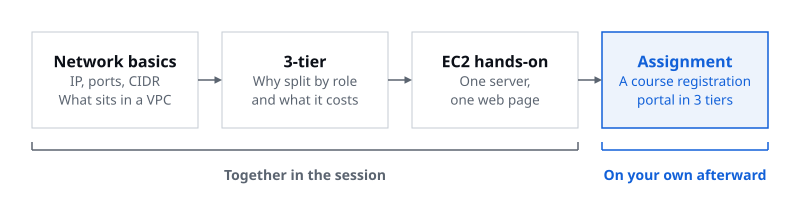
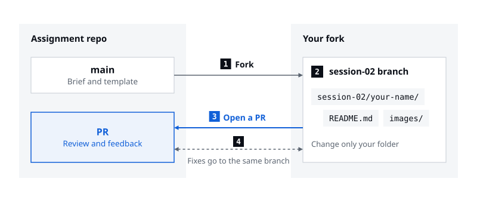

> Once you've put a web page on one server, it's time to design something that holds up when course registration opens

Session 02 was the first session in Cohort 1 to get properly into AWS infrastructure. Talks on network basics and 3-tier architecture led into a hands-on that put a web page on a single EC2 instance, and the session ended by handing out an assignment: design a course registration portal as a 3-tier service. Since the assignment is still underway, this post won't tell you which services or settings to pick. Instead, it reads the assignment one problem at a time and sets out the questions to answer before you start designing, what the validation plan needs, and how to submit.

## 01. From network basics to one EC2 instance

The [first talk](/en/activities/cohort-01/session-02-presentation-01) covered only the network terms you really need, IP and ports, TCP and UDP, and CIDR, and then moved to one picture: a VPC inside AWS, subnets inside the VPC, EC2 inside the subnets. It walked through what goes in a public subnet, like load balancers, NAT Gateways, and bastion hosts, and what goes in a private subnet, like app servers, RDS, and ElastiCache, then wrapped up with the difference between NACLs, which guard subnets, and security groups, which guard instances. Instead of a Q&A, the talk closed with a two-question quiz.

The [second talk](/en/activities/cohort-01/session-02-presentation-02) started from the fact that a website runs fine with WEB, APP, and DB all on one server. It then laid out why you'd still split them into separate environments by role, namely access control per tier, scaling only the busy tier, and keeping resources and changes contained, and pointed out that more tiers also mean more cost and operations work, so not every service needs three. The hands-on that followed went from creating a security group and an EC2 instance in the default VPC, to deploying a personal web page with Nginx, to deleting and restoring a single HTTP rule to watch access close and open again.

The hands-on was planned from the start as a way to get a feel for the assignment. So the assignment picks up where the hands-on left off.

## 02. The hands-on stopped at a single WEB tier

What the hands-on built was one of the three tiers: WEB. A single EC2 instance in a default subnet served an HTML file on port 80, so if that server stops, the page stops with it, and when requests pile up there's no other server to share them. The assignment starts from the same VPC, EC2, and security groups, but assumes several servers, some of which fail, and a server count that grows and shrinks.

| | Session hands-on | Assignment |
|---|---|---|
| Tiers | WEB only | WEB, APP, DB |
| Server count | One EC2 instance, as created | Grows and shrinks with request volume |
| Placement | Default VPC, one default subnet AWS picked | AZ and subnet layout you design, with multiple AZs in mind |
| Access rules | One security group allowing SSH and HTTP | Access control per tier |
| When a server stops | The page stops too | Detected, taken out, and recovered automatically |
| State and data | Just one static HTML file | Keeping login state, protecting data |
| AWS services | EC2 | VPC, EC2, EC2 Auto Scaling, ALB, RDS required |

In the hands-on, all you had to check was that the server ran. In the assignment, you have to explain **how the service keeps going while servers change, fail, and get swamped**.

## 03. The assignment: last semester's course registration portal

The [assignment](https://github.com/AWS-Student-Builder-Group-at-UOS/cohort-01-assignments/blob/main/session-02/README.md) is set at a university's course registration portal. The university wants to improve the portal's infrastructure before next semester's registration, because last semester ran into three problems. Logins dropped, requests kept going to a server that had stopped responding, and the server setup couldn't keep up as traffic surged and fell away.

The task is to design a WEB, APP, and DB 3-tier architecture that solves these three problems. It must include VPC, EC2, EC2 Auto Scaling, ALB, and RDS, you can add other services as needed, and it should also account for multi-AZ placement, access control per tier, and data protection. For each problem, the assignment asks for a solution and also for how it works and why you chose it. In other words, putting service names on a diagram isn't an answer on its own.

Three things are required, and actually building the environment to check it is optional.

| What to submit | What it should cover |
|---|---|
| Architecture diagram | Each tier's role, AZ and subnet layout, main traffic paths |
| Design explanation | How each problem is solved, key settings and why, remaining limits |
| Validation plan | How, and against what criteria, you'll check login persistence, failure handling, and auto scaling |

## 04. Problem ①: Logins drop

The first problem holds two situations. The portal ran two APP servers, and logins dropped now and then while students browsed courses or moved to the registration screen; logins also didn't survive server restarts or replacements. The first is about which APP a request lands on, and the second is about the APP that was handling a user's requests going away or a new one appearing. The assignment names both cases too: keeping login state even when APPs are added or removed, or when a request is passed to a different APP.

The load balancer from the session takes requests at a single entry point and spreads them across several servers, and scaling out adds more servers. Both help the service hold up, but they also make it hard to count on one user's requests always reaching the same APP. The problem comes from splitting and adding servers, which makes it one concrete form of the operations burden the 3-tier talk pointed out. How to keep login state across several servers wasn't covered in the session, so it's something to research as you work on the assignment.

Your design should be able to answer questions like these.

- Why did logins drop in last semester's setup? What was lost both when a request went to a different APP and when an APP restarted?
- When a request reaches an APP for the first time, how does that APP know the user has already logged in?
- At the moment an APP is added or removed, what happens to users who were logged in?
- Does your approach still hold alongside replacing servers in problem ② and changing the server count in problem ③?
- Does your approach bring new costs or new points of failure?

## 05. Problem ②: Failures linger

The second problem also splits in two. Requests kept reaching an APP that had stopped responding, which means nothing noticed the failed server and took it out of rotation. Operators had to step in by hand, which means filling the gap depended on people. The assignment separates the steps the same way: detect and remove the failed server, keep serving from healthy ones, and recover automatically.

The session touched on a concept for each step. The first talk said a load balancer uses health checks to see whether the servers behind it are alive and sends requests only to healthy ones, and the second introduced Auto Scaling as adjusting the number of servers automatically based on conditions you set. Both are required services, but what they base their judgment on and in what order they act weren't covered in the session.

- What counts as "not responding"? Is a server being up the same as it handling registration requests properly?
- How quickly should a server be taken out? Too sensitive, and a server that slows down for a moment gets pulled; too slow, and requests fail in the meantime.
- Who creates the replacement, and when? How long until it's ready to take requests?
- Can the remaining servers carry the load until the replacement is ready? What if that moment is right after registration opens?
- What if a whole AZ goes down, not just one server?

Only once you can answer these can the validation plan say what will show that a failed server was taken out.

## 06. Problem ③: Capacity lags

The third problem has time built into it. Requests piled up right after registration opened, causing delays and errors; adding servers by hand made the response slow; and the extra servers kept running, and costing money, after registration closed. The assignment splits this into two asks: "prepare" for the load at the moment registration opens, and "adjust" the server count to match request volume. Preparing happens before the rush, while adjusting happens during it and after it ends.

The second talk distinguished scaling up, which makes a server bigger, from scaling out, which adds servers, and introduced the load balancer that spreads requests across the added servers along with Auto Scaling, which adjusts the server count automatically. One line the talk stressed applies as is. **Decide which tier to scale after you've found the bottleneck.** How to set the conditions and range for adding and removing servers is something to research during the assignment.

- Registration opens at a set time. Given how long new servers take to start serving requests, how many need to be ready, and by when?
- What metrics drive the decision to add or remove servers? Do those metrics track the delays and errors students actually run into?
- What are the lower and upper limits on the server count, and what are they based on? Did you weigh cost and the failure handling from problem ② together?
- When a server is removed, what happens to the requests it's still handling and the users logged in through it?
- More APPs mean more requests to the DB. What if the bottleneck moves to the DB?

## 07. Three more things to account for

Alongside the three problems, the assignment asks you to account for multi-AZ placement, access control per tier, and data protection. That's also why the diagram has to show the AZ and subnet layout and the main traffic paths.

Availability Zones (AZs) came up briefly in the hands-on, when the default VPC was explained. An AZ is one of the separate groups of data centers within a region, and the Seoul region's default VPC has one subnet in each AZ. Your design should be able to say which subnet in which AZ each tier goes in, and what's left to keep the service running if an entire AZ stops.

Access control per tier came up in both talks. The first showed what goes in public and private subnets and what NACLs and security groups each guard, and the second showed a security group on each tier that allows only the traffic it needs. For the portal, start by writing down where students' requests, traffic between tiers, and administrators' access each come in and how far each needs to reach, and every rule will have a reason behind it.

Data protection wasn't covered in depth. The session went as far as RDS being a service that manages a relational database for you and usually only accepts connections from app servers. It helps to first separate what you're protecting the data from. Access from outside, a DB server or AZ failure, and data deleted or changed by mistake are different risks, and they call for different defenses.

Whatever you look up outside the session, don't just copy it over. Pair it with the portal problem you chose it to solve, and it becomes a design explanation.

## 08. What goes in the validation plan

The validation plan decides in advance how you'll confirm that the design behaves as intended. The assignment asks how, and against what criteria, you'll check three things: login persistence, failure handling, and auto scaling. None of them shows itself in normal operation, so you have to create the situation on purpose to check it.

| Behavior to check | Situation to create | What to observe |
|---|---|---|
| Login persistence | After logging in, send requests to a different APP, and add or remove an APP | Whether the login holds, and which APP actually handled each request |
| Failure handling | Make one APP stop responding | How long until requests stop going to it and the errors in the meantime, and how long until a replacement takes requests |
| Auto scaling | Raise request volume, then lower it | When the server count changed, response times and errors along the way, and the server count once requests drop |

Write criteria so a result shows pass or fail at a glance. Rather than "logins hold up well," write something like "all N requests sent to a different APP come back logged in," so you can hold your results up against it. Write down what you can't check, too. The assignment template has its own place for the scope and limits of your validation.

Building the environment to check it is optional, and building only part of it is fine. You can use an existing sample application, and since what counts is evidence that the infrastructure behaved as intended rather than screen design or app features, attach result screens, logs, or metrics along with what you built. Once you're done checking, clean up as in the hands-on. ALBs and RDS bill for as long as they run, too.

## 09. Submit as a PR, review in the PR

Submissions go to the [assignment repository](https://github.com/AWS-Student-Builder-Group-at-UOS/cohort-01-assignments) on GitHub as a pull request. Fork the repository to your own account, create a `session-02` branch in your fork, and add a new folder with your name inside the `session-02` folder. Put `README.md` and `images/` in that folder, then open a PR from your branch to the assignment repository's `main`. To address review comments, fix things on the same branch and push, and the open PR picks up the changes.

Write the README following the four sections of the [assignment template](https://github.com/AWS-Student-Builder-Group-at-UOS/cohort-01-assignments/blob/main/TEMPLATE.md).

| Section | What goes in it |
|---|---|
| 1. What I Built | What you built and how it works |
| 2. Design Decisions | Architecture diagram, each service's role and how they connect, key settings and why |
| 3. Troubleshooting & Validation | What you checked, how you checked it and what you did, results and evidence, scope and limits of validation |
| 4. Screenshots | For each completion criterion, how you checked it, the result, and a result screen |

The template is shared across sessions, so before you finish, make sure this session's required deliverables, the diagram, the design explanation, and the validation plan, all made it into those four sections. For key settings, give a reason even when you kept the default. Before opening the PR, check that only your folder changed, that the architecture diagram and result screens in `images/` all show up in the README, and that no AWS keys, passwords, or personal information slipped in. The rest of the rules are in the [general guide](https://github.com/AWS-Student-Builder-Group-at-UOS/cohort-01-assignments/blob/main/README.md).

The [submission sample](https://github.com/AWS-Student-Builder-Group-at-UOS/cohort-01-assignments/issues/2) has a README written for a fictional memo service, along with the core team's feedback on its PR and the replies. It's a different service from the portal, so look at how it states reasons, grounds its judgments, and scopes its validation rather than at its design. Reviews are led by the core team, but any member can comment on someone else's PR.

There's no single right architecture for this assignment. The same required services can lead to different designs depending on how you keep logins, how many servers you start with, and what triggers scaling, which is exactly why the assignment asks for your reasons at every turn. We're looking forward to seeing PRs with **designs that show not just what you picked, but why**.
