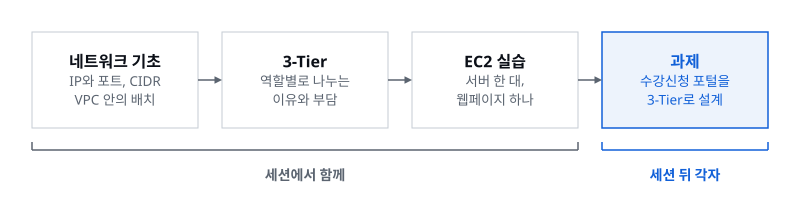
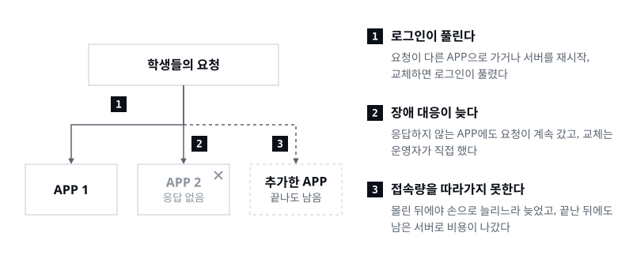
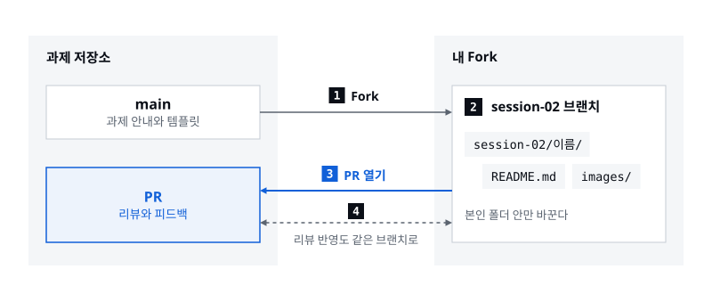

> 서버 한 대에 웹페이지를 띄웠다면, 이제 수강신청이 몰리는 날을 버티는 구조를 설계할 차례입니다

세션 02는 1기에서 AWS 인프라를 본격적으로 다룬 첫 세션이었습니다. 네트워크 기초와 3-Tier 아키텍처 발표에 이어 EC2 한 대에 웹페이지를 띄우는 실습까지 했고, 마지막으로 수강신청 포털을 3-Tier로 설계하는 과제가 나갔습니다. 과제가 아직 진행 중이라 이 글에서는 어떤 서비스와 설정을 고르면 되는지 말하지 않습니다. 대신 과제 문서를 문제별로 나눠 읽고, 설계를 시작하기 전에 답해 봐야 할 질문과 검증 계획, 제출 형식을 정리했습니다.

## 01. 네트워크 기초에서 EC2 한 대까지

[첫 발표](/ko/activities/cohort-01/session-02-presentation-01)는 IP와 포트, TCP와 UDP, CIDR처럼 꼭 필요한 네트워크 용어만 짚은 뒤 'AWS 안에 VPC, VPC 안에 서브넷, 서브넷 안에 EC2'라는 그림으로 넘어갔습니다. 퍼블릭 서브넷에 두는 로드밸런서와 NAT Gateway, Bastion Host, 프라이빗 서브넷에 두는 App 서버와 RDS, ElastiCache 같은 리소스를 차례로 짚었고, 서브넷을 지키는 NACL과 인스턴스를 지키는 보안 그룹의 차이로 정리했습니다. 발표 끝에는 Q&A 대신 퀴즈 두 문제로 복습했습니다.

[두 번째 발표](/ko/activities/cohort-01/session-02-presentation-02)는 서버 한 대에 WEB, APP, DB를 모두 올려도 웹사이트는 돌아간다는 데서 출발했습니다. 그런데도 역할별로 실행 환경을 나누는 이유를 계층별 접근 제한, 바쁜 계층만 따로 늘리는 확장, 자원과 변경의 영향 분리로 정리하고, 계층이 늘어나는 만큼 비용과 운영 작업도 늘어나니 모든 서비스에 3-Tier가 필요하지는 않다는 점까지 짚었습니다. 뒤이은 실습에서는 기본 VPC에 보안 그룹과 EC2를 만들고, Nginx로 나만의 웹페이지를 배포한 뒤, HTTP 규칙 하나를 지웠다가 되살리며 접속이 막히고 열리는 것까지 확인했습니다.

실습은 기획 단계부터 과제의 감을 잡는 시간으로 넣었습니다. 그래서 과제도 실습이 끝난 자리에서 시작합니다.

## 02. 실습은 WEB 계층 하나에서 멈췄다

실습에서 만든 것은 3-Tier 가운데 WEB 계층 하나였습니다. 기본 서브넷의 EC2 한 대가 80번 포트로 HTML 파일을 내주는 구성이라, 이 서버가 멈추면 페이지도 함께 멈추고 요청이 몰려도 나눠 받을 서버가 없습니다. 과제는 같은 VPC와 EC2, 보안 그룹에서 출발하지만, 서버가 여러 대이고 그중 일부가 고장 나거나 서버 수가 늘었다 줄어드는 상황을 전제로 합니다.

| | 세션 실습 | 과제 |
|---|---|---|
| 계층 | WEB 하나 | WEB, APP, DB |
| 서버 수 | EC2 한 대, 만든 그대로 | 요청량에 따라 늘고 줄어듦 |
| 배치 | 기본 VPC, AWS가 고른 기본 서브넷 하나 | AZ와 서브넷 배치를 직접 설계, 다중 AZ 고려 |
| 접근 규칙 | 보안 그룹 하나에 SSH와 HTTP | 계층별 접근 제어 |
| 서버가 멈추면 | 페이지도 함께 멈춤 | 감지하고 제외한 뒤 자동으로 복구 |
| 상태와 데이터 | 정적 HTML 파일 하나뿐 | 로그인 상태 유지, 데이터 보호 |
| AWS 서비스 | EC2 | VPC, EC2, EC2 Auto Scaling, ALB, RDS 필수 |

실습에서는 서버가 돌아가는지만 확인하면 됐습니다. 과제에서는 **서버가 바뀌고, 멈추고, 몰리는 순간에도 서비스가 이어지는지**를 설명해야 합니다.

## 03. 과제: 지난 학기의 수강신청 포털

[과제](https://github.com/AWS-Student-Builder-Group-at-UOS/cohort-01-assignments/blob/main/session-02/README.md)의 배경은 대학의 수강신청 포털입니다. 다음 학기 수강신청을 앞두고 포털 인프라를 개선하려는데, 지난 학기에 문제가 세 가지 있었습니다. 로그인이 풀렸고, 응답하지 않는 서버에도 요청이 계속 갔고, 몰렸다 빠지는 접속량을 서버 구성이 따라가지 못했습니다.

과제는 이 세 문제를 해결하는 WEB, APP, DB 3-Tier 아키텍처를 설계하는 것입니다. VPC, EC2, EC2 Auto Scaling, ALB, RDS는 반드시 포함하고 필요한 서비스는 더할 수 있으며, 다중 AZ 배치와 계층별 접근 제어, 데이터 보호도 함께 고려해야 합니다. 과제 문서는 문제마다 해결 방법을 묻고, 그 방법이 어떻게 동작하는지와 왜 골랐는지까지 설명하라고 합니다. 서비스 이름을 다이어그램에 올리는 것만으로는 답이 되지 않는다는 뜻입니다.

필수로 제출할 것은 세 가지이고, 실제로 구축해 동작을 확인하는 것은 선택입니다.

| 제출할 것 | 담아야 할 내용 |
|---|---|
| 아키텍처 다이어그램 | 계층별 역할, AZ와 서브넷 배치, 주요 통신 경로 |
| 설계 설명 | 문제별 해결 방법, 주요 설정과 선택 근거, 남아 있는 한계 |
| 검증 계획 | 로그인 유지, 장애 대응, 자동 확장을 어떤 방법과 기준으로 확인할지 |

## 04. 문제 ① 로그인이 풀린다

첫 번째 문제에는 상황이 두 가지 들어 있습니다. APP 서버 두 대로 운영했는데 강의를 조회하거나 신청 화면으로 이동할 때 간헐적으로 로그인이 풀렸고, 서버를 재시작하거나 교체할 때도 로그인이 유지되지 않았습니다. 앞의 것은 요청이 어느 APP에 닿느냐의 문제이고, 뒤의 것은 요청을 받던 APP이 사라지거나 새로 생기는 문제입니다. 과제 문장도 'APP이 추가·제거되거나 요청이 다른 APP으로 전달되어도'라고 두 경우를 함께 적었습니다.

세션에서 본 로드밸런서는 하나의 진입점으로 요청을 받아 여러 서버로 나눠 보내고, Scale Out은 서버의 수를 늘립니다. 둘 다 서비스를 버티게 해 주지만, 그만큼 한 사용자의 요청이 매번 같은 APP에 닿는다고 기대하기 어려워집니다. 서버를 나누고 늘리면서 생기는 문제라, 3-Tier 발표에서 짚은 운영 부담이 구체적으로 드러나는 자리이기도 합니다. 서버가 여러 대일 때 로그인 상태를 유지하는 방법은 세션에서 다루지 않았으니 과제를 하면서 직접 찾아봐야 합니다.

설계에서는 이런 질문에 답할 수 있어야 합니다.

- 지난 학기 구조에서 로그인은 왜 풀렸을까? 요청이 다른 APP으로 갔을 때와 APP이 재시작됐을 때 공통으로 사라진 것은 무엇인가?
- 요청을 처음 받는 APP은 이 사용자가 이미 로그인했다는 것을 무엇으로 알 수 있는가?
- APP이 추가되거나 제거되는 순간, 로그인해 있던 사용자에게는 무슨 일이 생기는가?
- 고른 방법은 문제 ②의 서버 교체, 문제 ③의 서버 수 조정과 함께 쓰여도 그대로 성립하는가?
- 그 방법 때문에 새로 생기는 비용이나 장애 지점은 없는가?

## 05. 문제 ② 장애 대응이 늦다

두 번째 문제도 두 부분으로 나뉩니다. 응답하지 않는 APP에도 요청이 계속 갔다는 것은 고장 난 서버를 알아채고 요청 대상에서 빼는 단계가 없었다는 뜻입니다. 운영자가 직접 조치해야 했다는 것은 빠진 자리를 다시 채우는 일이 사람 손에 달려 있었다는 뜻입니다. 과제 문장도 감지와 제외, 정상 서버로 서비스 지속, 자동 복구로 단계를 나눠 적었습니다.

세션에서는 두 단계에 해당하는 개념을 한 번씩 만났습니다. 첫 발표에서 로드밸런서는 헬스 체크로 뒤에 있는 서버가 살아 있는지 확인해 정상인 서버로만 요청을 보낸다고 했고, 두 번째 발표에서 Auto Scaling은 설정한 조건에 따라 서버 수를 자동으로 조절한다고 소개했습니다. 둘 다 필수 서비스에 들어 있지만, 무엇을 기준으로 판단하고 어떤 순서로 움직이는지는 세션에서 다루지 않았습니다.

- '응답하지 않는다'는 것은 무엇으로 판단하는가? 서버가 켜져 있는 것과 수강신청 요청을 제대로 처리하는 것은 같은가?
- 얼마나 빨리 빼야 하는가? 너무 민감하면 잠깐 느려진 서버까지 빠지고, 너무 둔하면 그동안 요청이 실패한다.
- 빠진 서버를 대신할 서버는 누가, 언제 만들고, 요청을 받을 준비가 되기까지 얼마나 걸리는가?
- 대신할 서버가 준비될 때까지 남은 서버만으로 요청을 버틸 수 있는가? 그 순간이 신청 시작 직후라면?
- 서버 한 대가 아니라 한 AZ가 통째로 멈추면 어떻게 되는가?

이 질문들에 답이 있어야 검증 계획에서 '장애 서버가 빠졌다'를 무엇으로 확인할지도 정할 수 있습니다.

## 06. 문제 ③ 접속량을 따라가지 못한다

세 번째 문제에는 시간이 들어 있습니다. 신청이 시작된 직후 요청이 몰려 응답 지연과 오류가 났고, 서버를 손으로 추가하느라 대응이 늦었고, 신청이 끝난 뒤에도 추가한 서버가 남아 비용이 나갔습니다. 과제 문장은 이를 수강신청 시작 시점의 부하에 '대비'하는 것과 요청량에 따라 서버 수를 '조정'하는 것으로 나눠 묻습니다. 대비는 요청이 몰리기 전의 일이고, 조정은 몰리는 동안과 끝난 뒤의 일입니다.

두 번째 발표에서는 서버 사양을 키우는 Scale Up과 서버 수를 늘리는 Scale Out을 구분하고, 늘어난 서버로 요청을 나누는 로드밸런서와 서버 수를 자동으로 조절하는 Auto Scaling을 함께 소개했습니다. 같은 발표에서 강조한 한 줄도 그대로 적용됩니다. **확장할 계층은 병목을 확인한 뒤 결정합니다.** 서버를 늘리고 줄이는 조건과 범위를 어떻게 정하는지는 과제를 하며 직접 찾아봐야 합니다.

- 수강신청이 시작되는 시각은 미리 정해져 있다. 서버가 늘어나 요청을 받기까지 걸리는 시간을 생각하면, 언제 몇 대가 준비되어 있어야 하는가?
- 서버를 늘리고 줄이는 판단은 어떤 지표를 보고 내리는가? 그 지표는 학생들이 겪는 지연이나 오류와 이어지는가?
- 서버 수의 아래쪽과 위쪽 한계는 얼마로 두고, 근거는 무엇인가? 비용과 문제 ②의 장애 대응을 함께 따졌는가?
- 서버를 줄일 때 그 서버에서 처리 중이던 요청과 로그인해 있던 사용자는 어떻게 되는가?
- APP을 늘린 만큼 DB로 가는 요청도 늘어난다. 병목이 DB로 옮겨 가면 어떻게 하는가?

## 07. 함께 고려할 세 가지

과제 문서는 세 문제와 함께 다중 AZ 배치, 계층별 접근 제어, 데이터 보호도 고려하라고 합니다. 다이어그램에 AZ와 서브넷 배치, 주요 통신 경로를 그리라고 한 것도 이 셋과 이어집니다.

가용 영역(AZ)은 실습에서 기본 VPC를 설명하며 잠깐 나왔습니다. 한 리전 안에서 서로 떨어져 있는 데이터센터 묶음이고, 서울 리전의 기본 VPC에는 가용 영역마다 서브넷이 하나씩 있습니다. 설계에서는 각 계층을 어느 AZ의 어느 서브넷에 둘지, 한 AZ가 통째로 멈췄을 때 무엇이 남아 서비스를 이어 가는지 설명할 수 있어야 합니다.

계층별 접근 제어는 두 발표가 모두 다룬 주제입니다. 첫 발표에서는 퍼블릭과 프라이빗 서브넷에 무엇을 두는지, NACL과 보안 그룹이 각각 어디를 지키는지 봤고, 두 번째 발표에서는 계층마다 보안 그룹을 붙여 필요한 통신만 허용하는 그림을 봤습니다. 수강신청 포털에서는 학생의 요청, 계층 사이의 통신, 관리자의 접속이 각각 어디로 들어와 어디까지 닿아야 하는지부터 적어 보면 규칙마다 근거가 생깁니다.

데이터 보호는 세션에서 깊이 다루지 않았습니다. RDS가 관계형 DB를 관리해 주는 서비스이고, 보통 App 서버에서 오는 접근만 허용해 둔다는 데까지 짚었습니다. 무엇으로부터 데이터를 지키려는지부터 나눠 보면 좋습니다. 바깥의 접근, DB 서버나 AZ의 장애, 실수로 지우거나 잘못 바꾼 데이터는 서로 다른 위험이고 대비하는 방법도 다릅니다.

세션 밖에서 찾아본 내용은 그대로 옮겨 적기보다, 수강신청 포털의 어떤 문제를 풀려고 골랐는지와 함께 적어야 설계 설명이 됩니다.

## 08. 검증 계획에 담을 것

검증 계획은 설계한 구조가 의도대로 움직이는지 무엇으로 확인할지 미리 정해 두는 부분입니다. 과제 문서는 로그인 유지, 장애 대응, 자동 확장 세 가지를 어떤 방법과 기준으로 확인할지 설명하라고 합니다. 세 가지 모두 평소에는 드러나지 않는 동작이라, 그 상황을 일부러 만들어야 확인할 수 있습니다.

| 확인할 동작 | 만들어 볼 상황 | 관찰할 것 |
|---|---|---|
| 로그인 유지 | 로그인한 뒤 요청이 다른 APP으로 가게 하고, APP을 추가하거나 제거한다 | 로그인이 유지되는지, 그 요청을 실제로 어느 APP이 받았는지 |
| 장애 대응 | APP 한 대가 응답하지 않게 만든다 | 그 서버로 요청이 가지 않게 되기까지 걸린 시간과 그동안의 오류, 대신할 서버가 요청을 받기까지 걸린 시간 |
| 자동 확장 | 요청량을 늘렸다가 줄인다 | 서버 수가 바뀐 시점, 그 사이의 응답 시간과 오류, 요청이 줄어든 뒤의 서버 수 |

기준은 결과를 보고 통과인지 아닌지 바로 판단할 수 있게 적습니다. '로그인이 잘 유지된다'보다 '다른 APP으로 간 요청 N번이 모두 로그인된 상태로 응답한다'처럼 적어야 확인한 결과와 맞춰 볼 수 있습니다. 확인하지 못하는 범위도 함께 적어 둡니다. 과제 템플릿에도 검증 범위와 한계를 적는 칸이 따로 있습니다.

설계한 환경을 실제로 구축해 확인하는 것은 선택이고, 일부만 구현해도 됩니다. 기존 예제 애플리케이션을 써도 되고, 화면 디자인이나 애플리케이션 기능보다 인프라가 의도대로 움직였다는 근거가 중요하니 구현한 범위와 함께 결과 화면이나 로그, 지표를 붙입니다. 확인이 끝나면 실습 때처럼 리소스를 정리합니다. ALB와 RDS도 켜 둔 시간만큼 요금이 나갑니다.

## 09. 제출은 PR로, 리뷰도 PR에서

과제는 GitHub의 [과제 저장소](https://github.com/AWS-Student-Builder-Group-at-UOS/cohort-01-assignments)에 PR로 제출합니다. 과제 저장소를 본인 계정으로 Fork하고, Fork에 `session-02` 브랜치를 만든 뒤 `session-02` 폴더 안에 본인 이름의 폴더를 새로 만듭니다. 그 폴더에 `README.md`와 `images/`를 넣고 브랜치에서 과제 저장소의 `main`으로 PR을 엽니다. 리뷰 의견은 같은 브랜치에서 고쳐 푸시하면 열려 있는 PR에 그대로 반영됩니다.

README는 [과제 템플릿](https://github.com/AWS-Student-Builder-Group-at-UOS/cohort-01-assignments/blob/main/TEMPLATE.md)의 네 항목을 따라 씁니다.

| 항목 | 쓰는 내용 |
|---|---|
| 1. What I Built | 무엇을 만들었고 어떻게 동작하는지 |
| 2. Design Decisions | 아키텍처 다이어그램, 서비스별 역할과 연결 흐름, 주요 설정과 선택 이유 |
| 3. Troubleshooting & Validation | 점검 대상, 확인 과정과 조치, 결과와 근거, 검증 범위와 한계 |
| 4. Screenshots | 완료 조건마다 확인 방법, 확인 결과, 결과 화면 |

템플릿은 모든 회차가 함께 쓰니, 이번 회차의 필수 제출 내용인 다이어그램, 설계 설명, 검증 계획이 네 항목 안에 빠짐없이 들어갔는지 마지막에 확인합니다. 주요 설정은 기본값을 그대로 둔 경우에도 이유를 적습니다. PR을 열기 전에는 본인 폴더만 바뀌었는지, `images/`의 아키텍처 다이어그램과 결과 화면이 README에 모두 보이는지, AWS 키나 비밀번호, 개인정보가 들어가지 않았는지 확인합니다. 그 밖의 세부 규칙은 [공통 안내](https://github.com/AWS-Student-Builder-Group-at-UOS/cohort-01-assignments/blob/main/README.md)에 있습니다.

[제출 샘플](https://github.com/AWS-Student-Builder-Group-at-UOS/cohort-01-assignments/issues/2)에는 가상의 메모 서비스로 쓴 README와, 그 PR에 남긴 코어팀의 피드백과 답변이 함께 있습니다. 수강신청 포털과는 다른 서비스이니 설계 내용보다는 선택 이유와 판단 근거, 검증 범위를 적는 방식을 참고하면 됩니다. 리뷰는 코어팀이 중심이 되어 진행하지만 멤버 누구나 다른 사람의 PR에 의견을 남길 수 있습니다.

이 과제에는 하나로 정해진 정답 구성이 없습니다. 같은 필수 서비스로도 로그인을 유지하는 방법, 처음 준비해 둘 서버 수, 서버를 늘리는 기준에 따라 서로 다른 설계가 나오고, 과제 문서가 문제마다 선택 이유를 묻는 것도 그래서입니다. **무엇을 골랐는지보다 왜 골랐는지가 보이는 설계**를 PR에서 기다리겠습니다.
