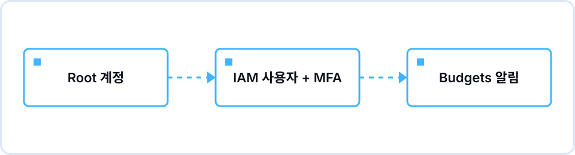

## Overview

On Tuesday, September 8, at 7 p.m., Cohort 1 met for the first time in the Information Technology Building. Five core team members and eleven members came, most from the Department of Computer Science. Subin Son (Leader) spent the first fifteen minutes on what ASBG is and why we started one at the University of Seoul: there was no place on campus to learn cloud together. A semester runs on five official sessions plus a weekly self-directed study per team. Each session is a loop: the core team sends a brief with the topic and requirements in the Pre-Session, the In-Session weighs trade-offs rather than one right answer, and the Post-Session retrospective sets keywords to review and feeds improvements into the next brief. She also showed where Learn, Build, Share, and Connect sit inside that loop.

Introductions were one line each: name, department, and whether you had ever opened the AWS console. Few people already had an account, and most said, as in the pre-survey, that they wanted server, network, and cloud fundamentals first. We split into five teams of three or four, spreading out the people with some experience.

From 7:30, Yena Lee (Tech Lead) ran the hands-on, "Your first cloud account, started safely." The demo account's console was on the projector and everyone followed along in their own account; those without one watched a neighbor's screen. Three spots caused the most confusion: root and IAM user sign-in screens differ, registering MFA takes two consecutive authenticator codes, and actual-spend and forecasted-spend alerts in Budgets mean different things. The Free Tier page also looked different depending on when the account was created, so what is free is something each person checks on their own screen.

## What we covered

| Time | Content |
|---|---|
| 19:00–19:15 | Opening — ASBG and ASBG UOS, how the semester runs, the Pre/In/Post session loop |
| 19:15–19:30 | Introductions and team formation — five teams of three or four |
| 19:30–19:40 | Why account security comes first — a billing incident that began with an access key in a public repository |
| 19:40–19:55 | Locking down the root account — what root can do, registering MFA with an authenticator app |
| 19:55–20:15 | Creating an IAM user for daily work — console-only sign-in, attaching a permissions policy, why we do not create access keys |
| 20:15–20:35 | AWS Budgets — a 5 USD monthly budget with alert thresholds, confirming the recipient email, reading the Free Tier page |
| 20:35–20:50 | Cleanup habits — checking for leftover resources across regions, reading this month's charges in the Billing console |
| 20:50–21:00 | Remaining schedule (9/29, 11/3, 11/24, 12/29), assignment, Q&A |

## Concepts we pinned down

- **Root account** — The identity tied to the sign-up email. It can do things that are hard to undo, such as changing billing or closing the account, so it stays out of daily work and is locked with MFA.
- **MFA** — A one-time code from an authenticator app on top of the password. A leaked password alone cannot sign in, so this went on root first.
- **IAM user** — A separate identity inside one account for a person or a program. Daily work happens as this user, with console sign-in only.
- **Least privilege** — Grant only what is needed. For a learning account we started with administrator permissions, but unlike root, those can be removed and the user deleted at any time.
- **AWS Budgets** — Set a monthly budget and alert thresholds, and it emails you when actual or forecasted spend crosses them. It reports cost; it does not stop it.
- **Free Tier** — A set amount of usage at no charge. Terms depend on when the account was created, so check your own range and remaining usage on the console's Free Tier page.

## Assignment and results

The assignment was to set up root MFA and an AWS Budgets alert (5 USD per month) in your own account and post screenshots to the study channel. Completion meant two shots: root's security credentials page showing a registered MFA device, and the Budgets console showing the budget and its thresholds. Nothing is provisioned, so it costs nothing, and a single budget with alerts only is free.

Two problems repeated across submissions. First, and most often, opening the Budgets console as an IAM user returned access denied. Root has to enable IAM user and role access to billing information in the account settings; the step never surfaced in the session because we worked as root. Second, some people set MFA on the IAM user only. You have to choose root user on the sign-in screen and go back in to reach root's security credentials page.

## Questions that came up

**Q.** If we are not using root anyway, how is an IAM user with full administrator permissions different from root?
A. Closing the account, changing billing information, and changing root's own credentials are still root-only. And if something goes wrong with an IAM user, you lock or delete that one user rather than the whole account. Start with one administrator user and narrow permissions as the assignments take shape.

**Q.** If I want to use the CLI later, won't I need an access key eventually?
A. This semester's assignments finish in the console, so there is no reason to create one now. When you do need one, keep it out of code and GitHub, and disable or delete keys you are not using. The incident we looked at also began with a key in a public repository.

**Q.** By the time a budget alert arrives, the money is already spent. What does it actually prevent?
A. Correct. Budgets reports charges; it does not block them. A forecasted-spend alert gives you a signal before month end, and when one arrives, find the service and region behind the cost in the Billing console and clean it up. Ahead of all that is cleaning up as soon as practice ends.

## Keywords to review

`root account`, `MFA`, `IAM user`, `least privilege`, `AWS Budgets`, `Free Tier`, `resource cleanup`

## Toward the next session

The retrospective confirmed that the Budgets access-denied problem hit several people, so the Session 02 brief opens with a "before you start" checklist: billing access enabled for IAM users, console region set to Seoul. On 9/29, Session 02 opens the shop's first server with VPC and EC2.
