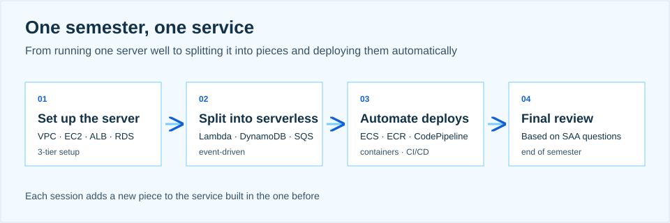

> From clicking around to building and running things together

I opened Cohort 1's first session with the kickoff: what ASBG UOS is and how the semester will go. Underneath all of it was one question. Why learn AWS together instead of alone? This post is my answer.

## 01. From certification prep to a community

I got into cloud last fall and, like a lot of people, started with certification study. Serverless architecture turned out to be the fun part, which led me to AWS Korea User Group seminars, and that experience is what eventually turned into starting a group like this on campus. Since September I've been a DevOps intern, spending most of that time on Kubernetes.

ASBG stands for AWS Student Builder Group. It's a student community program AWS runs at universities around the world, built around three words: Learn, Build, Connect. Learn what each AWS service is and when you'd use it, build things yourself to see what each service actually does, and show each other what you built while talking through career and technical questions. At the University of Seoul, Cohort 1 started this semester.

## 02. Clicking around the console vs. running a service

Say "studying AWS" and most people picture opening the console and clicking through EC2, S3, and the rest, one service at a time. But knowing a service's name and its screens is not the same as running something on it. Where does the server live, how do you deploy to it, what happens when traffic spikes, where does the money leak? Clicking around doesn't answer any of that. You have to go all the way to designing, deploying, and operating.

So this semester's regular sessions aren't ordered one service at a time. They're ordered so that one service grows a little each time. First, EC2 goes inside a VPC with an ALB in front and RDS behind it: a 3-tier setup, with a server that takes user requests, a load balancer that spreads traffic across several servers when it spikes, and a database managed separately from the application. Next, the parts that don't need a server move to Lambda and DynamoDB, with an SQS queue in between so work can be deferred and the pieces are less tightly coupled. Finally, ECR and ECS smooth out the differences between environments and CodePipeline automates deployment. At the end of the semester we go back over the whole thing with SAA questions.

In order: network and servers, then serverless and events, then containers and automated deployment. It starts as "run one server well" and moves step by step toward how a real service is actually operated.

## 03. The two places you get stuck alone

People who try AWS on their own tend to stall in the same two spots. The first is cost. The worry that a resource left running will come back as a bill stops a lot of people before they finish creating an account. So the group covers part of what session assignments cost. The point is that nobody should skip the hands-on part out of fear of the bill. In return, since a forgotten resource really can rack up charges, we build the habit of tearing things down when a lab is done.

The second is that, alone, the only work you ever see is your own. How someone else solved the same assignment, where they got stuck, how they got past it: that's the part only a community gives you. So assignments follow a fixed template (what you built, why you configured it that way, what went wrong, and screenshots of the result), go up as pull requests on GitHub, and we review each other's work. The record that builds up is each person's portfolio. I think the value of a community program is in showing up, listening together, asking questions, and seeing what others made.

## 04. Certifications come after

Rather than treating the certification as the goal, I'd recommend connecting things in this order: hands-on first, then the concepts, then certification study. Wire up several EC2 instances with an ALB in front yourself, then read "an ALB distributes traffic," and the same sentence lands differently. Study groups for the SAA and the like aren't scheduled by the core team; whoever wants one starts it and runs it. Rather than the core team deciding every activity, we want a structure where anyone can start what they want.

## 05. What learning together means

Connect doesn't mean only talking about AWS. Beyond the regular sessions, we're also building networking meetups for career questions and comparing notes on how everyone uses AI, exchanges with ASBG chapters at other universities, and talks from people working in the field.

Over the semester we'll build one service together, work through the parts that stall us together, and keep showing each other what we made. From the next session on, everyone opens their own console. The cloud is more fun than it looks.
