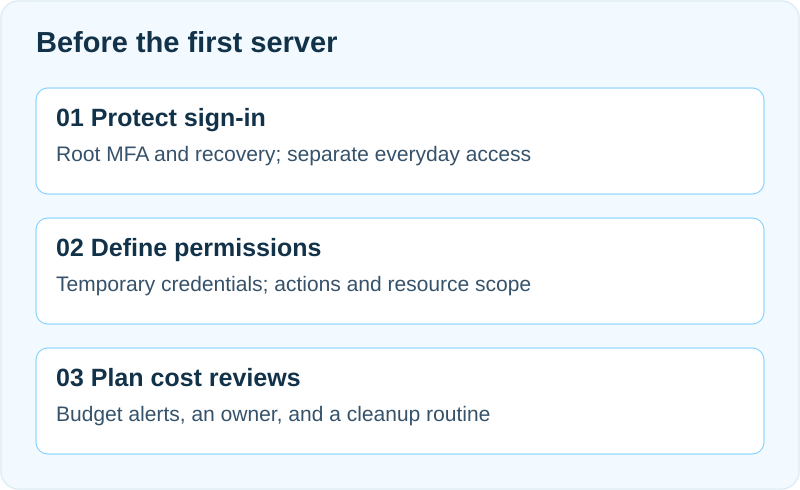

## From certifications to community

Leader Subin Son first got interested in cloud last fall and started, characteristically, by studying for certifications. That led to an interest in serverless architecture, then to AWS Korea User Group seminars, and eventually to starting this community. She has been a DevOps intern since September and has been deep in Kubernetes lately. The kickoff opened with that introduction before turning to the bigger picture: what ASBG UOS will actually do this semester, and why.

## What is ASBG UOS

ASBG stands for AWS Student Builder Group, a global student community program run by AWS. Studying AWS often brings to mind clicking through services like EC2 or S3 in the console one at a time, but what actually matters is experiencing how a service gets designed, deployed, and operated. ASBG centers on three directions:

- **Learn** — understand what each AWS service is and when to use it.
- **Build** — build things directly and confirm each service's role hands-on.
- **Connect** — share what you built with others and talk through career and technical questions together.

ASBG UOS launched with approval from Professor Minho Kim, head of the SW-centered university program, and was also selected as a NABIST project team for this semester.

## Five sessions, one continuous thread

This semester has five regular sessions, held on the Tuesdays listed below from 20:00–21:30 at Centennial Memorial Hall, Building B, Room 602.

| Date | Topic |
|---|---|
| 9/8 | Kickoff |
| 9/29 | VPC · EC2 · ALB · RDS |
| 11/3 | Lambda · DynamoDB · SQS |
| 11/24 | ECS · ECR · CodePipeline |
| 12/29 | Comprehensive review (based on SAA questions) |

Listed as service names, this can look complicated, but it reads naturally once you see it as building one web service. A server to handle requests (EC2) sits inside a VPC, an ALB spreads traffic across multiple servers when it spikes, and RDS stores data — together forming one 3-tier structure. The November sessions move a step further into a serverless, event-driven design where AWS manages more of the infrastructure (Lambda, DynamoDB), plus a queue (SQS) that defers processing to loosen coupling between services. The final November session brings in containers (ECR, ECS) to reduce environment differences, and CodePipeline to automate deployment as CI/CD.

Put together, the semester moves from network and server, to serverless and events, to containers and automated deployment — each step edging closer to how a real service actually runs.

## Beyond the regular sessions

Two more activities run alongside the regular schedule. A networking meetup is planned for Friday, October 2 — not just an AWS discussion, but a space to connect, talk about career paths, and share how people are using AI. There's also a self-organized study track: anyone who wants to study for a certification like the SAA can start and run their own study group. Rather than the core team deciding every activity, the goal is a structure where anyone can start what they want. Sessions with leaders from other university groups and talks from industry speakers are also in progress and will be announced separately from the Tuesday schedule once confirmed.

## Hands-on cost support

Using AWS directly can incur costs, so ASBG UOS — selected as a NABIST project — reimburses actual billed usage from session assignments, up to 60,000 KRW per person for the semester; anything beyond that is on the individual. The point is to keep cost anxiety from getting in the way of actually building things, while still building the habit of cleaning up resources afterward, since leaving something running can rack up unexpected charges. The recommendation is to spend this budget trying out services you wouldn't normally reach for, rather than keeping a long-running server up.

## Assignments are optional, but the record stays

Assignment participation is optional. Use the fixed four-part Markdown template — What I Built, Design Decisions, Troubleshooting, Screenshots — in the [Cohort 1 assignment repository](https://github.com/AWS-Student-Builder-Group-at-UOS/cohort-01-assignments), and submit **one PR per person per session**. Include at least one architecture diagram and one screenshot of your actual results in `images/`, and embed every image, including any additional images, in your submission README. The core team leads reviews, and general members can also comment and review. You reply or revise within the same PR. After [@Subin Son](/en/members/cohort-01#son-subin) gives final approval, the core team merges the submission to preserve the learning record.

Assessment covers completion requirements, reasons for design and configuration choices, and verification and troubleshooting. If no problems occurred, write `None` under Troubleshooting and record how you verified normal operation under Screenshots. Having a problem or avoiding one does not change the score. Standout assignments are selected using the published criteria: first place receives a 10,000 KRW Starbucks card, and second place receives a 5,000 KRW card. Submission steps, deadlines, and assessment details are available in the assignment repository.

## Completion requirements and benefits

Completion requires attending at least 4 of the 5 sessions. Arriving after the 10-minute mark counts as late, and two late arrivals count as one absence. Attendance matters not for its own sake, but because the value of a community program comes from showing up, listening together, asking questions, and seeing what others built. So while 4 sessions meets the requirement, attending all 5 is encouraged.

Those who complete the program receive a certification exam voucher and a certificate. Vouchers start with CLF (AWS Certified Cloud Practitioner); anyone who already holds the CLF can request the SAA instead. The certification itself isn't really the point — the recommended order is hands-on building, then concepts, then certification study. Reading "an ALB distributes traffic" after actually wiring up several EC2 instances behind one lands very differently than reading it cold.

## Join AWS Builder Center now

AWS Builder Center is the official learning platform for this program. Signing up now unlocks the student verification event, and the Workshop Studio's hands-on guides are ready to use right away. The newly added **Student Rewards** program offers the following benefits based on student verification and activity badges.

| Condition | Benefit |
|---|---|
| Student verification + complete profile | 12 months of AWS Skill Builder Premium |
| 7 badges | $10 AWS Credit |
| 14 badges | $20 additional AWS Credit |
| 21 badges | AWS Foundational Certification exam voucher |

Reaching 21 badges adds up to $30 in AWS Credit plus a Foundational Certification exam voucher worth about $100, and the 12-month Skill Builder Premium is listed as roughly $449 in value, covering 900+ courses, hands-on labs, and certification prep content. Sign up at [builder.aws.com/learn/students](https://builder.aws.com/learn/students) if you haven't already.

## Next session — Building a 3-Tier Web Service

The next session is Tuesday, September 29, on building a 3-tier web service. It covers VPC, EC2, Auto Scaling, ALB, and RDS, centered on one question: how do you keep a service from going down when traffic suddenly spikes? Starting from a single server that collapses under a sudden surge, the session walks through distributing traffic with an ALB, scaling server count with Auto Scaling, and separating the database from the application servers — finding the single point of failure (SPOF) and designing around it.

## A few closing notes

Important updates will keep landing in the announcements channel, so please check it. If you haven't joined the meetup or GitHub yet, now's the time. Submitting assignments is worth doing as much as possible — the process itself builds a portfolio on your GitHub. Study groups can be organized freely any time in the open chat. Also follow ASBG UOS on [Instagram](https://www.instagram.com/aws.sbg.uos) (@aws.sbg.uos) and [LinkedIn](https://www.linkedin.com/company/aws-student-builder-group-uos).

The [original slides](files/kickoff-slides.pdf) used for this talk have more detail.
