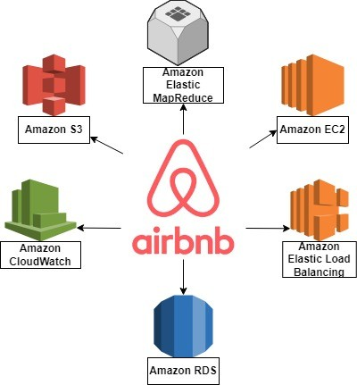

> 만드는 개발자에서 운영하는 개발자로

백엔드에서 서버와 API를, 프론트엔드에서 사용자 화면을 배우고 나면 일단 서비스 하나는 만들 줄 알게 됩니다. 저도 그 시점에 "이제 나 혼자서도 서비스 하나는 만들 수 있겠는데?"라고 생각했습니다. 이 발표는 그 생각이 어디서 깨졌는지에서 출발해서, 스타트업이 계속 시도하는 과정에서 클라우드와 인프라가 어떤 역할을 하는지까지 이어집니다.

## 01. 만드는 것과 서비스하는 것은 다르다

코드는 완성했습니다. 그런데 서비스를 실제로 열어 두려면 바로 다음 질문들이 따라옵니다. 서버는 계속 켜져 있는 건가? 사용자가 몰리면 어떻게 되지? 배포는 어떻게 안전하게 하지? 서버가 죽으면 누가 먼저 알지? 백엔드와 프론트엔드로 서비스의 형태를 만드는 것과, 그 서비스가 돌아가는 동안 생기는 문제를 감당하는 것은 다른 일이었습니다. 서버와 API, 배포와 서버 운영, 트래픽 대응, 데이터 관리, 장애 대응까지. **코드는 완성했지만, 서비스는 이제 시작입니다.**

## 02. 창업에서는 이 문제가 훨씬 커진다

보통의 팀이라면 백엔드 담당자, 프론트엔드 담당자, 인프라 담당자가 따로 있습니다. 스타트업은 다릅니다. 한 사람이 백엔드도, 프론트엔드도, 인프라와 운영도 맡습니다. 1인 1역이 아니라 1인 N역입니다.

그런데 스타트업에게 진짜 무서운 건 서버 그 자체가 아닙니다. 아이디어를 내고, MVP를 만들고, 출시하고, 사용자 반응을 보고, 고치는 과정을 반복해야 하는데, 검증하기도 전에 너무 많은 것을 먼저 준비해야 한다는 점입니다. 시작하기 전에 드는 돈(setup cost)과 계속 돌보는 데 드는 시간(operation load)이 그것입니다.

## 03. 스타트업은 결국 계속 시도하는 게임이다

스타트업은 가설을 세우고, MVP를 만들고, 출시하고, 반응을 보고, 수정하고, 다시 시도하는 일을 반복합니다. 한 번에 완벽한 결과를 내는 것보다 한 번의 시도를 얼마나 빠르고 싸게 할 수 있는가가 중요합니다. Time-to-Market과 Experiment Cost, 이 둘이 핵심 지표입니다. **1번의 완벽한 시도보다 10번의 빠른 시도.**

## 04. 작은 서비스 하나가 이렇게 커진다

Airbnb 사례를 봤습니다. 처음엔 작은 서비스였지만 어느 시점엔 EC2 인스턴스 200대를 돌리고, 하루 50GB의 데이터와 10TB의 사용자 사진을 다루게 됐고, 데이터베이스를 옮길 때는 15분의 다운타임을 감수해야 했습니다. 서비스가 커지면 인프라도 같이 커지고, 운영의 복잡성도 함께 늘어납니다.

## 05. 직접 만들 것인가

이 인프라를 직접 구축하고 운영한다고 가정해 보겠습니다. 엔지니어 3명이 6개월을 쓰면 18 engineer-months입니다. 그 시간은 어디에 쓸 수 있었을까요. 클라우드의 가치는 서버를 빌려 쓰는 데 있는 게 아니라, 인프라에 들어갈 사람과 시간을 제품 개발과 실험에 다시 쓸 수 있게 하는 데 있습니다.

## 06. 클라우드는 사실 시작 속도의 문제다

예전에는 서버를 사서 설치하고 네트워크를 구성하는 데 몇 주가 걸렸습니다. 지금은 콘솔에서 클릭 몇 번이면 몇 분입니다. 이게 스타트업에 주는 의미를 네 가지로 나눠 봤습니다.

- **SPEED** 시작이 몇 분이면 됩니다.
- **CAPITAL** 초기 인프라에 큰돈을 넣지 않아도 되니, 싸게 실패하고 다시 시도할 수 있습니다.
- **SCALE** 성공해서 트래픽이 늘어도 무섭지 않습니다. 그에 맞춰 늘리면 됩니다.
- **OPERATION** 인프라를 직접 돌보는 손이 줄어듭니다.

시도 한 번에 드는 시간과 비용이 낮아지고, 그만큼 더 많이 시도할 수 있습니다. **더 많은 반복이 더 높은 생존 확률로 이어집니다.**

## 07. 클라우드도 공짜는 아니다

그렇다고 클라우드가 모든 걸 해결해 주지는 않습니다. 규모가 커지면 비용도 같이 커지고, 특정 벤더에 묶이는 Vendor Lock-in 문제가 있고, 보안은 자동으로 되는 게 아니고, 작은 서비스에 과한 구조를 얹으면 오히려 독이 됩니다. 클라우드는 리스크를 없애는 기술이 아니라 리스크의 종류와 시점을 바꾸는 기술입니다. 어떤 리스크를 언제 감당할 것인가를 정하는 건 여전히 사람의 몫입니다.

## 08. 그래서 요즘 클라우드를 공부하고 있다

백엔드와 프론트엔드 다음에 인프라와 클라우드를 배우는 이유는 간단합니다. 전체가 실제로 돌아가는 방식을 알고 싶어서입니다. 클라우드를 공부한다는 건 AWS 서비스를 더 많이 아는 게 아니라, 만든 서비스를 실제 세상에서 계속 돌아가게 만드는 방법을 배우는 것이라고 생각합니다. 서비스를 만들고, 사용자 증가에 대응하고, 장애를 관리하고, 비용을 통제하고, 계속 운영하는 것까지. **만드는 사람에서, 서비스하는 사람으로.**
