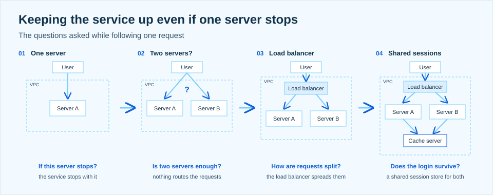
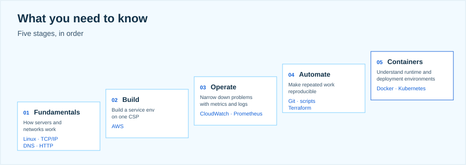

> A cloud engineer is someone who can explain the reason behind each choice

At the kickoff I took the question "learn the cloud, then do what?" Even once you've decided to study the cloud, it's hard to see what kind of company you'd end up at and what you'd actually do there. So I went in order: who builds and runs the cloud, how the roles divide up, what kind of request a cloud engineer actually gets and how they work through it, and what you need to know to do that.

## 01. Who builds the cloud, and who runs it

The industry splits roughly three ways. First there are the CSPs, the cloud service providers who supply the infrastructure and services themselves: global players like AWS, Azure, and Google Cloud, and domestic ones like Naver Cloud and KT Cloud. Then there are the MSPs, managed service providers who help customers adopt, build on, and operate the cloud, such as Megazone Cloud, LG CNS, and Samsung SDS. And there are the customers, the companies and organizations building their own services on top of the cloud, each with a development team that builds the service and an operations team that keeps it running. Learn the cloud and any of the three is open to you.

## 02. Same cloud, different roles

Even working on the same cloud, each role is preoccupied with a different question.

| Role | The question they keep asking | Center of the work |
|---|---|---|
| Solutions Architect (SA) | Which architecture fits the customer's needs? | Architecture design, technical proposals |
| Cloud Engineer | How do we build it and run it reliably? | Building and operating infrastructure, troubleshooting |
| DevOps Engineer | How do we deploy faster and more safely? | CI/CD, automation |
| SRE | How do we make the service more reliable? | Reliability, incident response, automation |

## 03. A cloud engineer explains the reason behind each choice

A customer request usually arrives as a sentence like this: "We'd like the service to keep going even if one server stops." A cloud engineer turns that into requirements, designs a structure, builds it, and runs it. And for every choice along the way, they need to be able to say why. In the talk I followed this one request and asked the questions one at a time.

If there's a single server A inside a VPC and users connect straight to it, the service stops the moment that server does. So we add a server B. But is two servers the end of it? Nothing decides which server a user's request should go to. So we put a load balancer in front and spread the requests. That raises the next question. If this request goes to A and the next one goes to B, does the login survive the switch? Not if each server keeps its sessions to itself. So we add a cache server as a shared session store that both servers use.

Real services are far more complex than this. The method is the same, though. Start from the request, ask the question, and add one component at a time as the answer, finding the reason for each.

## 04. What you need to know

To explain those reasons there are things you have to know, and I split them into five stages in order. Fundamentals means understanding how servers and networks work: Linux, TCP/IP, DNS, HTTP. Build means standing up a service environment on one CSP yourself, which for us is AWS. Operate means narrowing down a problem with metrics and logs, using tools like CloudWatch and Prometheus. Automate means making repeated work reproducible with Git, scripts, and Terraform. And containers means understanding runtime and deployment environments with Docker and Kubernetes.

## 05. The practical case for a cloud job

I closed with the practical side. Most cloud roles don't have a coding test. The competition feels less brutal than the developer market, though that is very much my personal opinion. And certifications actually count for something, which means it's clear what to prepare and the job hunt gets a lot more concrete.

I hope this gave you a clearer picture of where cloud skills lead and what you need to know to get there. This semester, let's become infrastructure geniuses together, with AWS.
