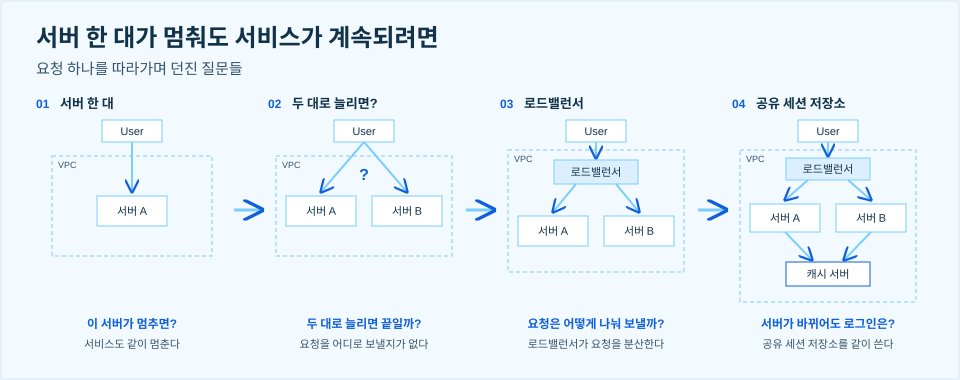
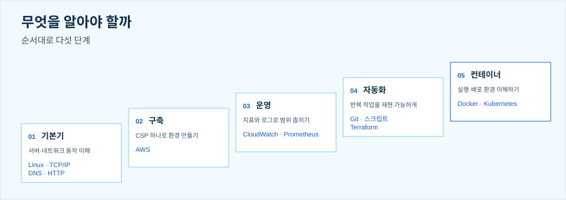

> 클라우드 엔지니어는 '선택의 이유'를 설명하는 사람입니다

킥오프 세션에서 저는 "클라우드를 배우면 어떤 일을 할까?"를 맡았습니다. 클라우드를 공부해 보기로 마음먹어도, 그걸 배우면 어떤 회사에서 무슨 일을 하게 되는지는 잘 안 보입니다. 그래서 누가 클라우드를 만들고 운영하는지, 직무는 어떻게 나뉘는지, 클라우드 엔지니어가 실제로 어떤 요청을 받아 어떻게 풀어 가는지, 그러려면 무엇을 알아야 하는지 순서로 정리했습니다.

## 01. 클라우드는 누가 만들고, 누가 운영할까

클라우드 업계는 크게 셋으로 나뉩니다. 먼저 클라우드 인프라와 서비스를 직접 제공하는 CSP가 있습니다. AWS, Azure, Google Cloud 같은 글로벌 사업자와 네이버 클라우드, KT 클라우드 같은 국내 사업자입니다. 다음으로 고객이 클라우드를 도입하고 구축하고 운영하는 일을 돕는 MSP가 있습니다. 메가존클라우드, LG CNS, 삼성SDS 같은 회사입니다. 마지막으로 그 클라우드 위에서 자기 서비스를 만드는 고객사가 있고, 그 안에는 서비스를 만드는 개발팀과 서비스를 돌리는 운영팀이 있습니다. 클라우드를 배우면 이 셋 중 어디로든 갈 수 있습니다.

## 02. 같은 클라우드, 서로 다른 역할

같은 클라우드를 다뤄도 직무마다 주로 붙잡고 있는 질문이 다릅니다.

| 직무 | 주로 고민하는 질문 | 업무의 중심 |
|---|---|---|
| Solutions Architect (SA) | 어떤 구조가 고객의 요구에 맞을까? | 아키텍처 설계, 기술 제안 |
| Cloud Engineer | 어떻게 구축하고 안정적으로 운영할까? | 인프라 구축과 운영, 문제 해결 |
| DevOps Engineer | 어떻게 더 빠르고 안전하게 배포할까? | CI/CD, 자동화 |
| SRE | 서비스의 신뢰성을 어떻게 높일까? | 신뢰성 관리, 장애 대응, 자동화 |

## 03. 클라우드 엔지니어는 '선택의 이유'를 설명한다

고객 요청은 보통 이런 문장으로 옵니다. "서버 한 대가 멈춰도 서비스가 계속됐으면 좋겠습니다." 클라우드 엔지니어는 이 요청을 요구사항으로 확인하고, 구조를 설계하고, 구축해서 운영합니다. 그리고 그 과정의 선택 하나하나에 왜 그렇게 했는지 이유를 댈 수 있어야 합니다. 발표에서는 이 요청 하나를 따라가면서 질문을 하나씩 던져 봤습니다.

VPC 안에 서버 A 한 대가 있고 사용자가 거기에 바로 붙는 구조라면, 이 서버가 멈추는 순간 서비스도 멈춥니다. 그래서 서버 B를 하나 더 둡니다. 그런데 두 대로 늘리면 끝일까요. 사용자의 요청을 어느 서버로 보낼지 정해 주는 것이 없습니다. 그래서 앞에 로드밸런서를 두고 요청을 나눠 보냅니다. 그러면 또 질문이 생깁니다. 이번 요청은 A가 받고 다음 요청은 B가 받는다면, 서버가 바뀌어도 로그인은 유지될까요. 세션을 각 서버 안에만 두면 유지되지 않습니다. 그래서 캐시 서버를 공유 세션 저장소로 두고 두 서버가 같이 쓰게 합니다.

실제 서비스는 이것보다 훨씬 복잡한 구조입니다. 그래도 방식은 같습니다. 요청에서 출발해 질문을 던지고, 그 답으로 구성 요소를 하나씩 더하면서 '이유'를 찾아갑니다.

## 04. 무엇을 알아야 할까

그 이유를 설명하려면 알아야 할 것들이 있습니다. 순서대로 다섯 단계로 나눴습니다. 기본기는 서버와 네트워크가 어떻게 동작하는지 이해하는 것이고, Linux, TCP/IP, DNS, HTTP가 여기에 들어갑니다. 구축은 한 CSP에서 서비스 환경을 직접 만들어 보는 단계로, 우리에게는 AWS입니다. 운영은 CloudWatch나 Prometheus 같은 도구로 지표와 로그를 보면서 문제의 범위를 좁히는 일입니다. 자동화는 Git과 스크립트, Terraform으로 반복 작업을 재현 가능하게 만드는 것이고, 컨테이너는 Docker와 Kubernetes로 실행 환경과 배포 환경을 이해하는 단계입니다.

## 05. 클라우드 취업이 좋은 현실적인 이유

마지막으로 현실적인 이유도 말씀드렸습니다. 클라우드 업계는 대부분의 직무에서 코딩테스트가 없습니다. 개발자 시장보다는 경쟁이 덜 빡세다고 느끼는데, 이건 지극히 개인적인 의견입니다. 그리고 자격증이 실제로 어필이 됩니다. 무엇을 준비해야 하는지가 분명하다는 뜻이고, 취업 준비에 명확성이 생깁니다.

클라우드를 배우면 어디서 무슨 일을 하게 되는지, 그 일을 하려면 무엇을 알아야 하는지 조금은 그려졌으면 합니다. 이번 학기, AWS와 함께 인프라 천재가 되어 봅시다.
