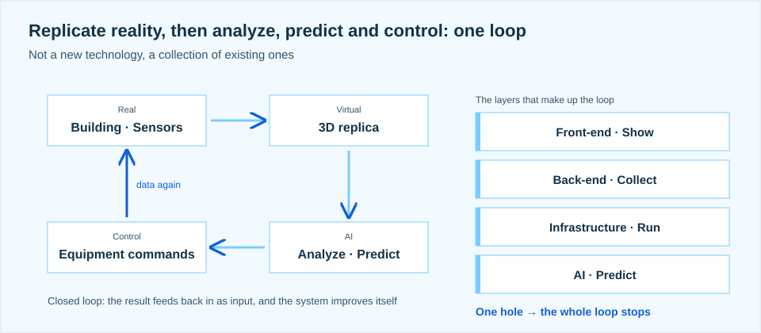
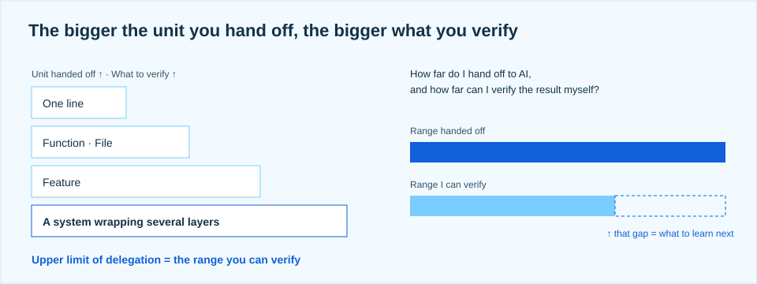
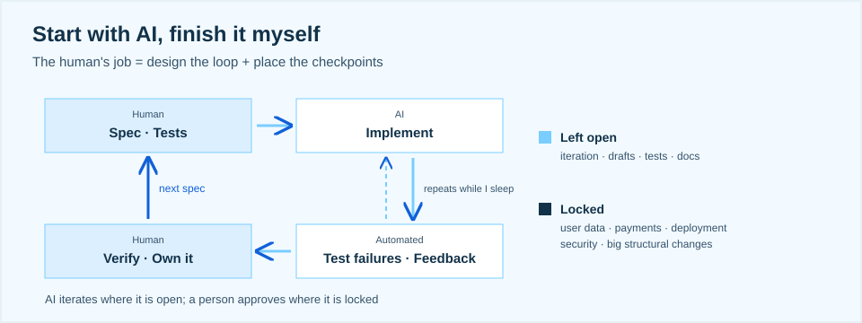

> How far do I hand off to AI, and how far can I verify the result myself?

At the ASBG UOS Cohort 1 kickoff I gave a talk titled "A First-Year Developer's Strategy for the AI Era." Having graduated only this year, I was fairly nervous about telling students a year or two behind me what I think. But with AI changing so much, I wanted to share what I actually think about as I work and study. This is a summary of what I said.

## 01. A loop of four interlocking layers

I build a smart-building digital twin platform. It connects building information with sensor data and feeds analysis results back into equipment control. Data from the building and its sensors is replicated in 3D in a virtual space, AI analyzes and predicts on that data, and the result goes back to the real world as equipment commands, which become data again: a closed loop. None of it is new technology, just existing technology brought together. The front-end shows, the back-end collects, the infrastructure runs, and the AI predicts.

Because front-end, back-end, infrastructure, and AI are interlocked like this, finding the cause of a problem meant understanding how each area connects to the others and how it behaves. When 3D objects didn't match sensor values it looked like a screen problem, but the cause was the data structure. When data stopped arriving it looked like an API problem, but the cause was the network and the deployment. The layer where the symptom shows is not the layer where the cause lives, and if you know only one layer you can't judge the cause.

## 02. The bigger the unit you hand off, the bigger what you verify

Screen, data, infrastructure: in every layer, AI has started filling in the implementation. But as the unit you hand to AI grows, what you have to verify grows with it, from a single line of code to functions and files, to a feature, to the whole system. To use AI well, I think you have to decide for yourself what to hand off, and widen the range of what you can verify along with it. More developers use AI tools every year and fewer trust the results, so this is a transition period, and in the end the upper limit of what you can delegate is what you can verify.

## 03. Connecting fields over going deep in one

"Do at least one thing properly" was right then and is right now. But depth used to mean implementation skill plus judgment, and AI is absorbing the implementation skill. So in the AI era I think a better strategy than digging deep into a single field is connecting several fields and understanding the whole flow. I try to learn front-end, back-end, cloud, and AI without drawing lines between them, and to understand how each technology connects to the others. The principle stands; what changed is what counts as something not just anyone can do.

## 04. Beyond IT

If you understand fields outside IT too, I think there are far more chances to use AI to connect different fields and create something new. Even in AX, where AI is brought in to change how a business works, you have to understand that business to judge what to improve and how. IT is execution and basic literacy, the domain is the source of ideas, and AI is the amplifier. People who know IT keep multiplying, but people who speak both IT and the domain are still rare.

For me that field is building equipment. So I'm also studying HVAC and building automation. I want to talk with equipment engineers, energy researchers, and facility operators, understand what each of them needs and why, and get that accurately into the software.

## 05. Start with AI, finish it myself

At work I keep the phrase "start with AI, finish it myself" in mind. The more you use it the more uses you see, so I use AI aggressively, but I take responsibility for the result. The human's job is to design the loop and place the checkpoints: I write the spec and the tests, AI implements, failing tests feed back automatically so it can iterate while I sleep, and I verify the result, own it, and write the next spec.

I'm working out the range I hand to AI (unlock) and the points where I judge and approve myself (lock). Iteration, drafts, tests, and docs stay open; user data, payments, deployment, security, and big structural changes stay locked.

## 06. Keeping a record

I also try to record on GitHub how I defined the problem, what I handed to AI, and what criteria I verified the result against. I want what I learn from trial and error to carry into the next piece of work, and a portfolio that shows how I work and how I've grown. In the talk I put this as three habits: look wide and never rule out "the back-end isn't my area," take responsibility to the end even for work AI started, and record all of it. The three habits have one purpose: widening the range of what I can verify.

## 07. So, infrastructure. So, ASBG

The environments a digital twin gets deployed to range from the cloud to air-gapped networks cut off from the internet, and sometimes a hybrid setup is needed that links on-site systems with the cloud. Configuring infrastructure for each of these showed me the limits of what I know. Even when AI helped build it, I struggled to explain why it was configured that way and to verify how it actually behaves.

How far do I hand off to AI, and how far can I verify the result myself? Looking at the gap between those two is how I decided what to learn next. Right now the area where I feel most lacking is infrastructure. That's why I joined ASBG, to learn and practice cloud and networking with other people and close that gap.
