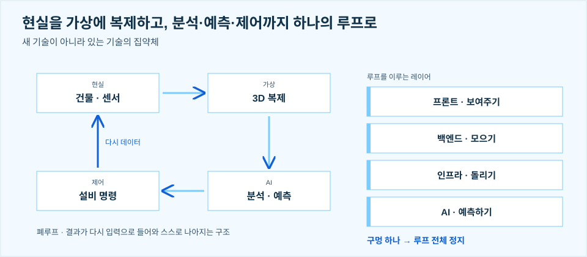
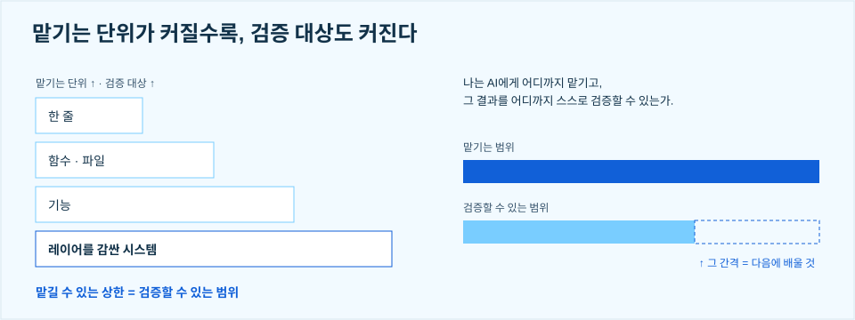
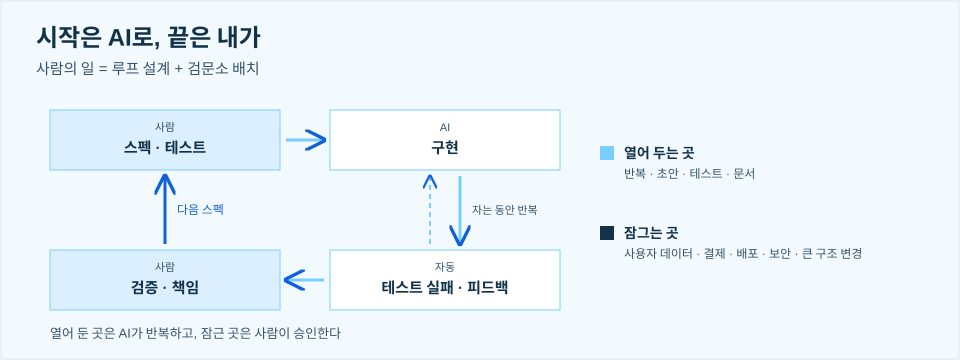

> 나는 AI에게 어디까지 맡기고, 그 결과를 어디까지 스스로 검증할 수 있는가

ASBG UOS 1기 킥오프에서 "1년차 개발자가 AI 시대에서 정한 전략"이라는 주제로 발표했습니다. 올해 초 졸업한 제가 후배들 앞에서 제 생각을 말하려니 꽤 떨렸지만, AI로 많은 것이 달라진 지금 제가 어떤 고민을 하며 일하고 공부하는지 이야기하고 싶었습니다. 발표에서 전한 내용을 정리합니다.

## 01. 네 레이어가 맞물린 루프

저는 스마트 빌딩 디지털트윈 플랫폼을 만들고 있습니다. 건물 정보와 센서 데이터를 연결하고, 분석 결과를 설비 제어에 활용하는 시스템입니다. 건물과 센서에서 나온 데이터가 가상 공간에 3D로 복제되고, AI가 그 데이터를 분석하고 예측하고, 결과가 설비 명령으로 현실에 돌아가서 다시 데이터가 되는 폐루프 구조입니다. 새 기술이 아니라 있는 기술의 집약체이고, 프론트가 보여 주고, 백엔드가 모으고, 인프라가 돌리고, AI가 예측합니다.

프론트엔드, 백엔드, 인프라, AI가 이렇게 맞물려 있다 보니, 문제의 원인을 찾으려면 각 영역이 어떻게 연결되고 동작하는지 이해해야 했습니다. 3D 객체와 센서값이 안 맞으면 화면 문제처럼 보이지만 원인은 데이터 구조에 있었고, 데이터가 안 오면 API 문제처럼 보이지만 원인은 네트워크와 배포에 있었습니다. 증상이 난 레이어와 원인이 있는 레이어는 다르고, 한 레이어만 알면 원인을 판단할 수 없습니다.

## 02. 맡기는 단위가 커지면 검증 대상도 커진다

화면, 데이터, 인프라 어느 레이어든 구현은 AI가 채우기 시작했습니다. 그런데 AI에게 맡기는 단위가 커지면 검증 대상도 코드 한 줄에서 함수와 파일, 기능, 시스템 전체로 넓어집니다. AI를 잘 활용하려면 무엇을 맡길지 스스로 판단하고, 그 결과를 검증할 수 있는 범위도 넓혀야 한다고 생각합니다. AI 도구를 쓰는 개발자는 해마다 늘고 결과를 믿는 개발자는 줄어드는 과도기이고, 맡길 수 있는 상한은 결국 검증할 수 있는 범위입니다.

## 03. 한 분야의 깊이보다 여러 분야의 연결

"한 가지라도 제대로 해라"는 조언은 그때도 맞았고 지금도 맞습니다. 다만 그때의 깊이는 구현 숙련과 판단력이었고, 그중 구현 숙련은 AI가 흡수하고 있습니다. 그래서 AI 시대에는 한 분야만 깊이 파고드는 것보다 여러 분야를 연결하며 전체 흐름을 이해하는 것이 더 좋은 전략이라고 생각합니다. 프론트엔드, 백엔드, 클라우드, AI를 가리지 않고 배우며 각 기술이 어떻게 연결되는지 이해하려 합니다. 원칙은 그대로이고, 바뀐 것은 '아무나 못 하는 것'의 내용입니다.

## 04. IT 밖의 분야까지

IT 밖의 분야까지 이해하면, AI를 활용해 서로 다른 분야를 연결하고 새로운 가치를 만들 기회도 많아진다고 생각합니다. AI를 도입해 업무 방식을 바꾸는 AX에서도 해당 분야의 업무를 이해해야 무엇을 어떻게 개선할지 판단할 수 있기 때문입니다. IT는 실행력이자 기본 교양이고, 도메인은 아이디어의 원천이고, AI는 증폭기입니다. IT를 아는 사람은 계속 많아지지만, IT와 도메인의 말을 둘 다 알아듣는 사람은 아직 드뭅니다.

제게는 건물 설비가 그런 분야입니다. 그래서 공조 설비와 건물 자동제어도 공부하고 있습니다. 설비 엔지니어, 에너지 연구자, 시설 운영자와 소통하며 각자의 요구와 판단 근거를 이해하고, 이를 소프트웨어에 정확히 반영하고 싶습니다.

## 05. 시작은 AI로, 끝은 내가

일할 때는 '시작은 AI로, 끝은 내가'를 떠올립니다. 직접 써볼수록 활용 방법도 보이기에 AI를 적극적으로 사용하되, 결과는 제가 책임지려 합니다. 사람의 일은 루프를 설계하고 검문소를 배치하는 것입니다. 제가 스펙과 테스트를 쓰고, AI가 구현하고, 테스트가 실패하면 피드백이 자동으로 돌아가 자는 동안에도 반복하고, 제가 결과를 검증하고 책임진 다음 다음 스펙을 씁니다.

AI에게 맡길 범위(unlock)와 제가 직접 판단하고 승인할 지점(lock)을 정해 가고 있습니다. 반복, 초안, 테스트, 문서는 열어 두고, 사용자 데이터, 결제, 배포, 보안, 큰 구조 변경은 잠급니다.

## 06. 기록으로 남기기

문제를 어떻게 정의했는지, AI에게 무엇을 맡겼는지, 결과를 어떤 기준으로 검증했는지도 GitHub에 기록하려 합니다. 시행착오에서 배운 점을 다음 작업에 반영하고, 제 작업 방식과 성장 과정이 드러나는 포트폴리오를 만들고 싶습니다. 발표에서는 이걸 습관 셋으로 정리했습니다. "프론트니까 백엔드는 안 봐"라고 배제하지 않고 넓게 보기, AI로 시작한 일이라도 끝까지 책임지기, 그리고 전부 기록하기. 세 습관의 목적은 하나, 검증할 수 있는 범위를 넓히는 것입니다.

## 07. 그래서 인프라, 그래서 ASBG

디지털트윈을 배포하는 환경도 클라우드부터 인터넷과 분리된 폐쇄망까지 다양합니다. 현장 시스템과 클라우드를 연계하는 하이브리드 구성이 필요할 때도 있습니다. 환경에 맞게 인프라를 구성하면서 제 지식의 한계를 많이 느꼈습니다. AI의 도움으로 구축해도 왜 그렇게 구성했는지, 실제로 어떻게 동작하는지 충분히 설명하고 검증하기 어려웠습니다.

나는 AI에게 어디까지 맡기고, 그 결과를 어디까지 스스로 검증할 수 있는가. 이 두 범위 사이의 간격을 돌아보며 다음에 무엇을 배울지 정하게 되었습니다. 지금 제가 가장 부족하다고 느끼는 분야는 인프라입니다. 그래서 ASBG에 합류했고, 클라우드와 네트워크를 함께 배우고 실습하며 그 간격을 좁혀 가고 싶습니다.
