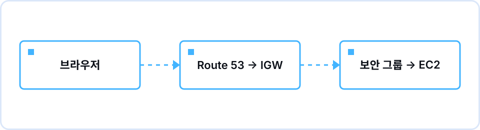

## Overview

Session 02, held on the evening of Tuesday, September 29 in the Information Technology Building, was the first in a series that grows one online shop step by step. There was one goal: by the end, every participant should be able to draw and explain the journey of one request, from the moment a URL is typed into the browser to the moment an EC2 instance sends a response back. Every later session builds on this picture, so we spent the time on where the network boundaries fall rather than on memorizing service names.

Sujin Hwang (Tech Lead) ran the session. The first 55 minutes went through VPC, subnets, and security groups in order, and after each concept we opened the console on the demo account to see where the setting actually lives. On the whiteboard we drew one large box first (the VPC, 10.0.0.0/16) and filled it in with subnets and an instance as the explanation moved along. The next 15 minutes were a live demo launching a single t3.micro, and we closed the 90 minutes by drawing the request's journey on the whiteboard together. The remaining half hour went to checking Session 01 assignment submissions (root MFA, Budgets) and individual questions.

The point that confused people most, as expected, was the difference between a public and a private subnet. Only after seeing that the subnet creation screen has no "public" option did it land that the only criterion is whether the route table has a route to an internet gateway. Why a response can leave without a separate outbound rule in the security group (stateful behavior) also drew a run of questions.

## What we covered

| Time | Content |
|---|---|
| 19:00–19:10 | Intro — the goal for the evening: be able to explain "the journey of one request" as a drawing |
| 19:10–19:25 | VPC — an isolated virtual network inside the account, choosing an IP range with a CIDR block, regions and Availability Zones as concepts only |
| 19:25–19:40 | Subnets — why we split a VPC, the internet gateway, and checking the public/private criterion on an actual route table screen |
| 19:40–19:55 | Security groups — instance-level firewall, inbound/outbound, deny-all by default with allow rules added on top |
| 19:55–20:10 | Live demo — launching one EC2 instance: AMI, instance type, key pair, attaching the security group |
| 20:10–20:20 | The request's journey — browser → Route 53 → IGW → route table → security group → EC2, drawn together on the whiteboard |
| 20:20–20:30 | Assignment briefing and Q&A |

## Concepts we pinned down

- **VPC** — A logically isolated virtual network inside an AWS account. The first decision is the CIDR block (for example 10.0.0.0/16) that defines the usable IP range.
- **Subnet** — A smaller slice of the VPC, tied to a single Availability Zone. We left the AZ itself as a concept only, parking the question "what if one goes down?" for later.
- **Public vs. private** — Not a property of the subnet itself. It comes down to whether the attached route table has a 0.0.0.0/0 → internet gateway route.
- **Internet gateway** — The doorway between the VPC and the internet. Creating it is not enough; it has to be attached to the VPC and referenced from a route table before anything works.
- **Security group** — An instance-level firewall. Deny-all by default with allow rules only, and stateful, so the response to an allowed inbound request leaves without an outbound rule. We did not cover NACLs this time.
- **EC2** — We narrowed instance creation down to four choices: AMI (OS image), instance type (specs), storage, and key pair (SSH key).

## Assignment and results

The assignment was optional. Create one VPC and one public subnet, launch one EC2 instance with Apache or Nginx installed, and post a screenshot of the web page loaded in your own browser via the instance's public IP. We estimated 1 to 1.5 hours. For cost, only the free-tier t2.micro or t3.micro, and the last slide asked everyone to Stop or Terminate the instance once done. As a stretch, we suggested adding one private subnet.

Two blockers repeated across the submissions. First, opening only port 22 for SSH in the security group and forgetting port 80, so SSH worked while the browser just kept loading. Second, creating the VPC with the "VPC only" option and never adding a 0.0.0.0/0 route to the route table, so the instance had a public IP but nothing could reach it. Both were points we had checked on screen during the session, which confirmed that they are easy to miss again once you are doing it yourself.

## Questions that came up

**Q.** Route 53 was not part of today's hands-on, so why is it in the request's journey?
A. People remember domain names and the network works with IP addresses, so in a real service the browser first asks DNS for the IP before anything else. This assignment skips that step because you type the public IP directly; we kept it in the drawing so the full flow stays visible.

**Q.** I only opened inbound port 80 in the security group. Does the response need its own outbound rule to reach my browser?
A. No. Security groups are stateful, so the response to an allowed inbound request goes out automatically. The default outbound rule is also allow-all, so you will rarely touch outbound during this exercise.

**Q.** If I just Stop the instance after the exercise, is the bill zero?
A. Instance charges stop, but the attached storage keeps billing a small amount. That is fine within the free tier, but if you will not use it again, Terminate is cleaner. We also noted that the public IP changes when you Stop and Start again.

## Keywords to review

`CIDR block`, `public subnet`, `internet gateway`, `0.0.0.0/0`, `security group (stateful)`, `AMI`, `key pair`

## Toward the next session

Because the assignment blockers overlapped with the exact points we had checked on screen, the next brief will ship with a "where people get stuck" checklist alongside the assignment. Session 03 (11/3) picks up from the single server we launched this time.
