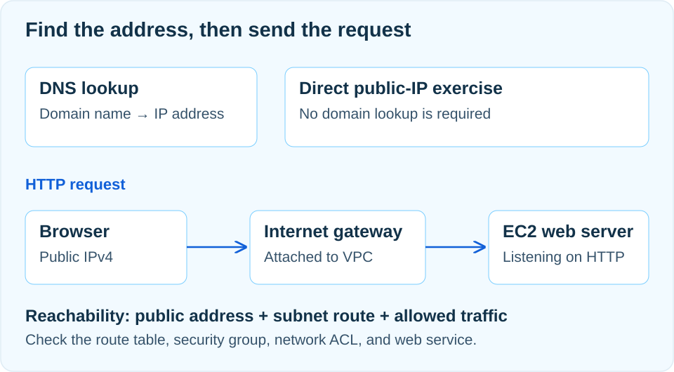

## 첫 서버의 목표는 응답 한 장입니다

상품 세 개와 가격을 보여주는 작은 쇼핑몰을 생각해 봅시다. HTML 파일은 이미 있지만 내 노트북에서만 열립니다. 다른 사람이 주소를 입력했을 때도 같은 페이지를 받으려면, 파일을 읽어 응답할 서버와 그 서버까지 도달하는 길이 필요합니다. 이 발표에서는 개인정보 없는 정적 페이지를 EC2 한 대에 올리는 구성을 출발점으로 삼습니다.

처음부터 데이터베이스와 여러 서버를 붙이면 실패 원인을 나누기 어렵습니다. 우선 “외부에서 요청을 보냈고, 내가 만든 서버가 기대한 본문을 돌려줬다”를 확인합니다. 페이지가 뜬다는 사실에 더해, 주소·경로·허용 규칙 중 하나를 바꾸면 어떤 증상이 생기는지 설명할 수 있어야 합니다.

## VPC와 서브넷으로 주소의 범위를 정합니다

VPC는 사용할 네트워크 주소 공간의 경계입니다. 예를 들어 VPC를 `10.0.0.0/16`, 첫 서브넷을 `10.0.1.0/24`로 잡으면 서버의 사설 주소는 해당 서브넷 범위에서 할당됩니다. 예시 주소를 외우기보다 서브넷이 VPC 안에 포함되고, 서로 겹치지 않는지 확인하는 것이 중요합니다. 나중에 다른 네트워크와 연결할 계획이 있다면 그쪽 주소 범위도 함께 고려합니다.

서브넷 하나는 하나의 가용 영역에 속합니다. EC2를 생성할 때 VPC와 서브넷을 선택하는 것은 서버가 어디에 놓일지 정하는 일입니다. 이름에 `public`을 붙였다고 인터넷 연결이 생기지는 않습니다. 해당 서브넷에 실제로 연결된 라우팅 테이블을 봐야 합니다.

## 퍼블릭 주소와 인터넷 경로를 함께 준비합니다

IPv4로 직접 접속하는 이 구성에는 네 조건이 필요합니다. VPC에 인터넷 게이트웨이(IGW)를 연결하고, 서브넷의 라우팅 테이블에 인터넷 목적지 경로를 넣고, EC2에 퍼블릭 IPv4 주소를 할당하고, 필요한 통신을 허용해야 합니다. 예를 들어 `0.0.0.0/0 → IGW`는 다른 경로에 더 구체적으로 해당하지 않는 인터넷행 IPv4 트래픽의 목적지를 정합니다.

IGW로 향하는 경로가 있는 서브넷을 퍼블릭 서브넷이라고 부릅니다. 그래도 퍼블릭 주소나 접근 규칙이 빠진 인스턴스까지 자동으로 공개되는 것은 아닙니다. 주소만 있고 경로가 없는 경우도 인터넷 통신이 되지 않습니다. 구성 조건은 [AWS의 인터넷 게이트웨이 안내](https://docs.aws.amazon.com/vpc/latest/userguide/VPC_Internet_Gateway.html)를 기준으로 확인합니다.



## DNS는 웹 요청을 대신 전달하지 않습니다

도메인으로 접속하면 먼저 DNS를 통해 연결할 주소를 알아냅니다. Route 53을 권한 있는 DNS 서비스로 사용할 수 있지만, 주소를 받은 뒤의 HTTP 통신이 Route 53 서버를 경유하는 것은 아닙니다. 브라우저는 조회 결과로 얻은 주소에 연결합니다. DNS 캐시 때문에 매번 같은 조회 과정을 반복하지 않을 수도 있습니다. [AWS의 DNS 요청 흐름](https://docs.aws.amazon.com/Route53/latest/DeveloperGuide/welcome-dns-service.html)에 두 단계가 구분되어 있습니다.

퍼블릭 IP를 직접 입력하는 첫 확인에서는 도메인 조회를 따로 구성할 필요가 없습니다. IP로는 열리는데 도메인으로 안 열린다면 웹 서버를 다시 만들기 전에 레코드의 대상과 조회 결과부터 비교합니다. 반대로 도메인이 올바른 주소를 반환해도 웹 서버가 응답한다는 보장은 없습니다.

## 보안 그룹에는 허용할 통신을 구체적으로 적습니다

새로 만드는 보안 그룹은 인바운드 규칙이 없고, 기본 아웃바운드는 전체 허용입니다. VPC에 자동으로 생기는 기본 보안 그룹이나 생성 마법사가 추가한 규칙은 별도로 확인해야 합니다. 모두 “처음이니 양방향 전체 차단”이라고 가정하면 실제 설정을 잘못 읽게 됩니다. 보안 그룹 규칙은 허용 규칙이며 명시적인 거부 규칙을 추가하는 방식이 아닙니다. [AWS 보안 그룹 규칙](https://docs.aws.amazon.com/vpc/latest/userguide/security-group-rules.html)을 참고합니다.

이 실습에서 웹 페이지를 내 브라우저에만 보여주려면 HTTP 80번의 소스를 내 공인 IP로 제한합니다. SSH가 필요할 때도 22번을 필요한 출발지에만 엽니다. 인터넷에 공개할 페이지라면 공개 범위와 HTTPS 구성을 따로 결정합니다. 보안 그룹은 상태를 추적하므로 허용된 요청의 응답에는 반대 방향의 별도 규칙이 필요하지 않습니다. 서버가 새로 시작하는 외부 통신과는 구분해야 합니다.

## 서버 안에서 확인한 뒤 바깥에서 확인합니다

EC2를 만들 때는 운영체제 이미지, 인스턴스 사양, 디스크뿐 아니라 앞서 정한 서브넷과 보안 그룹을 연결합니다. 네트워크가 준비되어도 웹 서버 프로그램이 실행 중이지 않으면 페이지는 나오지 않습니다. Nginx를 설치한 Linux 인스턴스라면 먼저 서버 안에서 아래 상태를 읽어 볼 수 있습니다.

```sh
sudo systemctl status nginx --no-pager
sudo ss -lntp
curl --max-time 5 -i http://127.0.0.1/
```

서비스가 실행 중인지, 80번 포트에서 연결을 기다리는지, 로컬 요청에 상태 코드와 본문이 돌아오는지 순서대로 봅니다. `127.0.0.1`에만 묶인 애플리케이션은 서버 내부에서만 접근할 수 있으므로 외부 요청을 받을 바인딩 주소도 확인합니다. 준비되면 내 컴퓨터의 브라우저에서 `http://퍼블릭-IPv4/`로 같은 본문을 확인합니다. HTTP만 구성한 상태에서 HTTPS로 접속하면 다른 포트와 프로토콜을 요청하게 됩니다.

## 오류 문구로 확인 범위를 좁힙니다

SSH가 되는데 HTTP가 안 된다면 인터넷 연결 전체가 없는 것과는 다른 상황입니다. 웹 포트의 허용 규칙, 실행 중인 프로세스, 리슨 주소를 먼저 봅니다. 연결이 시간 초과되면 현재 퍼블릭 IP, 서브넷의 실제 라우팅 테이블 연결, 보안 그룹 소스를 점검합니다. 회사나 집의 네트워크가 바뀌어 내 공인 IP가 달라진 경우도 있습니다. 별도로 변경한 네트워크 ACL이나 운영체제 방화벽이 있다면 해당 규칙도 확인합니다.

`Connection refused`는 대상 포트에서 연결을 받아줄 프로그램이 없거나 적극적으로 거부한 경우에 살펴볼 단서입니다. HTTP 403이나 404가 돌아왔다면 적어도 웹 서버의 응답을 받은 것이므로 파일 권한, 문서 루트, 요청 경로를 확인하는 쪽이 맞습니다. 한 번에 규칙을 전부 열기보다 관찰한 증상에 맞춰 설정 하나와 결과 하나를 대응시킵니다.

## 서버를 멈추는 것과 비용을 정리하는 것은 다릅니다

작은 인스턴스 타입이라는 이유만으로 무료를 보장할 수 없습니다. 계정에 적용되는 혜택과 사용 조건을 확인하고, 실행 시간·스토리지·주소·전송량을 함께 살펴야 합니다. 이 구성에서 EBS 기반 인스턴스를 중지하면 컴퓨팅 사용 과금은 멈추지만 EBS 등 남은 리소스의 비용까지 사라지는 것은 아닙니다.

다시 사용할 계획이 없다면 필요한 파일을 먼저 보관하고 인스턴스 종료와 남은 리소스 정리를 구분해서 확인합니다. 볼륨은 종료 시 삭제 설정에 따라 남을 수 있고, 자동 할당 퍼블릭 IPv4는 중지 후 시작할 때 바뀔 수 있습니다. 따라서 북마크에 저장한 주소가 계속 유효하다고 가정하지 않습니다. [AWS의 인스턴스 상태별 동작과 과금](https://docs.aws.amazon.com/AWSEC2/latest/UserGuide/ec2-instance-lifecycle.html)을 기준으로 마지막 상태까지 확인해야 첫 서버 구성이 마무리됩니다.
