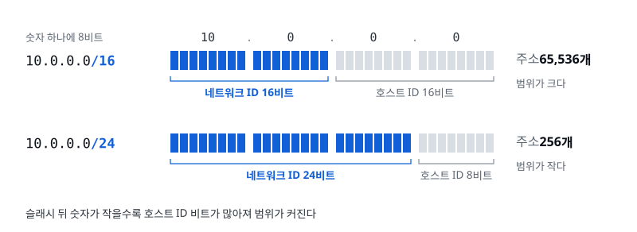
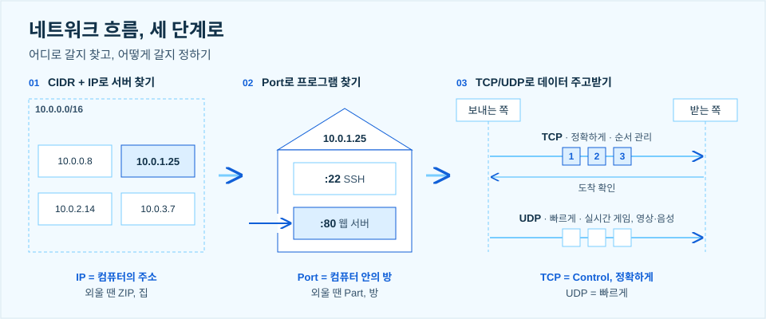
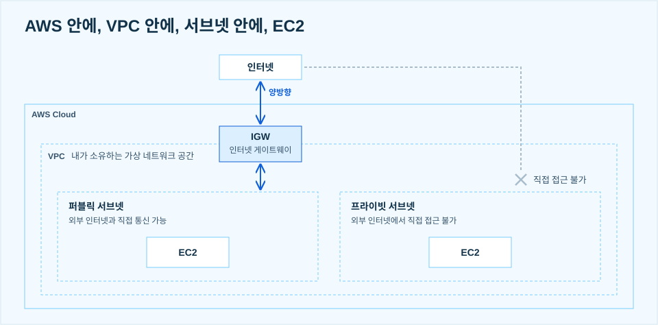
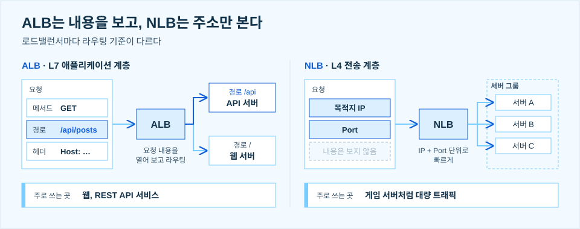
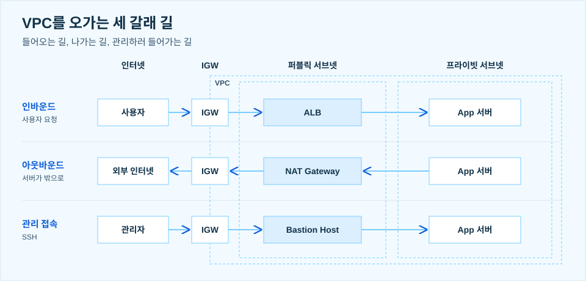
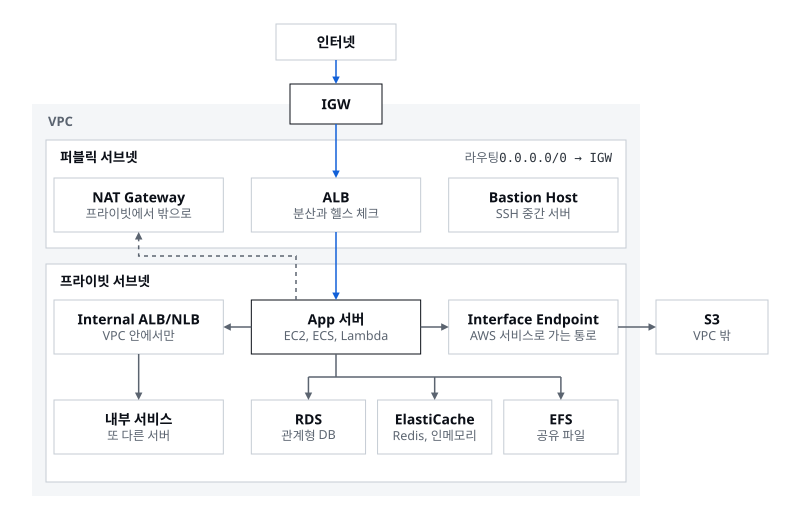
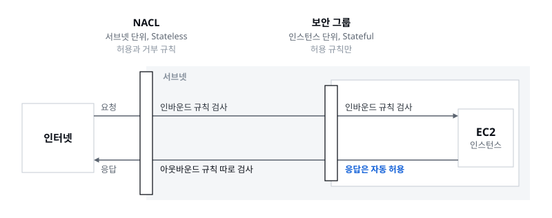

> AWS 안에 VPC, VPC 안에 서브넷, 서브넷 안에 EC2

세션 02의 첫 발표를 맡았습니다. 이번 세션부터 AWS 안의 네트워크를 본격적으로 다룹니다. 네트워크 자체는 데이터 통신 같은 수업에서 깊이 배우게 될 테고 설명하자면 끝이 없는 분야라, 꼭 알아야 하는 용어만 빠르게 짚고 AWS 서비스로 넘어갔습니다. 새 용어를 이미 아는 개념과 엮어 체화하는 방법도 곳곳에 함께 담았습니다.

## 01. 어디로? IP와 포트

네트워크는 무언가를 전달하는 일이니, 우리가 배달원이라고 생각해 보겠습니다. 가장 먼저 궁금한 건 '어디로 가야 하지?'입니다. 그 '어디'에 해당하는 개념이 IP와 포트입니다. **IP는 컴퓨터의 주소이고, 포트는 그 컴퓨터 안의 특정 방입니다.**

앞으로 용어가 정말 많이 나올 테니, 자기만의 방식으로 체화하는 방법이 필요합니다. 저는 IP는 글자가 비슷한 ZIP, 곧 '집'으로 외우고, 포트는 비슷하게 생긴 Part, 곧 집의 한 부분인 '방'으로 외웠습니다. 제가 데이터 통신 과목을 싫어했던 건 외울 게 많아서라고 생각했는데, 돌아보면 체화하려는 노력조차 안 해서였습니다. 지금 배우는 기초부터 이렇게 탄탄히 외워 두면 그 위에 무엇이 쌓여도 헷갈리지 않습니다.

## 02. 어떻게? TCP와 UDP

어디로 갈지 알았으면 이제 어떻게 갈지 정해야 합니다. 오토바이가 있으면 오토바이로, 없으면 두 다리로 가는 것처럼요. 그 방법에 해당하는 개념이 TCP와 UDP입니다.

약어를 풀어 쓴 이름까지 외우게 하는 시험 문제는 정말 싫어하지만, 외우는 데 꼭 필요한 것들은 슬라이드에 풀어서 적어 뒀으니 그것만큼은 알고 가면 좋겠습니다. TCP는 Transmission Control Protocol의 줄임말인데, 가운데 C가 Control이라는 것만 외워도 절반은 갑니다. 전달을 '관리'하는 쪽이라 정확하게 보내는 게 우선이고, 순서를 맞추고 잘 도착했는지 확인합니다. TCP와 UDP는 어디서든 짝으로 나오니, UDP는 TCP와 비교해서 기억해 두면 충분합니다. 정확함보다 빠른 게 더 중요한 곳에 씁니다.

| | TCP | UDP |
|---|---|---|
| 한 줄 요약 | 정확하게 전달 | 빠르게 전달 |
| 특징 | 순서 관리, 도착 확인 | 순서와 도착을 챙기기보다 속도 우선 |
| 주로 쓰는 곳 | HTTP/HTTPS 웹 통신, DB 연결 | 실시간 게임, 실시간 영상·음성 스트리밍 |

## 03. CIDR, IP 주소의 범위를 적는 법

CIDR은 IP 주소의 범위를 표현하는 방식입니다. 10.0.0.0/16을 예로 들면, 점으로 나뉜 숫자 하나가 8비트라서 IPv4 주소는 모두 32비트입니다. 앞의 10.0.0.0은 네트워크 주소이고, 슬래시 뒤의 16은 네트워크 ID에 쓰는 비트 수입니다. 앞 16비트를 네트워크 ID에 쓰면 남은 뒤 16비트는 자동으로 호스트 ID가 됩니다.

CIDR은 보통 "범위가 크다, 작다"로 이야기합니다. 범위가 크다는 건 호스트 ID에 쓰는 비트 수가 많다는 뜻이니, **슬래시 뒤 숫자가 작을수록 범위가 큽니다.** /16이면 호스트 ID가 16비트라 주소가 65,536개, /24면 8비트라 256개입니다.

## 04. 지금까지를 한 줄로

네트워크는 새 개념을 하나 배울 때마다 그게 어디에 쓰이는지, 이미 아는 것과 어떻게 이어지는지 계속 연결하면서 공부하는 게 좋습니다. 그래서 지금까지 나온 용어만으로 흐름을 정리해 봤습니다. **CIDR과 IP로 서버를 찾고, 포트로 프로그램을 찾고, TCP나 UDP로 데이터를 주고받습니다.**

## 05. AWS 안에, VPC 안에, 서브넷 안에, EC2

이제 AWS 서비스로 넘어갑니다. 여기서부터는 정말 많은 용어가 나오니, 무엇이 무엇 안에 있는지를 머릿속에 먼저 그려 두고 보면 훨씬 쉽습니다. 출발점은 이 한 줄입니다. AWS 안에 VPC가 있고, VPC 안에 서브넷이 있고, 서브넷 안에 EC2가 있다.

VPC는 ASBG 부원이라면 길 가다 누가 물어봐도 답할 수 있어야 하는 개념입니다. AWS 하면 VPC라고 할 만큼 기본이 되니까요. Virtual Private Cloud, 이름 그대로 **AWS 안에 내가 소유하는 가상 네트워크 공간**입니다.

그 VPC의 주소 범위를 다시 작은 범위로 나눈 것이 서브넷입니다. 10.0.0.0/16인 VPC 안에 10.0.1.0/24 서브넷을 두는 식입니다. 서브넷은 인터넷과 어떻게 연결되느냐에 따라 두 가지로 나뉩니다. 퍼블릭 서브넷은 외부 인터넷과 직접 통신할 수 있고, 프라이빗 서브넷은 외부 인터넷에서 직접 접근할 수 없습니다.

## 06. 퍼블릭 서브넷: 인터넷으로 통하는 길이 있는 곳

어떤 서브넷을 퍼블릭이라고 부를지에는 기준이 있습니다. 라우팅 테이블은 서브넷에서 나가는 트래픽을 목적지별로 어디로 보낼지 적어 둔 표인데, 기준은 **이 표에 0.0.0.0/0 경로가 인터넷 게이트웨이(IGW)로 향하고 있는가**입니다. 0.0.0.0/0은 모든 IPv4 주소를 뜻합니다. VPC 안으로 가는 트래픽은 따로 있는 local 경로를 먼저 타니, 결국 'VPC 밖이라면 어디로 가든 IGW로 보내라'는 길이 있으면 퍼블릭 서브넷입니다. 그래서 이 경로를 IGW 경로라고도 부릅니다.

인프라에는 줄임말이 정말 많은데, 게이트웨이도 흔히 GW로 줄여 부릅니다. 그래서 인터넷 게이트웨이는 IGW입니다. IGW는 VPC와 인터넷을 연결해 주는 AWS 리소스이고, VPC 하나에 IGW 하나를 연결할 수 있으며, 양방향 통신을 지원합니다. 앞으로 계속 나올 두 단어도 여기서 짚고 가겠습니다. 인바운드는 외부에서 VPC로 들어오는 방향, 아웃바운드는 VPC에서 외부로 나가는 방향입니다.

퍼블릭 서브넷에 주로 두는 리소스는 세 가지입니다.

**로드밸런서.** 하나의 엔드포인트로 트래픽을 받아 여러 대의 서버로 나눠 보냅니다. 그래서 단일 진입점이 되고 트래픽을 분산하며, 헬스 체크로 뒤에 있는 서버가 살아 있는지 확인해 정상인 서버로만 요청을 보냅니다. 종류가 여럿인데 대표적인 두 가지가 ALB와 NLB입니다. ALB는 Application Load Balancer라는 이름 그대로 애플리케이션 계층(L7)에서 동작합니다. NLB는 이름에 Network가 들어 있지만 네트워크 계층(L3)이 아니라 전송 계층(L4)에서 동작한다는 점을 주의해야 합니다. L7, L4는 네트워크를 일곱 계층으로 나눈 OSI 7계층 기준의 번호입니다.

| | ALB (Application Load Balancer) | NLB (Network Load Balancer) |
|---|---|---|
| 계층 | L7 애플리케이션 계층 | L4 전송 계층 |
| 라우팅 기준 | HTTP/HTTPS 요청의 내용(메서드, 경로, 헤더)을 보고 라우팅 | 요청 내용은 보지 않고 IP + Port 단위로 빠르게 라우팅 |
| 주로 쓰는 곳 | 웹, REST API 서비스 | 게임 서버처럼 대량 트래픽을 빠르게 처리할 때 |

**NAT Gateway와 NAT Instance.** 둘 다 프라이빗 서브넷의 리소스가 아웃바운드할 수 있게 해 줍니다. 프라이빗 서브넷은 외부에서 직접 들어올 수 없는 곳이지만, 안에서 밖으로 나가야 할 일은 생기기 때문입니다. NAT Gateway는 AWS가 관리해 주는 관리형 서비스이고, NAT Instance는 EC2 인스턴스를 NAT 역할로 직접 구성하는 사용자 관리형 인스턴스입니다. 직접 관리하는 수고가 드는 대신 인스턴스 요금만 내면 되니, NAT Instance를 NAT Gateway의 저렴이 버전이라고 부르기도 합니다. 한 문장으로 정리하면, **프라이빗 서브넷의 리소스는 퍼블릭 서브넷의 NAT Gateway를 거쳐 IGW를 통해 외부 인터넷으로 나갑니다.**

**Bastion Host.** 인터넷에서 SSH로 프라이빗 서브넷 안의 서버에 접속할 때 거쳐 가는 중간 서버입니다. 인터넷에서 IGW를 지나 퍼블릭 서브넷의 Bastion Host로 들어간 다음, 거기서 프라이빗 서브넷의 서버로 접근합니다. 실제로는 중간에 생략된 단계가 많지만, 지금까지 나온 용어로만 나타내면 이런 모양입니다.

## 07. 프라이빗 서브넷: 밖에서 바로 닿지 않는 곳

프라이빗 서브넷의 중심은 **App 서버**입니다. 실제 비즈니스 로직을 처리하는 서버이고, 여기서도 인바운드와 아웃바운드가 나옵니다. 사용자의 요청은 IGW를 지나 퍼블릭 서브넷의 ALB를 거쳐 프라이빗 서브넷의 App 서버로 들어옵니다. 반대로 App 서버가 먼저 밖으로 요청을 보낼 때, 예를 들어 패키지를 설치하거나 외부 API를 부를 때는 퍼블릭 서브넷의 NAT Gateway를 거쳐 IGW를 통해 외부 인터넷으로 나갑니다. 사용자 요청에 대한 응답은 NAT Gateway가 아니라 들어온 길인 ALB를 거쳐 돌아갑니다. 앞에서 본 Bastion Host 경로까지 합치면 세 갈래 길이 이렇게 그려집니다.

App 서버를 구현하는 대표적인 방식은 세 가지입니다. **EC2**(Elastic Compute Cloud)는 가상 컴퓨터 한 대를 빌리는 것이고, **ECS**(Elastic Container Service)는 Docker 컨테이너 단위로 관리를 맡기는 것이고, **Lambda**는 함수를 올려 두고 요청이 올 때만 실행하는 것입니다. 이것도 이름에 Compute, Container가 들어 있으니 이름으로 외우면 됩니다. EC2에서 ECS, Lambda로 갈수록 점점 가벼워지는 느낌인데, 이런 것도 자기가 편한 방식으로 체화하면 됩니다.

App 서버 말고도 프라이빗 서브넷에 두는 것들이 있습니다.

- **RDS**(Relational Database Service): MySQL, PostgreSQL 같은 관계형 DB를 관리해 주는 AWS 서비스입니다. 데이터는 메모 한 줄일 수도, 키와 값의 짝일 수도 있는데, 관계형 DB는 그중 표 형태로 된 데이터를 다룹니다. 보통 보안 그룹으로 App 서버에서 오는 접근만 허용해 둡니다.
- **ElastiCache**: Redis 같은 인메모리 데이터 저장소를 관리해 주는 AWS 서비스입니다. Redis는 데이터를 RAM에 키-값 형태로 저장하는 DB라서, 디스크에 저장하는 RDS보다 빠르게 꺼낼 수 있습니다.
- **Interface Endpoint**: 프라이빗 서브넷에서 NAT Gateway나 인터넷을 거치지 않고 AWS 서비스에 접근하기 위한 통로입니다. App 서버가 Interface Endpoint를 거쳐 S3 같은 AWS 서비스로 갑니다.
- **Internal ALB/NLB**: 앞에서 본 ALB, NLB에 Internal이 붙은 것으로, 이름 그대로 VPC 내부에서만 접근할 수 있는 로드밸런서입니다. 외부 요청은 IGW를 지나 Public ALB를 거쳐 프론트엔드나 API 서버로 갑니다. 프론트엔드는 바로 결과를 돌려줄 수 있지만, API 서버는 또 다른 내부 서비스를 불러야 할 때가 있습니다. 그때 Internal ALB를 거쳐 내부 서비스로 갑니다.
- **EFS**(Elastic File System): 공유 파일을 저장하는 AWS 서비스입니다. EC2 여러 대가 같은 파일을 함께 쓸 수 있고, 서브넷에 만들어 두는 접속 지점인 Mount Target을 통해 접근합니다. 리전 같은 다른 개념과도 복잡하게 엮여 있어 깊이 파면 꽤 어려운 서비스인데, 여기서는 여러 서버가 같은 파일을 함께 쓰는 저장소라는 점만 가져가면 됩니다.

지금까지 나온 리소스를 한 장에 모으면 이렇습니다.

## 08. 네트워크 보안: NACL과 보안 그룹

지금까지가 핵심 기능을 제공하는 리소스였다면, 이들을 지켜 줄 장치도 필요합니다. 대표적인 것이 Network ACL(NACL)과 Security Group(SG, 보안 그룹)입니다. 둘 다 경호원인데, 지키는 단위와 방식이 다릅니다.

| | NACL | 보안 그룹(SG) |
|---|---|---|
| 지키는 단위 | 서브넷. 하위 인스턴스에 일괄 적용 | 인스턴스(EC2, ALB처럼 보안 그룹을 붙인 리소스). NACL보다 한 단계 안쪽 |
| 상태 | Stateless. 인바운드와 아웃바운드를 따로 명시 | Stateful. 인바운드를 허용하면 응답은 자동 허용 |
| 규칙 | 허용과 거부 둘 다 가능 | 허용만 가능 |

## 09. 퀴즈로 복습

발표를 마치며 Q&A 대신 퀴즈를 냈습니다. 질문을 받는 것보다 퀴즈가 더 참여하기 좋을 것 같아서였습니다.

**Q1. 다음 중 UDP를 쓰기에 더 적합한 것은?** ① 카톡 메시지 ② 파일 다운로드 ③ 영상통화 ④ 로그인

정답은 ③ 영상통화입니다. 영상통화는 조금 끊기더라도 실시간으로 빨리 전달되는 게 더 중요합니다. 나머지는 하나라도 빠지거나 순서가 바뀌면 안 되는 데이터라 TCP가 맞습니다.

**Q2. 하루에 몇 번만 실행되는 이미지 리사이징 작업이 있습니다. 요청이 없을 때는 돈을 내고 싶지 않습니다. 무엇을 써야 할까요?**

정답은 Lambda입니다. 함수를 올려 두고 요청이 올 때만 실행하니, 요청이 없는 동안에는 켜 둔 서버에 돈을 낼 일이 없습니다. 이 문제는 제가 실제로 해 본 작업이기도 합니다. 이미지 관련 작업은 비용이 정말 많이 들어서, 요청이 없을 때 돈이 나가지 않는 구조가 중요합니다.

네트워크는 이론만 들으면 둥둥 떠다니기 쉬워서, 이번 세션에는 실습을 꼭 넣고 싶었습니다. 오늘 짚은 VPC와 서브넷, 보안 그룹이 콘솔에서는 어떻게 보이는지, 이제 서버를 직접 만들어 보며 확인할 차례입니다. 대황수진 씨와의 실습 시간!
