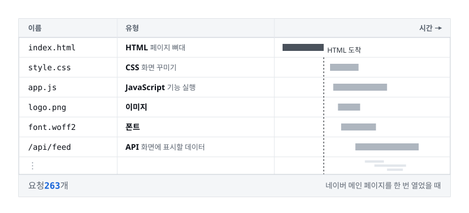
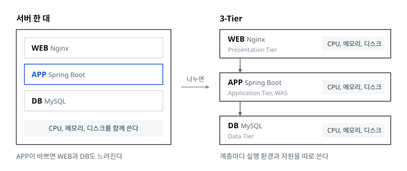
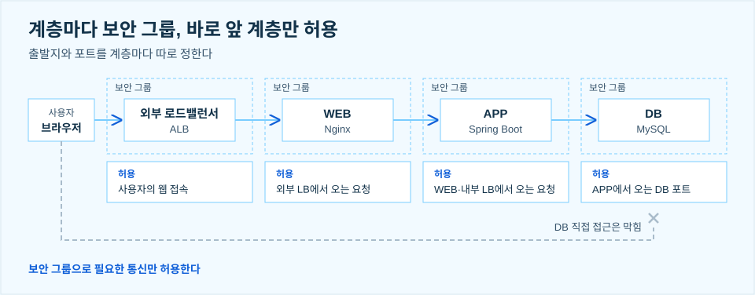
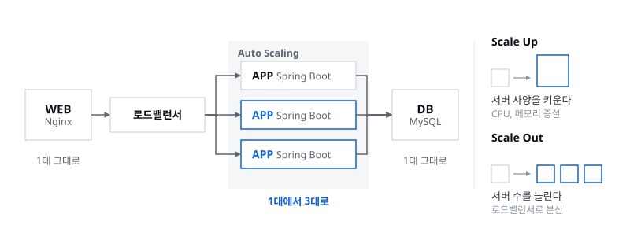
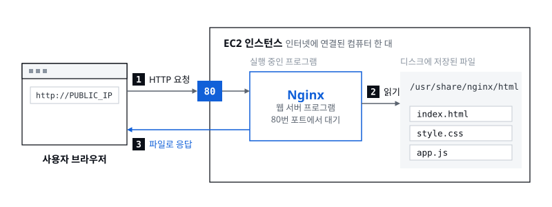
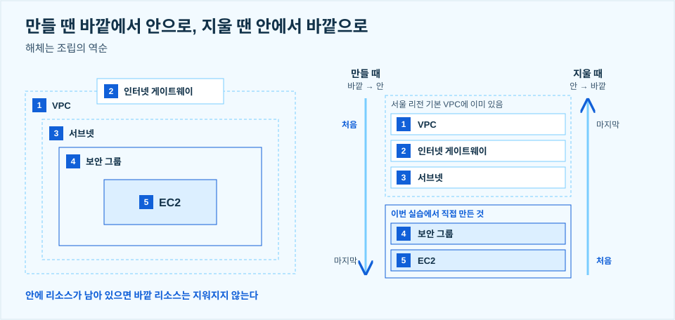
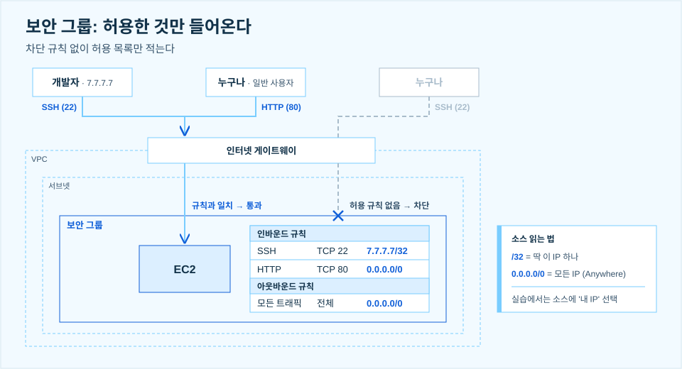
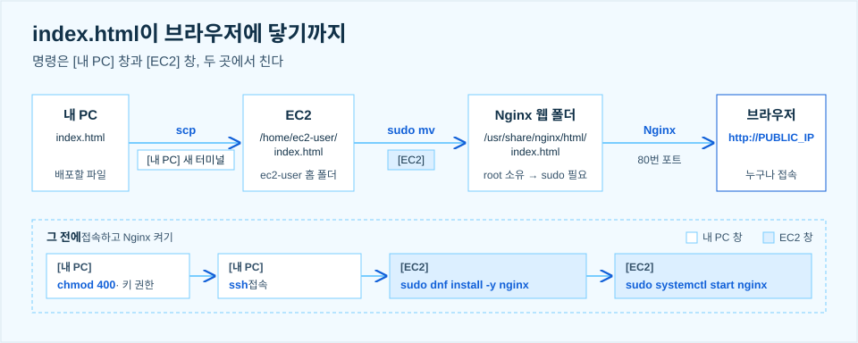

> 서버 한 대로도 돌아가지만, 역할마다 필요한 것이 달라지면 나눕니다

세션 02에서 3-Tier 아키텍처 발표와 EC2 실습을 맡았습니다. 앞 발표에서 VPC와 서브넷, 보안 그룹 같은 네트워크 구성 요소를 짚었으니, 저는 그 위에 서비스를 어떻게 나눠 올리는지, 그리고 실제로 서버 한 대를 만들어 웹페이지를 띄우는 데까지 이어 갔습니다. 개발은 해 봤어도 로컬에서 만들고 localhost로 확인하는 데서 끝난 경우가 많을 텐데, 서버에 프로그램을 띄우는 일, 보통 '배포'라고 부르는 것이 무엇인지 감을 잡는 것이 목표였습니다.

## 01. 서버 한 대에서도 웹사이트는 동작한다

게시판 서비스를 하나 만든다고 해 보겠습니다. 서버 한 대에 웹 서버(Nginx), 애플리케이션(Spring Boot), DB(MySQL)를 모두 설치해도 웹사이트는 잘 돌아갑니다. WEB은 브라우저의 요청을 받아 정적 파일을 내주거나 APP으로 요청을 넘기고, APP은 게시글 조회·작성, 로그인 같은 서비스 기능을 처리하고, DB는 게시글과 회원 정보를 저장합니다. WEB은 흔히 말하는 프론트엔드, APP은 백엔드라고 생각하면 편합니다.

이렇게 한 대에 모으면 좋은 점도 분명합니다. 관리할 서버가 적어 구성이 단순하고, 작은 서비스를 시작할 때 비용 부담을 줄일 수 있습니다.

## 02. 페이지 하나를 열어도 요청은 여러 개다

그런데 사용자가 페이지 하나를 열 때 서버가 받는 요청은 하나가 아닙니다. 브라우저는 HTML을 받은 뒤 필요한 리소스를 추가로 요청합니다. 화면을 꾸미는 CSS, 기능을 실행하는 JavaScript, 이미지와 폰트, 화면에 표시할 데이터를 가져오는 API 요청까지요. 네이버 메인 페이지를 열고 개발자 도구의 Network 탭을 캡처해 보니 요청이 **263개** 기록돼 있었습니다.



물론 263개가 모두 서버 한 대로 가지는 않습니다. 이미지는 이미지대로, 데이터는 데이터대로 여러 곳으로 나뉘어 갈 겁니다. 그래도 사용자 한 명이 페이지 하나를 여는 데 요청이 이만큼 생기고, WEB이 받은 요청은 다시 APP으로, APP의 요청은 다시 DB로 이어집니다. 이걸 서버 한 대가 모두 받아 낸다고 생각하면 부담이 꽤 큽니다.

## 03. 한 서버에서 자원을 함께 쓰면

서버 한 대에 모두 올리면 WEB, APP, DB가 같은 CPU와 메모리, 디스크를 나눠 씁니다. 뒤의 실습에서 만드는 t3.micro는 vCPU 2개에 메모리 1GiB인데, 서로 독립된 세 애플리케이션이 이 자원을 두고 경쟁하는 셈입니다. 실제로 APP의 연산이 많아지면 DB 처리까지 눈에 띄게 느려집니다.

| 상황 | 발생할 수 있는 문제 |
|---|---|
| APP의 CPU·메모리 사용량 증가 | 같은 서버의 WEB과 DB 처리에도 영향 |
| DB의 디스크 작업 증가 | 같은 디스크를 사용하는 다른 작업과 경쟁 |
| APP에만 자원이 더 필요 | APP과 DB를 함께 둔 서버 전체를 증설해야 할 수 있음 |
| 서버 장애 또는 재부팅 | WEB·APP·DB가 함께 중단 |

서비스가 커질수록 **역할마다 필요한 자원과 운영 조건이 달라지기 시작합니다.**

## 04. 3-Tier는 역할별로 실행 환경을 나누는 구조다

그래서 아예 인프라에서부터 서버를 역할별로 떼어 냅니다. 표현, 업무 처리, 데이터 저장을 세 계층으로 나눠 각각 별도의 실행 환경에 배치하는 구조, 이것이 3-Tier 아키텍처입니다.



- **Presentation Tier (WEB)**: 사용자에게 화면과 리소스를 제공합니다.
- **Application Tier (APP)**: 서비스의 업무 규칙을 실행합니다.
- **Data Tier (DB)**: 데이터를 저장하고 조회·수정합니다.

각 계층에는 필요에 따라 여러 서버를 둘 수 있습니다. APP 계층은 WAS(Web Application Server)라고 부르기도 해서, 인프라 쪽에서는 Web·App·DB보다 Web·WAS·DB라는 표현을 더 자주 씁니다.

## 05. 나누면 좋은 점 ① 계층별로 접근을 제한할 수 있다

계층을 나누면 각 계층에 접근할 수 있는 출발지와 포트를 따로 정할 수 있습니다. 앞 발표에서 본 보안 그룹을 계층마다 하나씩 붙이는 겁니다.



외부 진입점인 외부 로드밸런서는 사용자의 웹 접속을 받고, WEB은 지정한 외부 로드밸런서에서 오는 요청만, APP은 지정한 WEB이나 내부 로드밸런서에서 오는 요청만, DB는 지정한 APP에서 오는 DB 포트 통신만 받습니다. 문을 넓게 열어 둘 필요가 없습니다. **보안 그룹으로 필요한 통신만 허용합니다.**

## 06. 나누면 좋은 점 ② 바쁜 계층만 따로 확장할 수 있다

APP의 처리량이 부족하고 WEB과 DB에는 여유가 있다면, APP만 늘리면 됩니다. WEB과 DB 서버는 그대로 둔 채 APP 서버만 1대에서 3대로 늘리는 식입니다.



늘리는 방법과 함께 쓰는 장치는 이렇습니다.

- **Scale Up**: APP 서버의 CPU·메모리를 증설합니다.
- **Scale Out**: APP 서버의 수를 늘립니다.
- **로드밸런서**: 늘어난 여러 APP 서버로 요청을 분산합니다.
- **Auto Scaling**: 설정한 조건에 따라 서버 수를 자동으로 조절합니다.

다만 어느 계층을 늘릴지는 짐작으로 정하지 않습니다. **확장할 계층은 병목을 확인한 뒤 결정합니다.**

## 07. 나누면 좋은 점 ③ 자원과 변경의 영향을 줄일 수 있다

별도의 서버에서 실행하면 자원과 작업 범위를 나누기 쉬워집니다.

- **자원 분리**: 계층별로 CPU·메모리를 할당하고 사용량을 따로 확인합니다.
- **작업 분리**: APP 코드 배포와 DB 서버 관리를 따로 수행할 수 있습니다.
- **영향 범위 분리**: WEB 서버를 재부팅한다고 DB 서버까지 재부팅할 필요가 없습니다.

그렇다고 계층이 완전히 독립하는 건 아닙니다. 계층 사이의 의존성은 여전히 남아 있습니다.

## 08. 모든 서비스에 3-Tier가 필요할까?

아닙니다. 서비스의 요구와 운영 부담을 함께 비교해서 정해야 합니다. 트래픽도 많지 않고 짧은 기간 동안 만들어 보는 서비스라면 서버 한 대에서 시작해도 충분합니다.

| 서비스 상황 | 고려할 수 있는 구성 |
|---|---|
| 작은 실습·검증용 서비스 | 한 서버에서 시작 |
| APP과 DB의 관리 요구가 다름 | DB부터 분리 |
| 계층별 보안·확장·배포 요구가 다름 | 3-Tier 검토 |
| 정적 파일만 제공하는 사이트 | S3와 CDN 활용 검토 |

마지막 줄도 짚고 가겠습니다. HTML, CSS, JavaScript처럼 정적 파일만 있는 사이트는 요청마다 코드를 실행할 APP이 필요 없고, 파일만 전달하면 됩니다. 뒤에서 실습으로 EC2에 배포할 index.html도 사실 이런 정적 파일입니다. 이 전달을 직접 띄운 웹 서버 대신 AWS 서비스에 맡길 수 있습니다. S3는 구글 드라이브처럼 파일을 올려 두는 AWS의 저장소이고, 여기에 CloudFront 같은 CDN을 붙이면 곳곳에 있는 서버가 사용자 가까이에서 파일을 전달해 줍니다. 그러면 EC2를 계속 켜 두는 것보다 훨씬 적은 비용으로 충분히 감당할 수 있습니다.

계층이 늘어나면 비용과 운영 작업도 함께 늘어납니다. 서버마다 관리와 패치를 해야 하고, 계층 사이의 통신을 설정해야 하고, 문제가 생기면 여러 서버의 로그를 확인하며 장애 원인을 추적해야 합니다.

## 09. 실습 준비: EC2는 인터넷에 연결된 컴퓨터 한 대

실습에 앞서 알아 두면 좋은 개념을 짚었습니다. EC2는 결국 서버입니다. AWS는 빌려주는 컴퓨터를 EC2라는 이름으로 팔고 있을 뿐이고, 네이버 클라우드는 같은 상품을 그냥 '서버'라고 부르는 등 클라우드마다 이름만 다릅니다. EC2는 AWS의 가장 대표적인 상품이라, AWS를 쓰면서 EC2를 안 써 봤다면 AWS를 모른다고 해도 될 정도입니다. 저 멀리 AWS 데이터센터에 있다는 것만 빼면 지금 쓰는 노트북과 다를 게 없습니다.

그런데 이 EC2에 HTML, CSS, JavaScript 파일을 올려 두기만 하면 브라우저로 접속해도 아무것도 보이지 않습니다. 서버 입장에서 이 파일들은 노트북에 저장해 둔 텍스트 파일처럼 '죽어 있는' 문서라서, 누가 요청해도 스스로 응답하지 못합니다. JavaScript도 서버에서 저절로 실행되는 게 아니라, 파일을 받아 간 브라우저에서 실행됩니다. 그래서 **요청을 받아 파일을 전달해 줄 웹 서버 프로그램**이 있어야 하고, 가장 많이 쓰는 것이 Nginx와 Apache입니다.



Nginx는 기본으로 80번 포트에서 요청을 기다립니다. 앞 발표에서 IP가 집이고 포트가 방이라고 했으니, EC2라는 집의 80번 방에서 Nginx가 기다리다가, 요청이 오면 `/usr/share/nginx/html`(Amazon Linux에 설치했을 때의 기본 웹 폴더)에 있는 HTML 파일을 집어 브라우저에 던져 주는 겁니다. 브라우저는 받은 HTML을 렌더링해 보여 주고요.

EC2 한 대를 만들기까지는 순서가 있습니다. **VPC → 인터넷 게이트웨이 → 서브넷 → 보안 그룹 → EC2**, 바깥에서 안으로 들어가는 순서입니다. 직접 만들 때는 서브넷을 만든 뒤 라우팅 테이블에 0.0.0.0/0 → 인터넷 게이트웨이 경로도 넣어 줘야, 앞 발표에서 본 퍼블릭 서브넷이 되어 EC2가 인터넷과 통할 수 있습니다. 지울 때는 해체가 조립의 역순이듯 EC2부터 지우고 바깥으로 나와야 합니다. 안에 리소스가 남아 있는데 서브넷이나 VPC부터 지우려고 하면 지워지지 않습니다.



원래는 VPC부터 만들어 보면 이해하기 좋지만, AWS는 리전마다 기본 VPC를 미리 만들어 둡니다. 서울 리전의 기본 VPC에는 인터넷 게이트웨이, 가용 영역(한 리전 안에서 서로 떨어져 있는 데이터센터 묶음) 4곳에 하나씩 만든 서브넷 4개, 0.0.0.0/0 → 인터넷 게이트웨이 경로가 들어 있는 라우팅 테이블, 기본 보안 그룹까지 준비돼 있습니다. 사실 EC2부터 바로 만들 수 있는 상태입니다. 그래도 보안 그룹 정도는 직접 설계해 보면 네트워크를 이해하기에 좋아서, 이번 실습은 기본 VPC를 쓰고 보안 그룹부터 직접 만들었습니다. 기본 VPC의 주소 범위는 172.31.0.0/16이라, 슬라이드 예시의 10.0.0.0/16과 숫자가 달라도 정상입니다.

보안 그룹에는 어떤 출발지(소스)에서, 어떤 프로토콜과 포트로 들어오는 것을 허용할지 적습니다. 차단 규칙은 없고 허용 목록만 있어서, 목록에 없는 통신은 모두 막힙니다. 예를 들어 개발자 컴퓨터의 IP가 7.7.7.7이라면 이렇게 설계합니다.



소스에는 7.7.7.7/32처럼 CIDR로 적습니다. 앞 발표의 CIDR로 보면 /32는 32비트를 모두 네트워크 ID에 써서 호스트 ID가 남지 않으니, 주소가 딱 하나라는 뜻입니다. 80번은 웹사이트용이니 누구나 들어올 수 있게 0.0.0.0/0, 모든 IP에 엽니다. 22번은 원격 접속 프로그램인 SSH의 기본 포트라서 서버를 관리하는 사람만 들어와야 합니다. 그래서 **SSH는 내 IP만 허용하고, 절대 0.0.0.0/0으로 열지 않습니다.** 나가는 방향인 아웃바운드도 엄격하게 제한하는 경우가 있지만, 대부분은 따로 제한하지 않고 모든 트래픽을 허용합니다.

## 10. 실습: EC2에 나만의 웹페이지 배포하기

실습 목표는 EC2에 Nginx를 설치하고, 직접 배포한 웹페이지에 접속하는 것이었습니다. 시작하기 전에 콘솔 오른쪽 위에서 리전을 고릅니다. 리전은 AWS의 어느 지역 데이터센터에 리소스를 만들지 정하는 값입니다. 버지니아 북부를 고르면 그곳 데이터센터에 EC2가 만들어지는데, 물리적으로 멀수록 느려지니 가까운 아시아 태평양(서울) ap-northeast-2를 고릅니다. 네트워크는 기본 VPC와 기본 서브넷을 쓰니, 기본 VPC가 있는지도 확인합니다.

명령어는 두 곳에서 칩니다. 내 컴퓨터의 PowerShell(Windows)이나 터미널(macOS)은 **[내 PC]** 창, SSH로 접속한 뒤 `[ec2-user@ip-… ~]$`가 보이는 창은 **[EC2]** 창입니다. 두 창을 잘 구분해야 합니다.



### 1. 보안 그룹 만들기

콘솔 상단 검색창에 VPC를 입력해 VPC 콘솔로 들어가, 왼쪽 메뉴를 아래로 내려 **보안 → 보안 그룹**을 누르고 오른쪽 위 **보안 그룹 생성**으로 새 보안 그룹을 만듭니다. 이름은 `영문이름-sg`(예: `soojin-sg`), VPC는 기본 VPC입니다. 설명은 비워 둘 수 없고 한글도 쓸 수 없어서, 영문으로 적어야 다음으로 넘어갑니다(예: `security group for hands-on`). 인바운드 규칙은 **규칙 추가**로 두 줄을 넣습니다.

| 방향 | 유형 | 프로토콜 | 포트 | 소스 / 대상 |
|---|---|---|---|---|
| 인바운드 | SSH | TCP | 22 | 내 IP |
| 인바운드 | HTTP | TCP | 80 | Anywhere-IPv4 (0.0.0.0/0) |
| 아웃바운드 | 모든 트래픽 | 전체 | 전체 | Anywhere-IPv4 (0.0.0.0/0) |

SSH의 소스는 IP를 직접 적지 말고 '내 IP'를 고릅니다. 그러면 지금 내 컴퓨터가 바깥에서 보이는 IP가 자동으로 들어갑니다. 와이파이 공유기가 앞 발표의 NAT처럼 여러 기기를 하나의 공인 IP로 내보내기 때문에, 이 IP는 노트북 자체의 IP와 다를 수 있습니다. 아웃바운드의 모든 트래픽 규칙은 이미 들어 있으면 그대로 두고, 아래의 **보안 그룹 생성**을 누릅니다. `영문이름-sg` 보안 그룹이 생성됐다는 메시지가 보이면 완료입니다.

### 2. EC2 만들기

EC2 콘솔의 **인스턴스 → 인스턴스 시작**에서 서버를 만듭니다. EC2 서버 한 대 한 대를 인스턴스라고 부릅니다.

| 항목 | 선택값 | 의미 |
|---|---|---|
| 이름 | `영문이름-svr001` (예: `soojin-svr001`) | |
| AMI | Quick Start → Amazon Linux, Amazon Linux 2023 AMI, 64비트(x86) | 운영체제. 서버는 대부분 리눅스를 쓰고, 목록의 선택지도 대부분 리눅스 배포판입니다. AWS에서는 Amazon Linux가 가장 안정적입니다. AMI의 날짜·ID는 달라도 됩니다 |
| 인스턴스 유형 | t3.micro | 컴퓨터 사양. vCPU 2개, 메모리 1GiB로 노트북보다 낮지만 실습에는 충분합니다 |
| 키 페어 | 새 키 페어 생성: `영문이름-ec2-key`, RSA, .pem | 서버에 들어갈 때 쓰는 열쇠. .pem 파일은 이때 한 번만 내려받을 수 있으니 저장한 경로를 메모해 둡니다 |
| 네트워크 | 기본 VPC, 서브넷 기본 설정 없음, 퍼블릭 IP 자동 할당 활성화 | 서브넷은 서울의 기본 서브넷 4개 중 하나를 AWS가 고릅니다. 퍼블릭 IP가 있어야 인터넷에서 이 서버를 찾아올 수 있습니다. 값이 다르면 편집을 눌러 고칩니다 |
| 보안 그룹 | 기존 보안 그룹 선택 → `영문이름-sg` | 앞에서 만든 방화벽 |
| 스토리지 | 루트 볼륨 8GiB, gp3, 추가 볼륨·파일 시스템 없음 | 서버의 디스크. EBS 볼륨으로 만들어지고, 실습 정리 때 다시 나옵니다 |
| 인스턴스 개수 | 1 | |

오른쪽 요약을 확인한 뒤 **인스턴스 시작**을 누릅니다. 상단의 **인스턴스**로 이동해 `영문이름-svr001` 왼쪽 체크박스를 선택합니다. 인스턴스 ID는 누르지 않습니다. 인스턴스가 **실행 중**이 되고 상태 검사를 모두 통과하면, 아래 세부 정보의 **퍼블릭 IPv4 주소**를 복사해 둡니다. 방금 만든 컴퓨터의 IP, 앞에서 말한 '집 주소'입니다. 아래 명령의 `PUBLIC_IP`는 모두 이 주소로 바꿉니다.

### 3. SSH로 서버에 접속하기 [내 PC]

한 컴퓨터에도 계정이 여러 개 있을 수 있으니, 키 파일은 소유자만 읽을 수 있게 권한을 좁혀야 SSH 접속이 됩니다. 본인 운영체제에 해당하는 블록만 실행합니다. 첫 줄의 `PEM_FILE_PATH`를 .pem 파일의 전체 경로로 바꾼 뒤 블록 전체를 실행하고, 경로를 감싼 따옴표는 그대로 둡니다. 전체 경로는 Windows라면 `C:\Users\본인계정\Downloads\영문이름-ec2-key.pem`, macOS라면 `/Users/본인계정/Downloads/영문이름-ec2-key.pem` 같은 형태입니다.

macOS 터미널에서는 이렇게 실행합니다.

```bash
keyFile="PEM_FILE_PATH"
chmod 400 "$keyFile"
ls -l "$keyFile"
```

출력 앞부분의 권한 표시가 `-r--------`이면 성공입니다.

Windows는 CMD가 아니라 PowerShell에서 실행합니다.

```powershell
$keyFile = "PEM_FILE_PATH"
$currentUser = [System.Security.Principal.WindowsIdentity]::GetCurrent().Name
icacls.exe "$keyFile" /reset
icacls.exe "$keyFile" /grant:r "${currentUser}:(R)"
icacls.exe "$keyFile" /inheritance:r
icacls.exe "$keyFile"
```

마지막 출력에 현재 사용자의 읽기 권한 `(R)`만 남아 있으면 성공입니다. 중간에 나오는 '0개 파일을 처리하지 못했습니다' 같은 문구는 신경 쓰지 않아도 됩니다.

그다음 SSH로 접속합니다. 이 명령은 Windows와 macOS에서 똑같이 씁니다. `ec2-user`는 AWS가 Amazon Linux에 자동으로 만들어 두는 리눅스 계정이고, `PUBLIC_IP` 자리에는 복사한 IP를 앞뒤 공백 없이 넣습니다.

```bash
ssh -i "PEM_FILE_PATH" ec2-user@PUBLIC_IP
```

처음 접속하는 서버라는 확인 문구가 나오면 접속 대상 IP가 내 EC2 주소인지 확인하고 `yes`를 입력합니다. Amazon Linux 2023 환영 메시지와 `[ec2-user@ip-… ~]$` 프롬프트가 보이면 접속 성공입니다. `UNPROTECTED PRIVATE KEY FILE`이나 `bad permissions` 오류가 나오면 키 파일 권한 설정을 다시 확인합니다.

여기서부터 치는 명령은 내 PC가 아니라 EC2에서 실행됩니다. `pwd`를 치면 명령이 네트워크를 타고 EC2로 가서 실행되고, 그 결과인 `/home/ec2-user`가 다시 내 화면으로 돌아옵니다.

### 4. Nginx 설치하고 실행하기 [EC2]

```bash
sudo dnf install -y nginx
```

마지막에 `Complete!`가 보이면 설치가 끝난 것입니다. 이어서 Nginx를 실행합니다.

```bash
sudo systemctl start nginx
```

브라우저 주소창에 `http://PUBLIC_IP`를 입력하면 **Welcome to nginx!** 페이지가 보입니다. Nginx가 설치될 때 만들어 둔 기본 HTML 파일입니다. 이번 실습은 HTTPS를 설정하지 않았으니 꼭 `http://`로 접속합니다. 브라우저가 자동으로 `https://`로 바꾸면 사이트에 연결할 수 없다고 나옵니다.

### 5. 나만의 웹페이지 배포하기

EC2에 접속한 창은 그대로 두고, 내 PC에서 터미널을 하나 더 엽니다. 여기서 배포할 index.html을 SSH 기반의 파일 복사 명령인 `scp`로 EC2에 보냅니다. index.html은 제가 나눠 드린 파일을 써도 되고, ChatGPT 같은 AI에게 아무 웹페이지나 index.html로 만들어 달라고 해서 써도 됩니다. `HTML_FILE_PATH`는 배포할 index.html 파일의 전체 경로로 바꿉니다.

```bash
scp -i "PEM_FILE_PATH" "HTML_FILE_PATH" ec2-user@PUBLIC_IP:/home/ec2-user/index.html
```

전송 진행률이 100%가 되면 EC2 창으로 돌아와 `ls -l`로 index.html이 보이는지 확인하고, Nginx가 읽는 웹 폴더로 옮깁니다. 이 폴더는 root 소유라서 `sudo` 없이는 옮겨지지 않습니다.

```bash
ls -l
sudo mv /home/ec2-user/index.html /usr/share/nginx/html/index.html
```

`sudo mv`는 성공하면 아무것도 출력하지 않습니다. 다시 `http://PUBLIC_IP`로 접속하면 Nginx 기본 페이지 대신 내가 보낸 웹페이지가 보입니다. 이전 화면이 남아 있으면 강력 새로고침(Chrome 기준 Windows `Ctrl + Shift + R`, macOS `Command + Shift + R`)을 합니다. 이제 이 IP만 알면 누구나 자기 브라우저에서 이 페이지를 볼 수 있습니다. **이것이 배포입니다.**

### 6. 보안 그룹 실험: HTTP를 막으면?

보안 그룹이 정말 문 역할을 하는지는 규칙 한 줄을 지워 보면 바로 확인할 수 있습니다. EC2 콘솔의 **네트워크 및 보안 → 보안 그룹**에서 `영문이름-sg`를 누르고, **인바운드 규칙 → 인바운드 규칙 편집**에서 HTTP(TCP 80) 규칙만 삭제하고 SSH(TCP 22)는 남긴 채 **규칙 저장**을 누릅니다. 새 시크릿 창에서 `http://PUBLIC_IP`로 다시 접속하면 페이지를 불러오지 못하거나 연결 시간이 초과됩니다. 기존 연결이나 캐시 때문에 화면이 계속 보이면 시크릿 창을 모두 닫고 다시 열어 확인합니다.

같은 보안 그룹에서 다시 **인바운드 규칙 편집 → 규칙 추가**로 HTTP, TCP, 80, Anywhere-IPv4(0.0.0.0/0) 규칙을 넣고 **규칙 저장**을 누른 뒤 접속하면 웹페이지가 다시 정상으로 보입니다.

### 7. 실습 종료 후 정리

EC2는 만든 순간부터 요금이 나갑니다. 이번 실습 정도면 백 원 안팎이지만, 끝나면 반드시 정리합니다.

1. EC2 → 인스턴스에서 `영문이름-svr001`을 선택하고, **인스턴스 상태 → 인스턴스 종료**로 삭제합니다. 중지(Stop)가 아니라 **Terminate, 즉 종료**입니다. 중지는 서버를 끄기만 할 뿐이라, 인스턴스 요금은 멈춰도 남아 있는 디스크(EBS) 요금은 계속 나갑니다.
2. 종료 후 볼륨 메뉴에서 이번 실습의 EBS 볼륨이 함께 삭제됐는지 확인합니다.
3. 인스턴스 종료가 끝나 보안 그룹과의 연결이 정리되면, 직접 만든 `영문이름-sg`를 삭제합니다. 종료가 끝나기 전에는 아직 쓰이고 있어 지워지지 않습니다.
4. 더 쓰지 않을 `영문이름-ec2-key`도 키 페어 메뉴에서 삭제합니다.

기본 VPC, 기본 서브넷, 기본 라우팅 테이블, 기본 인터넷 게이트웨이는 삭제하지 않습니다. 종료한 인스턴스는 목록에 한동안 '종료됨'으로 남아 있다가 사라지니 신경 쓰지 않아도 됩니다. 종료 후 `http://PUBLIC_IP`를 새로고침하면 서버가 없어져 더 이상 접속되지 않습니다. 화면별 캡처와 전체 명령은 [실습 자료](files/hands-on.pdf)에 있습니다.

오늘 실습에서 만든 건 3-Tier 가운데 WEB 계층 하나입니다. 브라우저가 요청하면 Nginx가 HTML 파일을 가져다준 것까지라 WEB 계층만으로 충분했지만, 실제 서비스라면 요청이 APP 계층과 DB 계층까지 들어가고 WEB과 APP, APP과 DB 사이에 통신이 오가게 됩니다. 이 세 역할을 각자의 실행 환경으로 나눈 것이 3-Tier입니다.
