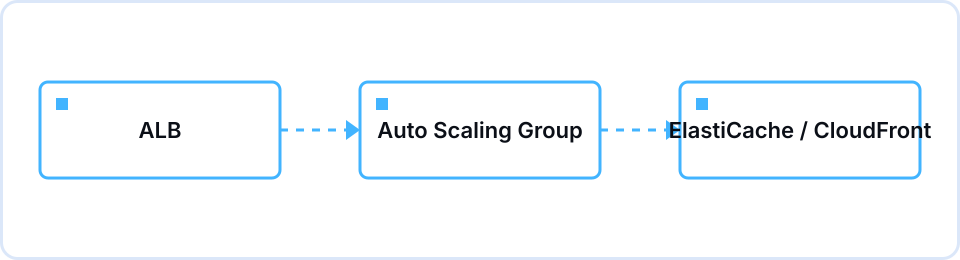

## Overview

Session 03, held on the evening of Tuesday, November 3 in the Information Technology Building, started with a question about the single-EC2 shop we built in Session 02: if a first-come-first-served event opens right now, does this server hold? We had two goals. Each participant should be able to explain in their own words why one server is dangerous, and should be able to tell apart what a load balancer, auto scaling, and caching each solve. Yena Lee (Tech Lead) presented, redrawing the Session 02 request path on the whiteboard first and then adding to it one piece at a time.

Of the 90 minutes, the first 20 went to review and the SPOF idea, the middle 40 to ALB and Auto Scaling, and the last 15 to caching. We opened the console twice: once on the target group page to look at the health check settings and each target's healthy/unhealthy status, and once on the Auto Scaling group page to find where the three numbers, minimum, desired and maximum, actually live. The point where most people got stuck was "if we have an ALB, why do we need Auto Scaling separately?" Sorting out that distributing requests and changing the number of servers are two different jobs done by two different services took longer than planned. After the 90 minutes, the remaining time went to feedback for Session 02 assignment submitters and individual questions.

Caching stayed at the concept level. We stopped at drawing where CloudFront and ElastiCache each sit and left hands-on work for a later session.

## What we covered

| Time | Content |
|---|---|
| 19:00–19:10 | Session 02 recap — scenario: the event has just opened; can one EC2 instance take the requests? |
| 19:10–19:20 | Limits of a single server — what a SPOF is, and cases where one machine stopping took the whole service down |
| 19:20–19:40 | ALB — what a layer 7 load balancer does, target groups, and what happens without health checks |
| 19:40–20:00 | Auto Scaling group — launch templates, minimum/desired/maximum capacity, a scaling policy based on average CPU |
| 20:00–20:15 | Caching — how it takes load off servers and the database; CloudFront (static, edge) versus ElastiCache (dynamic, in-memory) |
| 20:15–20:30 | Wrap-up, assignment briefing, Q&A |

## Concepts we pinned down

- **SPOF (single point of failure)** — A structure where one component failing takes everything down. The single-EC2 setup from Session 02 is exactly this shape.
- **ALB** — A layer 7 (application) load balancer. It spreads requests across targets in multiple AZs and automatically drops targets that fail health checks.
- **Target group** — The set of destinations an ALB sends traffic to. The health check path and pass/fail thresholds are configured here.
- **Auto Scaling group** — You set minimum, desired and maximum instance counts, and it adds or removes instances based on a metric such as average CPU. Scaling in counts as scaling too.
- **Launch template** — The blueprint an Auto Scaling group uses to start a new instance: AMI, instance type, security group and user data all live here.
- **Caching** — Keeping frequently read data somewhere fast so fewer requests reach the server and the database. CloudFront holds static files at edges close to users; ElastiCache holds dynamic data in memory in front of the database.

## Assignment and results

The assignment was to put an ALB and an Auto Scaling group in front of the EC2 instance from Session 02 and confirm that traffic is spread across at least two instances. There were two completion conditions: capture the ALB's DNS name returning a different instance ID on each refresh, and confirm the service keeps running after force-terminating one instance. We estimated 1.5 to 2 hours. For cost safety we asked everyone to cap maximum capacity at 2 to 3 instances and, once done, to set desired capacity to 0 or delete the group. The instance type stayed t3.micro as in Session 02.

The most common place submissions got stuck was creating the ALB. Anyone who had built only one public subnet in the Session 02 assignment hit the step where the ALB requires subnets in at least two AZs, and could only continue after adding a second public subnet in another AZ. The second was targets staying unhealthy. The instance security group's inbound rule on port 80 allowed only the person's own IP, so the ALB's health checks never reached the instance; changing the source to the ALB's security group brought the targets back to healthy.

## Questions that came up

**Q.** The ALB already spreads traffic, so why do we need an Auto Scaling group on top?
A. The ALB only divides requests among the instances that exist right now. If there are two, it splits between two, and that is all. Changing the number of instances to match traffic is the Auto Scaling group's job, so you need both to get through something like an event launch.

**Q.** When an instance fails its health check, who brings up a replacement?
A. The ALB only goes as far as taking the failed target out of rotation. Terminating that instance and launching a new one is the Auto Scaling group's job; it fills the gap to get back to desired capacity. When you force-terminated an instance in the assignment and a new one appeared shortly after, that was this behavior.

**Q.** Can we cache something like the remaining stock for the event, which changes constantly?
A. A cache returns the value it stored for a set period, so values that change often carry the risk of showing stale data. It is safer to start with things that rarely change, such as product images, and for values that must be exact, such as stock, either keep the time-to-live short or skip caching. We only touched this trade-off at the concept level this time.

## Keywords to review

`SPOF`, `ALB`, `target group`, `health check`, `launch template`, `min/desired/max capacity`, `CloudFront vs ElastiCache`

## Toward the next session

The retrospective showed that several submitters stalled on subnet AZ layout and security group sources, so the Session 04 brief will open with a pre-assignment checklist: are there public subnets in two AZs, and what is the source on the security group's inbound rule. Session 04 (11/24) moves on to where the shop's member and order data should live.
