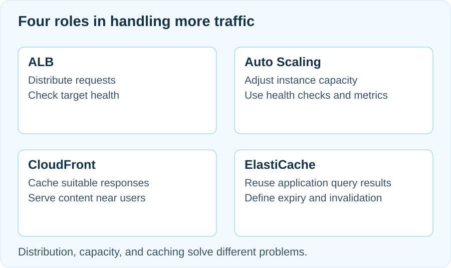

> 이번 회차의 주제는 **서버리스 이벤트 기반 서비스**입니다. 아래는 이전 기획의 참고 초안이며, 실제 발표 자료는 세션 후 갱신합니다.

## 선착순 이벤트에는 서로 다른 병목이 생깁니다

방문자가 오후 한 시에 동시에 새로고침하면 이미지 요청, 상품 조회, 재고 확인, 주문 생성이 늘어납니다. CPU가 높아질 수도 있고, 서버는 한가한데 데이터베이스 연결을 기다릴 수도 있습니다. 둘을 구분하지 않고 인스턴스만 늘리면 비용은 커져도 응답은 빨라지지 않을 수 있습니다.

먼저 응답 지연, 오류 비율, 애플리케이션 처리 시간, 데이터베이스 대기 등을 나눠 봅니다. 여기서 ALB는 요청을 나누고, Auto Scaling은 실행 용량을 조절하며, 캐싱은 반복 작업을 줄입니다. 세 기능은 서로 대체하지 않습니다. 서버가 버티는 것과 주문 수량을 정확히 지키는 것도 다른 설계 과제입니다.

## ALB는 처리할 대상을 고릅니다

ALB는 리스너로 HTTP·HTTPS 요청을 받고 규칙에 따라 타겟 그룹으로 전달합니다. 상품 조회 애플리케이션 두 대가 같은 타겟 그룹에 있으면, 어느 인스턴스를 이용할지는 라우팅 알고리즘과 상태에 따라 결정됩니다. 기본 알고리즘은 라운드 로빈이지만, 한 브라우저의 새로고침 결과가 반드시 A·B·A·B로 번갈아 보인다는 검증 기준은 적절하지 않습니다. 고정 세션과 브라우저 캐시도 관찰 결과에 영향을 줍니다.

분산 여부는 여러 응답의 식별자와 서버별 로그를 함께 봅니다. 요청이 두 대에 도달한 것과 부하가 비슷한 것도 다릅니다. 오래 걸리는 요청과 짧은 요청은 개수가 같아도 부담이 다릅니다. [AWS의 타겟 그룹 라우팅 설정](https://docs.aws.amazon.com/elasticloadbalancing/latest/application/edit-target-group-attributes.html)에서 알고리즘과 고정 세션의 관계를 확인할 수 있습니다.

## 정상 경로에서 빼는 일과 복구는 별개입니다

헬스체크는 정한 경로와 성공 코드로 응답을 확인합니다. 예를 들어 `/health`가 애플리케이션이 요청을 받을 준비가 된 상태에서 200을 반환하도록 설계할 수 있습니다. 로그인 페이지로 리다이렉트되거나 존재하지 않는 경로를 확인하면 서버가 실행 중이어도 검사에는 실패합니다. 정상 대상이 남아 있을 때는 실패한 대상으로 가던 트래픽을 다른 대상으로 돌릴 수 있습니다.

등록된 대상이 모두 unhealthy라면 ALB가 전체 대상으로 요청을 보내는 fail-open 동작을 할 수 있습니다. 헬스체크는 서비스 차단이나 복구를 보장하지 않으며, ALB가 인스턴스를 새로 만들지도 않습니다. [AWS의 타겟 헬스체크](https://docs.aws.amazon.com/elasticloadbalancing/latest/application/target-group-health-checks.html)에 이 동작이 설명되어 있습니다.

## Auto Scaling은 원하는 용량을 유지합니다

예시로 최소 2, 원하는 용량 2, 최대 4를 잡아 봅시다. 최소값은 용량의 하한이고 최대값은 상한입니다. 실제 목표는 원하는 용량이며, 스케일링 정책이 없다면 트래픽이 늘었다는 이유만으로 목표가 자동 상승하지 않습니다. 평균 CPU를 지표로 삼더라도 CPU와 처리 수요가 함께 움직이는 애플리케이션인지 먼저 확인해야 합니다.

ASG는 EC2 상태 확인을 기본으로 사용하지만, ALB의 헬스체크 결과로 인스턴스를 교체하려면 ELB 헬스체크 사용을 그룹에서 켜야 합니다. 웹 프로세스만 멈춘 상태와 EC2 자체가 중지된 상태의 관찰 결과가 다른 이유입니다. 새 인스턴스의 초기화 시간도 고려합니다. [AWS의 Auto Scaling 헬스체크](https://docs.aws.amazon.com/autoscaling/ec2/userguide/health-checks-overview.html)에서 기본 검사와 선택 검사를 구분해 확인할 수 있습니다.

새 인스턴스의 준비에는 시간이 걸립니다. 정해진 이벤트는 미리 용량을 준비해 부하를 확인하는 편이 합리적입니다. 최대값 4는 네 대면 충분하다는 성능 보장이 아니라 허용한 용량의 경계입니다.

## 새로 생긴 서버도 같은 응답을 해야 합니다

일반적인 리전의 인터넷용 ALB는 서로 다른 두 가용 영역의 서브넷을 사용하도록 구성합니다. 애플리케이션 인스턴스는 ALB에서 접근할 수 있는 위치에 두고, 해당 포트의 보안 그룹 소스에 ALB 보안 그룹을 지정합니다. 인스턴스의 웹 포트를 내 IP만 허용하면 브라우저 직접 접속과 달리 ALB의 연결은 막힐 수 있습니다.

시작 템플릿과 배포 과정에는 같은 애플리케이션 버전, 설정, 시작 절차가 들어가야 합니다. 처음 만든 서버에서만 수동으로 파일을 고치면 새 인스턴스는 다른 화면을 보여줍니다. 로그인 세션이나 업로드 파일을 특정 서버의 로컬 디스크에만 두는 설계도 확장할 때 문제가 됩니다. 서버를 추가해도 잃지 않아야 하는 상태를 어디에 둘지 함께 정합니다.

## 캐시는 재사용할 수 있는 결과에 적용합니다

상품 이미지처럼 여러 방문자가 같은 내용을 받는 파일은 CloudFront의 엣지 캐시로 전달할 수 있습니다. CloudFront가 정적 파일에만 한정되는 것은 아니며, 무엇을 얼마나 캐시할지는 응답과 정책으로 결정합니다. 애플리케이션에서 반복하는 상품 정보 조회에는 ElastiCache 같은 별도 캐시를 사용할 수 있습니다. 캐시 조회·원본 조회·저장을 애플리케이션이 처리하는 방식도 있으므로, 데이터베이스 앞에 서비스를 하나 붙이면 자동으로 빨라진다고 생각하면 안 됩니다.

예를 들어 상품 설명을 30초 캐시하는 선택은 그 시간만큼 오래된 설명을 허용할 수 있을 때 의미가 있습니다. 같은 값을 모든 사용자에게 보여줘도 되는지도 확인해야 합니다. 재고 표시를 짧게 캐시하더라도 주문 승인 시점의 수량 검증과 동시성 제어는 원본 상태를 기준으로 따로 설계합니다. TTL을 줄이는 것만으로 중복 주문이나 초과 판매가 해결되지는 않습니다.

캐시가 비었거나 동시에 만료될 때 원본으로 몰리는 요청도 측정합니다. 요청 병합과 만료 시점 분산처럼 원본의 급격한 부하를 줄이는 방법을 고려하고, 적중률과 원본 요청량이 실제로 개선되는지 확인합니다. 설계의 판단 기준은 [AWS의 캐싱 전략](https://aws.amazon.com/builders-library/caching-challenges-and-strategies/)에서 더 살펴볼 수 있습니다.

## 분산·확장·캐시를 따로 검증합니다

분산 확인용 응답에 인스턴스별 식별자를 넣고, 자신이 소유한 실습 환경에 적은 수의 요청을 보내 로그와 대조합니다. 캐시를 우회해 실제 서버 응답을 보는 검사와 캐시 적중률을 보는 검사를 섞지 않습니다. 한쪽 타겟의 상태를 바꾸는 복구 실험도 트래픽 우회와 ASG의 교체를 각각 관찰해야 합니다.

확장은 시작 시각, 준비 완료 시각, 정상 타겟 수, 지연·오류 추이를 함께 기록합니다. 새 EC2가 실행 중이라는 이유만으로 트래픽을 처리할 준비가 끝난 것은 아닙니다. 캐시는 같은 조회를 반복했을 때 원본 호출이 줄어드는지, 내용이 바뀌었을 때 언제 새 값이 보이는지 확인합니다. 서비스 이름이 화면에 존재하는 것보다 각 기능이 맡은 일을 실제로 수행하는지가 중요합니다.

## 설정이 어긋났을 때 먼저 볼 곳

타겟이 계속 unhealthy라면 경로·포트·성공 코드와 ALB에서 인스턴스로 향하는 보안 그룹 규칙을 확인합니다. 로그인이나 외부 API에 검사 자체가 불필요하게 의존하지 않는지도 봅니다. ASG가 계속 교체한다면 초기화 실패와 준비 시간, 헬스체크 조건을 먼저 비교합니다. 정책이 반응하지 않으면 지표가 들어오는지와 최소·최대·원하는 용량의 관계를 확인합니다.

원하는 용량을 0으로 정리하려면 최소값과 다시 용량을 늘릴 예약 작업·정책도 확인합니다. 인스턴스가 없어져도 ALB나 별도 캐시의 비용은 남을 수 있습니다. 비용 정리와 장애 복구를 구분하고 만든 리소스를 각각 확인합니다.
