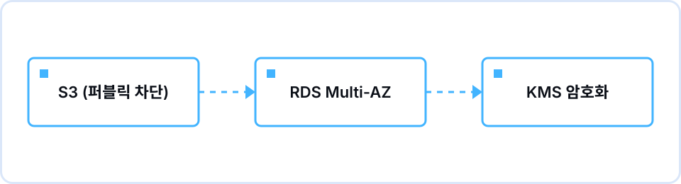

## Overview

Session 04, held on the evening of Tuesday, November 24 in the Information Technology Building, was about data. The shop we built in Sessions 02 and 03 had reached the point of running several servers, but member records and order history were still sitting somewhere on an EC2 disk. The goal this time was to be able to explain, separately, where that data should live (S3 or RDS), how not to lose it (backups), and how to protect it (encryption). Jiwon Jang (Director of Marketing), who is preparing for the SAA exam, ran the session and pointed out along the way how each concept tends to show up in the exam's security domain (30%).

Much of the time went to the console again. On the S3 bucket creation screen we confirmed that "Block all public access" is checked by default and located the default encryption setting; on the RDS creation screen we saw how choosing the free-tier template greys out the Multi-AZ option, and where the backup retention period and the encryption checkbox live. On the whiteboard we redrew the VPC diagram from Session 02 and placed RDS inside the private subnet. Those who had made a private subnet for the optional part of the Session 02 assignment could see that this was the spot.

Where we stalled longest was Multi-AZ versus read replicas. Both mean "one more database appears", so whether the standby can serve reads came up several times. In the encryption part, someone asked whether HTTPS already covers it, which led us to separate encryption at rest from encryption in transit once more. After the planned 90 minutes, the remaining time went to feedback on the Session 03 assignment and open questions.

## What we covered

| Time | Content |
|---|---|
| 19:00–19:10 | Opening — so far we had only covered compute and networking; scenario: where do member and order data go |
| 19:10–19:25 | S3 basics — object storage, buckets and objects, why a new bucket is private by default, storage classes |
| 19:25–19:45 | RDS basics — what a managed database does for you, Multi-AZ standby and automatic failover, tied back to the AZ concept from Session 02 |
| 19:45–20:00 | Backups and snapshots — automated backup retention, manual snapshots, why RPO decides the backup interval |
| 20:00–20:15 | Encryption basics — at rest versus in transit, KMS keys, demo of turning on encryption in the S3 and RDS consoles |
| 20:15–20:30 | Wrap-up and assignment briefing |

## Concepts we pinned down

- **S3 buckets and objects** — Object storage that scales without a capacity limit. A new bucket starts with public access blocked, and the moment someone changes that default is where most incidents happen.
- **Storage classes** — Different pricing tiers for data that is read often versus data that is only kept. This time we stopped at "cost depends on access frequency".
- **RDS and Multi-AZ** — A relational database whose patching and backups AWS manages. Multi-AZ keeps a standby replica in another AZ and fails over automatically; it is for availability, not read performance.
- **Read replicas** — Replicas that take a share of read requests. Their purpose differs from Multi-AZ, and SAA questions repeatedly test that distinction.
- **Automated backups, manual snapshots, RPO** — Automated backups allow point-in-time recovery within the retention period; manual snapshots stay until you delete them. The recovery point objective (RPO) is "how much data loss can we tolerate", and that number sets the backup interval.
- **Encryption at rest and KMS** — Encrypting data as it is written to disk with a key managed by KMS. Both S3 and RDS turn it on with a single checkbox in the console. It is separate from encryption in transit (HTTPS).

## Assignment and results

The assignment had two parts: create an S3 bucket, enable encryption, and confirm that public access stays blocked; then create a free-tier RDS instance (db.t3.micro) and connect to it from EC2. The completion criteria were two screenshots: an uploaded file failing to open via its public URL, and a successful connection to RDS from EC2 using a mysql or psql client. We estimated about 1.5 hours, and asked everyone to take a manual snapshot and then delete the instance afterwards.

The most common blocker in the submissions was the RDS security group. Some had not opened inbound port 3306, or had set the source to their own IP instead of the EC2 instance's security group, and then hit a timeout when connecting from EC2. The other was on the S3 side: one member saw the AccessDenied XML at the public URL and posted a question assuming something had gone wrong. We clarified in the channel that this screen is exactly the completion criterion.

## Questions that came up

**Q.** Does turning on Multi-AZ make reads faster too?
A. No. The Multi-AZ standby does not serve requests in normal operation; it exists only to take over the primary's role automatically when a failure occurs. To spread reads you need a separate read replica.

**Q.** If automated backups exist, why did you ask us to take a manual snapshot?
A. Automated backups disappear once the retention period passes, and with default settings they are cleaned up when the instance is deleted. A manual snapshot stays until you delete it yourself, so it is what preserves the state when you remove the instance after the exercise. It is also how you keep a restore option while saving cost.

**Q.** If we are already using HTTPS, isn't the data already encrypted?
A. HTTPS is encryption in transit, covering data while it crosses the network. Data that lands on disks and in snapshots needs encryption at rest turned on separately, with the key managed by KMS. A service handling personal or card data needs both.

## Keywords to review

`S3 Block Public Access`, `storage classes`, `RDS Multi-AZ`, `read replica`, `backup retention period`, `RPO`, `KMS encryption at rest`

## Toward the next session

The retrospective noted that we spent a long time untangling Multi-AZ from read replicas, and that how far to extend encryption varied from one submission to the next. The Session 05 (12/29) brief now includes "whether to enable Multi-AZ, and how far encryption should reach" as decisions each person makes and explains while drawing the integrated architecture.
