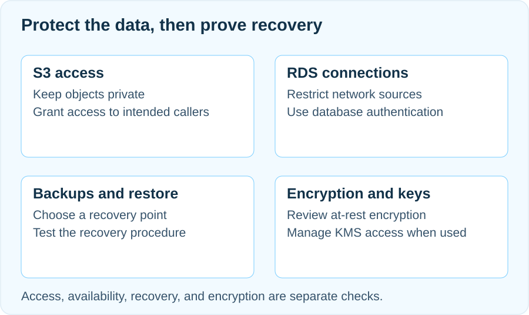

## 데이터의 생김새보다 사용 방식으로 저장소 고르기

쇼핑몰의 상품 사진과 주문 내역은 모두 데이터지만 필요한 작업은 다릅니다. 사진은 파일 하나를 올리고 특정 키로 읽는 일이 중심입니다. 주문은 회원·상품과 연결해 조회하고, 주문 생성과 재고 변경을 일관되게 처리해야 합니다. 이 예제에서는 사진과 내려받을 문서를 S3 객체로, 회원·주문·재고를 RDS의 관계형 테이블로 나눕니다.

DB에는 사진의 객체 키를 저장해 두고 애플리케이션이 필요한 파일을 찾게 합니다. 두 저장소를 함께 쓴다고 파일 업로드와 DB 변경이 하나의 트랜잭션이 되지는 않습니다. 업로드 후 DB 기록이 실패했을 때 남은 파일을 어떻게 찾을지, 객체 키가 가리키는 파일이 없을 때 무엇을 보여줄지도 설계에 포함합니다.

## DB 연결은 출발지와 목적지를 함께 확인하기

예제의 RDS는 인터넷에서 직접 접속하지 않고 같은 VPC의 애플리케이션 서버가 접근하도록 구성합니다. DB의 공개 접근 설정을 끄는 일과 보안 그룹에서 통신을 허용하는 일은 별개입니다. EC2에서 접속한다면 DB 보안 그룹의 인바운드 소스는 내 노트북 IP가 아니라 해당 클라이언트에 연결된 보안 그룹으로 제한합니다.

포트는 실제 DB 설정을 확인합니다. MySQL의 기본값은 3306, PostgreSQL은 5432지만 변경할 수 있으므로 숫자를 외워 넣지 않습니다. DNS 이름, 네트워크 경로, 보안 그룹, DB 인증을 순서대로 살펴보고, 타임아웃과 비밀번호 오류를 같은 원인으로 취급하지 않습니다. [RDS의 VPC 접근 구성](https://docs.aws.amazon.com/AmazonRDS/latest/UserGuide/USER_VPC.Scenarios.html)

연결 확인에는 엔진에 맞는 클라이언트로 `SELECT 1;`처럼 데이터 변경이 없는 쿼리를 사용합니다. 이어 읽어야 할 테이블을 읽을 수 있는지, 애플리케이션 계정에 불필요한 관리 권한이 없는지 확인합니다. 포트 연결 성공만으로 업무 권한까지 검증했다고 판단하지 않습니다.

## 암호화와 비공개 접근은 서로 다른 설정

S3에 새로 업로드되는 객체에는 기본적으로 S3 관리 키를 사용하는 SSE-S3 암호화가 적용됩니다. 고객 관리 키의 정책과 수명 주기를 직접 통제해야 한다면 SSE-KMS를 검토합니다. SSE-KMS 객체를 읽을 때는 S3 읽기 권한 외에 해당 KMS 키의 복호화 권한도 확인해야 하며, KMS 비용도 고려합니다. [S3의 SSE-KMS와 기본 암호화](https://docs.aws.amazon.com/AmazonS3/latest/userguide/UsingKMSEncryption.html)

암호화된 파일도 접근을 허용받은 주체는 읽을 수 있습니다. 따라서 버킷의 퍼블릭 액세스 차단, 관련 정책, 객체의 실제 암호화 설정을 따로 확인합니다. 기본 암호화 방식을 바꿨다고 기존 객체가 모두 새 키로 다시 암호화됐다고 가정하지 않습니다. HTTPS나 DB 클라이언트의 TLS는 전송 구간을 보호하므로 저장 시 암호화와 함께 검토합니다.

## Multi-AZ는 배포 형태까지 읽어야 합니다

**Multi-AZ DB 인스턴스 배포**는 다른 가용 영역의 대기 인스턴스로 장애 조치를 지원하며, 이 대기 인스턴스는 읽기 트래픽을 처리하지 않습니다. 반면 **Multi-AZ DB 클러스터 배포**에는 writer와 읽기 요청도 처리할 수 있는 두 reader가 있습니다. 따라서 “Multi-AZ는 읽기에 사용할 수 없다”는 문장은 모든 배포 형태에 적용할 수 없습니다. [RDS Multi-AZ 배포 구분](https://docs.aws.amazon.com/AmazonRDS/latest/UserGuide/Concepts.MultiAZ.html)

설계 질문도 나눕니다. 장애 시 서비스 중단을 줄이려는지, 평소 조회 부하를 분산하려는지 먼저 적고 배포 유형과 접속 대상을 선택합니다. 연결이 끊긴 뒤 애플리케이션이 다시 연결하는 동작도 확인해야 합니다. 복제된 DB가 있다는 사실은 실수로 바뀐 주문을 과거 상태로 되돌릴 방법까지 제공하지 않으므로 백업은 별도로 설계합니다.

## 백업은 허용할 손실부터 정하기

RPO는 사고가 났을 때 감수할 수 있는 데이터 손실의 범위이고, RTO는 복구에 허용할 시간입니다. 예를 들어 주문 데이터의 RPO를 10분, RTO를 1시간으로 정했다면 “매일 스냅샷을 찍는다”는 설명만으로 목표를 충족했다고 볼 수 없습니다. 이 값은 예제의 업무 목표이며 AWS가 보장하는 복구 수치가 아닙니다.

RDS 자동 백업은 보존 기간 안의 시점 복구를 지원합니다. 수동 스냅샷은 특정 상태를 보관하는 수단이며, DB 인스턴스를 삭제해도 자동으로 삭제되지 않습니다. 자동 백업은 인스턴스 삭제 시 보존을 선택했는지에 따라 처리 방식이 달라집니다. 백업 보존 기간과 최신 복원 가능 시점을 확인하고, 삭제 전에는 남길 백업을 명시해야 합니다. [RDS 자동 백업과 스냅샷](https://docs.aws.amazon.com/AmazonRDS/latest/UserGuide/USER_WorkingWithAutomatedBackups.html)

## 복원된 DB가 쓸 수 있는 상태인지 확인하기

주문 상태를 잘못 변경한 상황이라면 사고 직전의 복원 지점을 먼저 정합니다. DB 인스턴스의 시점 복구는 기존 인스턴스를 덮어쓰지 않고 새 인스턴스를 만드는 작업이므로, 복구 후 어느 연결 주소를 사용할지와 전환 전에 검증할 내용을 준비합니다.

확인은 다음 순서로 진행합니다.

1. 사고 시각과 목표 복원 시각, 실제 복원 가능한 범위를 대조합니다.
2. 복원한 DB의 네트워크·보안 그룹·키 접근과 애플리케이션 접속을 확인합니다.
3. 알려진 주문 번호, 주문 건수, 금액 합계와 최근 주문의 시각을 비교합니다.
4. RDS에 저장된 객체 키로 필요한 S3 파일도 읽히는지 확인합니다.
5. 검증 시간과 연결 전환 시간을 합쳐 RTO 목표와 비교합니다.

DB가 `available`인 것과 서비스가 정상인 것은 다릅니다. 특정 주문이 빠졌거나 파일과 DB 기록이 어긋났다면 그 차이를 확인한 뒤 전환해야 합니다. 실수 이후에 들어온 정상 주문을 어떻게 반영할지도 별도 결정 사항으로 남깁니다.

## 설계 검토에 남길 다섯 가지 결정

첫째는 데이터별 저장 위치입니다. 둘째는 누가 어떤 경로로 읽고 쓰는지입니다. 셋째는 암호화 방식과 키의 담당자이고, 넷째는 장애 대응에 필요한 배포 형태입니다. 마지막은 RPO·RTO와 그것을 확인할 복원 절차입니다. 각 결정을 “기능을 켰다”가 아니라 “어떤 상황에서 어떤 결과를 기대한다”로 기록합니다.

비용 검토에는 DB 실행 비용뿐 아니라 저장 용량, 백업·수동 스냅샷, 복원 중 함께 존재하는 DB, KMS 사용을 포함합니다. 실습이라는 이유나 특정 인스턴스 이름만으로 무료를 가정하지 않습니다. 정리할 때에도 인스턴스 삭제와 보존할 백업·키의 정리를 분리해서 판단합니다.

## 자주 묻는 질문

**Q. S3 주소에서 AccessDenied가 나오면 안전한 설정인가요?**

그 요청이 거부됐다는 뜻입니다. 파일 전체의 접근 정책이나 다른 로그인 주체의 권한까지 확인한 결과는 아닙니다. 의도한 사용자에게는 필요한 파일이 읽히는지도 함께 확인합니다.

**Q. DB를 비공개로 두면 내 노트북에서는 어떻게 관리하나요?**

조직이 승인한 사설 연결이나 관리 경로를 사용합니다. 연결 실패를 해결하려고 먼저 공개 접근을 켜기보다, 요청이 출발하는 위치와 DB까지의 경로를 확인합니다.

**Q. 백업 이름이 목록에 보이면 복구 준비가 된 건가요?**

복원 대상이 있다는 첫 단서입니다. 실제 복원과 데이터 검증, 애플리케이션 연결 전환까지 수행할 수 있어야 복구 목표를 평가할 수 있습니다.
