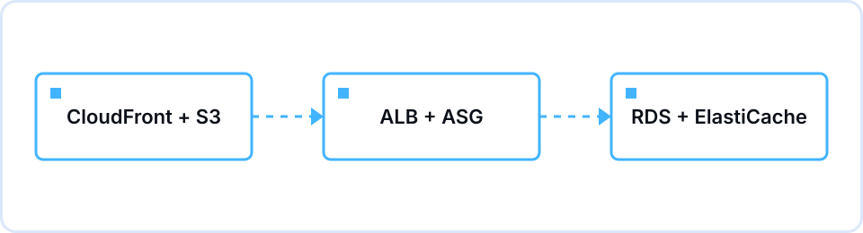

## 이런 세션이었습니다

12월 29일 화요일 저녁 정보기술관에서 진행한 5차 세션은 1기 마지막 세션이었습니다. 새 AWS 개념은 하나도 넣지 않았습니다. 2차에서 만든 VPC와 EC2, 3차에서 그 앞에 세운 ALB와 오토스케일링 그룹, 4차에서 붙인 S3와 RDS가 서로 다른 날 만든 조각으로만 남아 있었습니다. 쇼핑몰 오픈 전 마지막 점검이라는 가정으로, 이 세 조각을 한 장의 그림으로 합치고 "왜 그렇게 결정했는지"를 서로 설명하는 데 세션 전체를 썼습니다.

진행은 손수빈(Leader)이 도입과 정답 수렴, SAA-C03 문항을 맡고, 이채우(Director of Events)가 팀 활동과 트레이드오프 토론, 마무리 시상을 맡았습니다. 도입 10분 동안 화이트보드에 지금까지 만든 조각을 세 묶음으로 나열한 뒤, 2~4차와 같은 5팀으로 나눠 15분간 Excalidraw에 통합 아키텍처를 그렸습니다. 15분은 생각보다 짧았습니다. 대부분 팀이 사용자에서 ALB, EC2, RDS로 내려가는 세로 흐름은 금방 그렸지만, CloudFront를 어디에 두는지에서 손이 멈췼습니다. S3 앞에만 두는 팀, ALB 앞까지 전부 감싸는 팀, 아예 빼고 그린 팀이 갈렸습니다. ElastiCache도 절반 정도의 팀이 빠뜨렸습니다.

발표는 무작위로 두 팀을 지목해 3분씩 설명하게 했고, 그 위에 코어팀이 준비한 참조 아키텍처 슬라이드를 띄워 빠진 부분을 하나씩 짚었습니다. 그림이 맞았는지보다 "왜 여기 놓았는지"를 묻는 데 시간을 더 썼습니다. 이어진 토론과 문제 풀이에서는 팀이 돌아가며 답했는데, 정답을 외운 사람보다 3차 과제에서 인스턴스를 직접 강제 종료해봤던 사람이 더 구체적으로 답하는 장면이 있었습니다. 90분이 끝난 뒤에는 각자 계정에 남은 리소스가 없는지 함께 확인하고 마쳤습니다.

## 다룬 내용

| 시간 | 내용 |
|---|---|
| 19:00–19:10 | 도입 — 2~4차에서 만든 조각(VPC/EC2, ALB/ASG, S3/RDS)을 화이트보드에 나열하고, 오늘은 새 개념이 없다는 것을 먼저 밝힘 |
| 19:10–19:25 | 팀 활동 — 5팀이 Excalidraw에 통합 아키텍처를 그림 |
| 19:25–19:40 | 발표와 정답 수렴 — 두 팀이 그린 그림을 설명하고, 참조 아키텍처와 비교해 빠진 부분을 짚음 |
| 19:40–20:00 | 트레이드오프 토론 — Multi-AZ 비용, 오토스케일링 최대 용량, 정적·동적 분리, 아직 다루지 않은 위험 네 가지를 팀별로 답함 |
| 20:00–20:20 | SAA-C03 연결 — 네 영역에서 한 문항씩 그 자리에서 풀고 해설 |
| 20:20–20:30 | 마무리 — 스터디 이후 개인 학습 방향 안내와 1기 시상 |

## 함께 짚은 개념

- **RDS Multi-AZ의 비용과 대가** — 대기 복제본만큼 비용이 늘지만, AZ 장애 때 자동 장애 조치를 얻습니다. 읽기 성능을 늘리는 읽기 복제본과는 목적이 다르다는 점을 다시 구분했습니다.
- **오토스케일링 최대 용량 2~3대** — 프리티어 예산을 지키려는 안전장치였고, 그 이상 트래픽이 오면 인스턴스 CPU가 계속 올라가 응답이 늦어지고 헬스체크에 실패한 타겟이 빠지기 시작합니다. 최대치는 비용 상한이면서 성능 상한이기도 합니다.
- **정적 자산과 동적 요청의 분리** — 이미지·CSS는 S3에 두고 CloudFront 엣지에서 캐싱하면 EC2는 동적 요청만 처리합니다. 3차에서 배운 캐싱이 통합 그림에서는 "EC2 대수를 줄이는 방법"으로 다시 읽힙니다.
- **퍼블릭 서브넷과 프라이빗 서브넷의 배치** — 인터넷에서 직접 요청을 받아야 하는 ALB만 퍼블릭에 두고, EC2와 RDS는 프라이빗에 둡니다. 구분 기준은 2차에서 본 라우팅 테이블의 0.0.0.0/0 경로입니다.
- **암호화 범위** — S3와 RDS의 저장 시 암호화는 KMS 키로 콘솔에서 체크박스 하나로 켤 수 있습니다. 다이어그램에서 KMS는 요청 경로 위의 상자가 아니라 저장소에 점선으로 연결되는 관계로 그리는 것이 맞습니다.
- **아직 다루지 않은 위험** — 배포 자동화, 로깅·모니터링, 재해 복구는 이 스터디 범위 밖이었습니다. 오픈 전 점검을 마쳤다 해도 운영 단계의 문제는 남아 있다는 것을 적어두었습니다.

## 과제와 결과

이번 회차에는 새 과제가 없었습니다. 대신 2~4차 과제를 아직 제출하지 않은 멤버에게는 이 세션 전까지가 마지막 제출 기회라고 안내했고, 원하는 사람은 본인만의 최종 아키텍처 다이어그램 한 장을 추가로 제출할 수 있게 했습니다. 완료 조건은 스크린샷과 짧은 회고를 스터디 저장소에 올리는 기존 방식 그대로였습니다. 마지막 세션이라 실습 리소스 정리도 다시 안내했습니다. 오토스케일링 그룹은 원하는 용량을 0으로 낮추거나 삭제하고, RDS는 스냅샷을 남긴 뒤 삭제하고, 남은 EC2가 없는지 확인하는 순서입니다.

제출된 최종 다이어그램에서 반복해서 보인 빈틈은 두 가지였습니다. 하나는 가용 영역 경계가 없는 그림입니다. 오토스케일링 그룹 상자 하나에 EC2를 여러 대 그렸지만 모두 같은 AZ 안에 있어, 3차 과제에서 확인한 "한 대가 죽어도 계속되는" 구조가 실제로는 한 AZ 장애에 그대로 노출된 상태였습니다. 다른 하나는 RDS와 ElastiCache를 같은 층에 나란히 두고 EC2가 둘 중 하나를 고르는 것처럼 그린 경우입니다. 캐시는 DB의 대안이 아니라 DB 앞단에 놓이는 것이라고 짚었습니다.

## 세션에서 나온 질문

**Q.** 4차 과제에서 RDS Multi-AZ를 켰는데 조회 속도는 그대로였습니다. 잘못 설정한 건가요?
A. 정상입니다. Multi-AZ는 다른 AZ에 대기 복제본을 두고 장애 시 자동으로 전환하는 기능이라 읽기 성능과는 관계가 없습니다. 읽기 부하를 나누려면 읽기 복제본이 필요한데, 이 스터디에서는 실습 범위에 넣지 않았습니다.

**Q.** 야간에 트래픽이 거의 없으면 최소 용량을 0으로 두면 되지 않나요?
A. 0으로 두면 그 시간대에 요청을 받을 인스턴스가 없어 서비스가 멈춥니다. 최소 용량은 서비스가 응답할 수 있는 하한으로 두고, 원하는 용량이 CPU 지표에 따라 줄어들게 맡기는 것이 맞습니다. 늘리는 것만이 아니라 줄이는 것도 오토스케일링의 역할이라는 것이 SAA-C03 비용 영역 문항의 요지였습니다.

**Q.** S3 버킷에도 보안 그룹을 붙여서 막으면 안 되나요?
A. 보안 그룹은 VPC 안의 인스턴스에 붙는 방화벽이고, S3는 VPC 밖에 있는 서비스라 붙일 수 없습니다. S3는 퍼블릭 액세스 차단을 유지하고, 버킷 정책으로 접근을 제한하고, KMS로 저장 시 암호화를 켜는 방식으로 보호합니다.

## 복습 키워드

`가용 영역 분산`, `RDS Multi-AZ`, `읽기 복제본`, `S3 퍼블릭 액세스 차단`, `KMS 저장 시 암호화`, `CloudFront 엣지 캐싱`, `오토스케일링 최소/원하는/최대 용량`

## 다음 세션으로

1기 공식 세션은 이번 회차로 끝났습니다. 통합 다이어그램을 마지막에 한 번만 그리게 하니 2차 조각이 빠지는 팀이 나왔기 때문에, 다음 기수 브리프에는 매 회차 마무리마다 그날 만든 조각을 한 장에 누적해 그리는 10분을 넣기로 했습니다.
