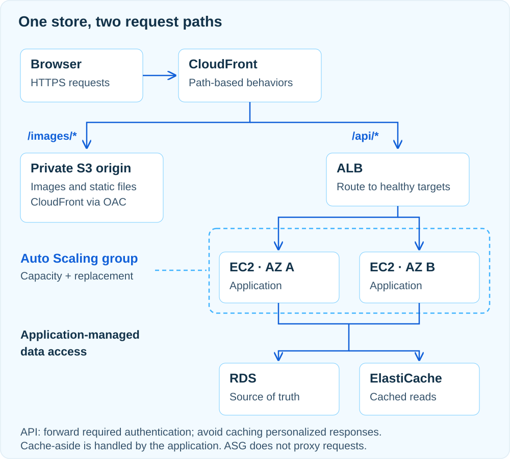

> 이번 회차의 주제는 **우리가 만든 서비스, 다시 그려보기 — 오픈 전 마지막 점검**입니다. 아래는 이전 기획의 참고 초안이며, 실제 발표 자료는 세션 후 갱신합니다.

## 서비스 이름보다 요구사항부터

쇼핑몰을 설계할 때 AWS 서비스 아이콘부터 늘어놓으면, 그림은 풍성한데 정작 주문이 어떻게 저장되는지 설명하기 어려워집니다. 이번 발표에서는 상품 목록을 보고 장바구니에 담아 주문하는 작은 쇼핑몰을 기준으로, 각 구성 요소가 필요한 이유와 서로 연결되는 방식을 살펴봅니다.

요구사항은 세 가지입니다. 상품 이미지는 여러 사용자가 반복해서 내려받고, 주문은 서버가 바뀌어도 유지되어야 하며, 행사 시간의 트래픽 증가를 감당해야 합니다. 모든 조회가 같은 수준의 최신성을 요구하지는 않습니다. 상품 소개 문구는 잠깐 이전 내용이 보여도 되지만, 주문을 확정할 때의 가격과 재고는 기준 데이터로 다시 확인해야 합니다. 이 차이가 캐시와 데이터베이스의 역할을 결정합니다.

## 이미지 요청과 주문 요청을 나누기

CloudFront에서 경로별로 오리진을 나눕니다. `/images/*`는 S3로, `/api/*`는 ALB로 보내고, 각 경로에 맞는 캐시 정책을 적용합니다. 이미지 전달과 주문 처리가 같은 도메인을 사용해도 동작 방식은 다릅니다.

```text
상품 이미지: 브라우저 → CloudFront → S3 (캐시 미스일 때)
상품 조회:   브라우저 → CloudFront → ALB → EC2 → 캐시 또는 RDS
주문 생성:   브라우저 → CloudFront → ALB → EC2 → RDS 트랜잭션
```

CloudFront는 이미지 응답을 재사용합니다. API 경로는 캐시를 비활성화하고 주문에 필요한 메서드, 인증 헤더, 쿠키와 쿼리 문자열을 오리진에 전달하도록 설정합니다. EC2가 권한 확인과 주문 처리를 담당하며, 사용자별 응답이 공용 캐시에 섞이지 않게 합니다. S3 버킷은 공개하지 않고, 일반 S3 버킷 오리진에 OAC를 연결해 해당 배포에서 필요한 객체만 읽도록 버킷 정책을 제한합니다. S3 웹사이트 엔드포인트는 이 OAC 구성에 해당하지 않습니다. 자세한 접근 제어 조건은 [CloudFront의 S3 오리진 보호 문서](https://docs.aws.amazon.com/AmazonCloudFront/latest/DeveloperGuide/private-content-restricting-access-to-s3.html)를 참고할 수 있습니다.



ASG는 요청 경로 밖에서 EC2 인스턴스의 수와 교체를 관리합니다. 그림의 연결선도 요청 흐름과 용량 관리를 구분해서 읽어야 합니다.

## 네트워크 경계와 권한을 함께 그리기

인터넷 연결 ALB는 서로 다른 가용 영역의 퍼블릭 서브넷에 두고, 애플리케이션 EC2와 RDS는 프라이빗 서브넷에 둡니다. 서버 수만 여러 대로 그리면 같은 가용 영역의 장애를 함께 겪을 수 있으므로, 그림에도 가용 영역 경계를 표시해야 합니다.

보안 그룹은 호출 관계대로 좁힙니다. ALB는 CloudFront에서 전달한 HTTPS 요청을 받고, EC2의 애플리케이션 포트는 ALB 보안 그룹에서만, RDS의 DB 포트는 EC2 보안 그룹에서만 허용합니다. ALB 직접 주소를 통한 우회 접근도 점검합니다. 프라이빗 서브넷도 외부 패키지 다운로드가 필요할 수 있으므로, 배포 방식에 맞는 아웃바운드 경로와 그 비용을 별도로 검토합니다.

저장소가 프라이빗이라는 사실만으로 애플리케이션 권한까지 해결되지는 않습니다. EC2에는 필요한 리소스에만 접근하는 IAM 역할을 부여하고, DB 계정도 애플리케이션 작업 범위로 제한합니다. 전송 구간의 TLS, 저장 시 암호화, 키 접근 권한은 각각 확인할 항목으로 남깁니다.

## 캐시는 빠른 복사본, 주문은 기준 데이터에

상품 조회에는 cache-aside 방식을 적용할 수 있습니다. 애플리케이션이 상품 ID로 캐시를 먼저 조회하고, 없을 때 RDS에서 읽어 TTL과 함께 캐시에 저장합니다. DB가 캐시를 자동으로 거치는 구조는 아닙니다. 상품을 수정하면 DB 변경이 커밋된 뒤 관련 캐시를 무효화하고, TTL로 오래된 값이 남을 수 있는 시간을 제한합니다. 기본 흐름과 오래된 데이터의 문제는 [ElastiCache 캐싱 전략](https://docs.aws.amazon.com/AmazonElastiCache/latest/dg/Strategies.html)에 정리되어 있습니다.

TTL만으로 즉시 일관성이 보장되지는 않습니다. 조회와 수정이 겹치면 이전 값이 다시 캐시에 들어갈 수도 있습니다. 따라서 캐시에는 재생성 가능한 조회 결과를 두고, 주문 확정은 DB 트랜잭션에서 가격과 재고를 검증한 뒤 처리합니다. 같은 주문 요청의 재시도로 중복 주문이 생기지 않도록 요청 식별자에 유일성 제약을 두는 방식도 함께 설계합니다.

캐시가 응답하지 않을 때는 짧은 제한 시간 뒤 DB로 우회할 수 있지만, 모든 요청이 한꺼번에 몰리면 DB가 다음 장애 지점이 됩니다. 우회 요청 수와 DB 연결 수를 제한하고, 감당할 수 없는 요청에는 재시도 가능한 오류를 반환하는 정책이 필요합니다.

## 장애가 나면 무엇이 이어받는가

EC2 한 대가 사라지는 경우에는 ALB의 대상 상태 확인과 ASG의 교체가 역할을 나눕니다. 새 인스턴스가 실제 요청을 받을 준비가 될 때까지 시간이 필요하므로, 로그인 상태나 주문 데이터를 인스턴스의 로컬 디스크에만 남기지 않습니다. 배포 때도 준비가 끝난 인스턴스부터 트래픽을 받고 기존 요청을 마친 뒤 이전 인스턴스를 종료합니다.

DB에는 RDS Multi-AZ DB 인스턴스 구성을 가정합니다. 다른 가용 영역의 대기 인스턴스는 장애 조치를 위한 것으로 읽기 요청을 처리하지 않습니다. 읽기 가능한 대기 인스턴스를 제공하는 Multi-AZ DB 클러스터와는 구분해야 합니다. 구성별 차이는 [RDS Multi-AZ DB 인스턴스 문서](https://docs.aws.amazon.com/AmazonRDS/latest/UserGuide/Concepts.MultiAZSingleStandby.html)에서 확인할 수 있습니다.

자동 장애 조치 중에도 연결 오류는 발생할 수 있습니다. 애플리케이션은 기존 연결을 버리고 다시 연결해야 하며, 실패한 주문을 무조건 새 주문으로 보내면 안 됩니다. DB 장애 조치와 함께 요청 식별자로 처리 결과를 확인하는 흐름을 검토해야 합니다.

## 정상 화면보다 복구 증거를 확인하기

첫 화면이 뜨는 것만으로 운영 준비를 판단하지 않습니다. 지연 시간의 상위 구간, 오류율, ALB의 비정상 대상 수, DB 연결 수, 캐시 적중률을 함께 봅니다. 요청 식별자를 로그에 연결하면 느린 주문 하나가 어느 단계에서 기다렸는지 추적할 수 있습니다. 로그에는 비밀번호나 결제 정보를 그대로 남기지 않습니다.

복구 검토에서는 허용 가능한 중단 시간인 RTO와, 되돌릴 수 있는 데이터 시점의 허용 범위인 RPO를 먼저 합의합니다. 백업이 있다는 사실과 정해진 시간 안에 복원할 수 있다는 사실은 다릅니다. 별도 환경에서 백업을 복원하고 주문 수와 주요 조회 결과를 확인해야 합니다. 복구 목표를 사업 영향에 맞춰 정하는 기준은 [AWS Well-Architected 복구 목표 지침](https://docs.aws.amazon.com/wellarchitected/latest/framework/rel_planning_for_recovery_objective_defined_recovery.html)을 참고합니다.

## 비용을 줄일 때 잃는 것도 기록하기

ASG의 최대 용량은 인스턴스 확장의 상한입니다. ALB, 데이터베이스, 저장 공간과 전송량의 비용까지 막아주는 지출 한도가 아닙니다. 최대치를 낮추면 확장 여유도 줄어들므로, 한계에 도달했을 때 어떤 요청을 제한할지 정해야 합니다.

캐시는 DB 부하를 줄이는 대신 별도 비용과 일관성 관리가 생깁니다. Multi-AZ는 장애 대응 능력을 높이지만 모든 장애나 잘못된 데이터 삭제를 해결하지는 않습니다. 비용 검토에는 남아 있는 스냅샷과 로그, 네트워크 경로까지 포함하고, 선택한 기능이 어떤 요구사항을 충족하는지 함께 기록합니다.

## 아키텍처 검토를 마치는 질문

최종 그림에는 정상 경로, 권한 경계, 장애 시 대체 경로가 모두 설명되어야 합니다. 아래 질문에 답할 수 있다면 구성 요소를 연결한 이유도 분명해집니다.

- 이미지가 캐시에 없을 때와 주문 저장이 실패했을 때의 경로가 구분되는가?
- 한 가용 영역을 잃어도 남은 용량으로 필요한 요청을 처리할 수 있는가?
- 캐시를 비워도 주문 데이터가 유지되고 DB 부하를 제어할 수 있는가?
- 요청이 재시도되어도 같은 주문이 중복으로 만들어지지 않는가?
- 백업 복원과 배포 되돌리기를 실제로 확인할 방법이 있는가?

좋은 설계는 많은 서비스를 넣은 그림보다, 요구사항과 실패 상황에 대해 선택의 이유를 설명할 수 있는 그림에 가깝습니다.
