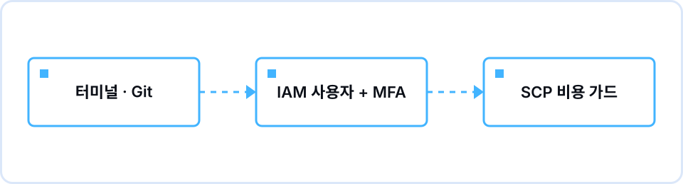

## 이런 세션이었습니다

3월 9일 화요일 저녁 7시, 정보기술관에서 2기 첫 세션이자 리그의 Round 0을 열었습니다. 1기 회고에서 가장 많이 나온 이야기는 "개념은 이해했는데 손이 덜 움직였다"였습니다. 그래서 2기는 라운드마다 AWS Workshop Studio의 공식 워크숍 하나를 팀으로 완주하고 그 과정을 GitHub 저장소에 남기는 방식으로 바꿨습니다. Round 0의 목표는 워크숍을 시작하기 전에 두 가지 준비를 끝내는 것이었습니다. 터미널과 Git 때문에 첫 주에 멈추지 않을 것, 그리고 계정을 안전하게 만들어 비용과 자격 증명 사고를 처음부터 막을 것.

두 시간을 꽉 채워 썼습니다. 앞 15분은 황수진(Tech Lead)이 터미널과 Git을 맡았습니다. 리눅스 커맨드라인을 처음 보는 참가자가 있어 cd, ls, ssh 세 개와 git init·add·commit·push 흐름만 다뤘고, 팀 저장소의 폴더 구조를 화면에 띄워 그대로 따라 만들게 했습니다. 이어서 이예나(Tech Lead)가 90분 핸즈온을 진행했습니다. 팀별로 미리 발급한 AWS 계정에 로그인해 루트 계정 MFA, 최소 권한 역할, SCP, AWS Budgets 알림을 순서대로 확인하고 설정하는 시간이었습니다.

가장 오래 멈춘 지점은 두 곳이었습니다. 하나는 "루트 계정으로 로그인이 되는데 왜 역할로 다시 들어가야 하느냐"였고, 다른 하나는 "SCP로 막았으면 예산 알림은 왜 또 필요하냐"였습니다. 둘 다 한 번의 설명으로 넘어가지 않아, 실제 SCP JSON과 Budgets 알림 설정 화면을 나란히 띄워 놓고 어느 쪽이 무엇을 막고 무엇을 알려주는지 짚었습니다. 마지막 15분은 리그 킥오프로 Round 1 워크숍과 완료 인증 기준을 안내했습니다.

## 다룬 내용

| 시간 | 내용 |
|---|---|
| 19:00–19:10 | 오프닝 — 2기 진행 방식(라운드마다 공식 워크숍 하나를 팀으로 완주, GitHub에 기록), 코어팀과 담당 멘토 소개 |
| 19:10–19:25 | 터미널과 Git — cd, ls, ssh, git init·add·commit·push, 팀 저장소 폴더 구조 통일 |
| 19:25–19:50 | 계정 구조 — 팀별 계정 분리, 루트 계정 MFA 등록, 최소 권한 역할로 콘솔 로그인, 장기 액세스 키를 만들지 않는 이유 |
| 19:50–20:15 | 비용 사전 차단 — SCP로 고비용 인스턴스 유형과 리전 생성을 막는 방식, 허용 리소스 목록, 태그 정책 |
| 20:15–20:40 | 비용 사후 감시 — AWS Budgets 알림 50%·80%·100% 설정, 라운드 종료 48시간 내 리소스 정리 규칙 |
| 20:40–20:55 | 리그 킥오프 — Round 1 워크숍(AWS Networking Workshop의 VPC Fundamentals 모듈) 안내, 완료 인증 기준, 멘토 배정 |
| 20:55–21:00 | 과제 안내와 Q&A |

## 함께 짚은 개념

- **터미널과 Git 최소 세트** — 워크숍을 따라가는 데 필요한 것은 cd, ls, ssh와 init·add·commit·push 흐름입니다. 나머지는 막힐 때 멘토와 같이 봅니다.
- **루트 계정과 MFA** — 루트는 계정 전체를 쥐는 자격이므로 MFA를 걸고 평소에는 쓰지 않습니다. 일상 작업은 별도 역할로 들어갑니다.
- **최소 권한 역할** — 이 라운드에 필요한 작업만 허용된 역할로 로그인합니다. 처음에는 답답하지만 실수의 범위가 그만큼 작아집니다.
- **장기 액세스 키 금지** — 노트북에 저장된 액세스 키는 커밋에 섞여 나가기 쉽습니다. 역할에서 받는 임시 자격 증명으로 대신하고, 커밋 전 비밀정보 검사를 붙입니다.
- **SCP(서비스 제어 정책)** — 계정이 만들 수 있는 리소스 종류를 조직 수준에서 원천적으로 제한합니다. 고비용 인스턴스 유형과 리전은 시도 자체가 거부됩니다.
- **AWS Budgets 알림과 태그** — 청구 데이터는 하루 몇 번만 갱신되므로 예산 알림은 즉시 차단이 아니라 사후 감시 장치입니다. 리소스마다 팀·라운드 태그를 붙여 정리 여부를 태그 기준으로 확인합니다.

## 과제와 결과

과제는 두 가지였습니다. 팀 GitHub 저장소를 만들어 합의한 폴더 구조와 README를 올리는 것, 그리고 팀 계정에서 루트 MFA 활성화, 역할로 로그인한 콘솔 화면, Budgets 알림 3단계가 보이는 스크린샷을 저장소에 커밋하는 것입니다. 완료 조건은 저장소 링크 하나로 세 스크린샷과 커밋 이력을 모두 확인할 수 있는 상태입니다. 이번 과제는 과금되는 리소스를 하나도 만들지 않으므로 비용은 발생하지 않지만, 스크린샷의 계정 ID와 이메일은 가려서 올리도록 안내했습니다.

제출된 결과에서 막힌 지점은 두 가지였습니다. 첫째, git push에서 인증이 실패한 팀이 있었습니다. GitHub는 HTTPS 비밀번호 인증을 받지 않으므로 SSH 키를 등록하거나 토큰을 써야 하는데, 세션에서 ssh를 다루고도 GitHub 쪽 키 등록까지는 연결하지 못했습니다. 둘째, 한 팀은 역할 대신 팀원마다 IAM 사용자를 만들고 액세스 키까지 발급해 두었습니다. 규칙에 어긋나는 구성이라 키를 삭제하고 역할 전환으로 다시 정리했습니다.

## 세션에서 나온 질문

**Q.** SCP로 비싼 리소스를 다 막았는데, 예산 알림을 따로 설정해야 하는 이유가 있나요?
A. SCP는 리소스의 종류를 막을 뿐, 허용된 리소스를 오래 켜 두는 것은 막지 못합니다. 허용 목록 안의 인스턴스도 며칠 켜 두면 비용이 쌓이고, 그것을 알려주는 장치가 Budgets 알림입니다. 하나는 사전 차단, 하나는 사후 감시로 역할이 다릅니다.

**Q.** 액세스 키를 만들지 않으면 CLI는 어떻게 쓰나요?
A. 역할로 로그인하면 몇 시간 뒤 만료되는 임시 자격 증명을 받습니다. CLI도 이 임시 자격 증명으로 쓰면 되고, 유출돼도 만료 시점까지만 유효하니 장기 키보다 피해가 제한적입니다. 이번 학기 워크숍은 대부분 콘솔에서 진행되므로 CLI가 필요한 시점에 멘토가 설정을 같이 봅니다.

**Q.** 라운드가 끝나고 48시간 안에 정리를 못 하면 어떻게 되나요?
A. 팀장이 태그 기준으로 남은 리소스를 확인하고, 그래도 남아 있으면 담당 멘토가 함께 정리합니다. 정리 완료 여부는 다음 라운드 킥오프에서 팀별로 다시 확인합니다.

## 복습 키워드

`ssh`, `git commit`, `git push`, `MFA`, `최소 권한 역할`, `SCP`, `AWS Budgets`

## 다음 세션으로

Round 1은 AWS Networking Workshop의 VPC Fundamentals 모듈을 팀별로 완주하고 그 결과를 발표하는 회차입니다. 이번 회고에서는 15분 Git 블록 안에 push까지 마치지 못한 팀이 있었다는 점을 반영해, Round 1 브리프에 "세션 전 팀 저장소에 커밋 1건 이상"을 사전 확인 항목으로 넣었습니다.
