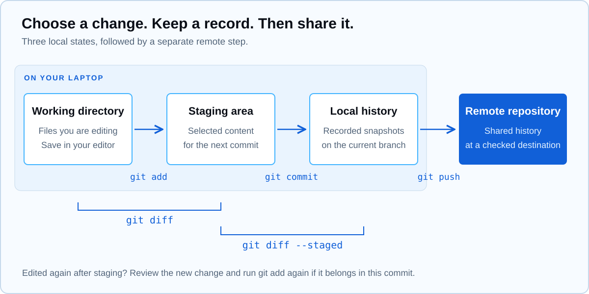

## What we tried in fifteen minutes

Sujin Hwang gave the opening talk of Round 0 from 19:10 to 19:25. This semester, completing a workshop was only part of the job: another teammate needed to be able to follow the record afterwards. For someone opening a repository for the first time, however, unfamiliar buttons and terms can get in the way before any useful writing happens. A terminal command appears to do nothing, or a file looks correct in the editor but the commit contains an earlier version. We started with a way to check where we were and what we were changing.

The demonstration used one small practice folder. Sujin wrote a README, inspected the change, selected files for a commit, and gave that record a useful name. The final few minutes separated a record on your own laptop from a repository that teammates can access. SSH and push were introduced as parts of that connection; individual GitHub authentication setup continued as follow-up work.

The exercise below expands the short demonstration into something you can repeat at home. It stays inside a new local folder and does not require AWS resources or changes to the shared team repository. Finishing every command was less important than explaining why the output changed after each step.

## The running order

| Time | Demonstration | What we checked |
|---|---|---|
| 19:10–19:13 | Locate the current directory, move between folders, list files | A terminal always runs commands from a particular location |
| 19:13–19:17 | Write a README, initialize a repository, inspect changes | Saving a file and recording it in Git are separate actions |
| 19:17–19:22 | Select files, commit, then edit a file after staging | You choose the content of the next commit |
| 19:22–19:25 | Connect local history to remote sharing and collect questions | Authentication, access permissions, and history problems need different checks |

## Three places to keep separate

The working directory contains the files you edit. The staging area contains the changes selected for the next commit. A commit records that selection in repository history. We selected whole files in this exercise, but the selection captures their content at that point in time. Editing a file again after `git add` does not automatically include the new edits. That behavior is described in the official [git add documentation](https://git-scm.com/docs/git-add).



The remote repository is shown as a separate final step. A new commit on your laptop does not immediately change what a teammate sees. During a workshop, you can build a local record and then check its content and destination before sharing it.

## Exercise 1 · Where are you working?

Use a macOS or Linux terminal, or Git Bash on Windows, with Git installed. First move to a parent folder where you want to create the practice directory. Run the following commands one line at a time. If `asbg-round0-git-practice` already exists, choose a different new folder name instead of reusing it. Stop at any error and check the location and name before continuing.

```sh
pwd
ls
mkdir asbg-round0-git-practice
cd asbg-round0-git-practice
pwd
git --version
git init -b main
```

The second `pwd` should end with the name of the folder you just created. An empty result from `ls` is normal in an empty directory. `git init -b main` creates a repository here and explicitly names its initial branch; it does not create a commit. The initial state and branch option are documented in [git init](https://git-scm.com/docs/git-init).

We did not immediately clone the team repository or connect a remote. If you keep entering commands from the wrong location, you first have to work out which repository you changed. Reading the current folder name before starting was a useful habit to practice. We also checked that the editor's file explorer and the terminal were looking at the same directory.

## Exercise 2 · Create a record someone else can read

Create the following files inside the new practice repository. The initial text is deliberately small enough to copy and then improve in your own words.

```sh
mkdir notes
cat > README.md <<'EOF'
# Round 0 Git Practice

Goal: leave workshop notes another teammate can follow.

Start with notes/round-0.md.
EOF
cat > notes/round-0.md <<'EOF'
# Round 0 Notes

## Goal
Explain the difference between saving a file and making a commit.

## What I checked
- I can find the repository folder in my terminal.

## Next question
- How do I choose what goes into the next commit?
EOF
cat > .gitignore <<'EOF'
.DS_Store
.env
.env.*
EOF
git status --short
```

New files normally appear with `??`, meaning they are not yet tracked. Git may group entries under a directory such as `notes/`, so the display does not have to match an example character for character. We used the official [git status documentation](https://git-scm.com/docs/git-status) to interpret the short format.

A useful team record can start with three questions: what did you try, what result told you it worked, and what remains unresolved? A command by itself can omit the directory where it runs. A success screenshot by itself can omit what the reader should inspect. We decided to write one sentence naming the file and working location before adding screenshots.

The `.gitignore` file lists patterns for files we do not want to share in this exercise. Adding a pattern later does not remove a file that Git already tracks or erase its history. Checking notes for account information and credentials remains a separate task. The scope of ignore rules is explained in [gitignore](https://git-scm.com/docs/gitignore).

## Exercise 3 · Record the selected changes

Select the three files explicitly. Reading the names helped keep unfinished notes and unrelated material out of the first record.

```sh
git add README.md notes/round-0.md .gitignore
git diff --staged
git status --short
git commit -m "docs: add round 0 practice notes"
git log -1 --oneline
git status --short
```

Before committing, read the staged diff and check the title, body, and ignore patterns. The commit records the staged content at that moment. With no other changes, the final status command displays no files. The selection rules and message option are covered in the official [git commit documentation](https://git-scm.com/docs/git-commit).

The `docs:` prefix is a convention we chose to identify documentation work, not a requirement imposed by Git. We preferred a specific description to messages such as “update” or “done,” so a teammate could understand the history without opening every entry. One commit for the record structure and another for the results made a useful first pair.

## Exercise 4 · Edit a file after staging it

Continue only after the first commit succeeds. Add a line to the tracked notes file, stage it, and then add another line.

```sh
printf '\n- I checked the staged changes before committing.\n' >> notes/round-0.md
git add notes/round-0.md
printf '\n- I added another observation after staging.\n' >> notes/round-0.md
git status --short
git diff
git diff --staged
```

The file now appears with `MM`. In this example, it has both a staged modification and a later unstaged modification. `git diff` shows the later line, while `git diff --staged` shows the line selected earlier. The two comparison targets are documented in [git diff](https://git-scm.com/docs/git-diff).

This was the point where the editor's current view and the next commit stopped looking like the same thing. If both lines belong in the same record, stage the file again and inspect it. If the later line belongs to a future task, it can stay outside the current selection. Decide what the record should say before deciding which command to run.

```sh
git add notes/round-0.md
git diff --staged
git commit -m "docs: record staging observations"
git log -2 --oneline
```

## How we separated the common failures

### “Not a git repository”

Start by checking `pwd` and `ls -a`. One easy mistake is opening another terminal tab and assuming it starts in the same folder as the previous one. For this exercise, return to `asbg-round0-git-practice` and run `git status`. Repeating `git init` wherever the error appears can make the repository boundaries harder to understand. Finding the directory you already created is the first step.

### Git asks for an author identity

The name and email recorded in a commit are not your GitHub login password. We checked whether they were configured with `git config --get user.name` and `git config --get user.email`. If either is missing, choose your own author name and commit email and set them in this practice repository's local configuration. Do not copy a teammate's identity. If you prefer not to expose a personal address, use the private commit email provided in your GitHub account settings. See GitHub's instructions for [setting your commit email address](https://docs.github.com/en/account-and-profile/how-tos/email-preferences/setting-your-commit-email-address).

### You selected a draft that should not go into this commit

Only run the following exercise after the repository has at least one commit. Add a draft line to the existing notes file, stage it, and then remove it from the selection. The `--staged` option targets the index, leaving the edited working file in place. The target of that option is explained in [git restore](https://git-scm.com/docs/git-restore).

```sh
printf '\n- Draft question for the next workshop.\n' >> notes/round-0.md
git add notes/round-0.md
git restore --staged notes/round-0.md
git status --short
git diff
```

This is an intentional unfinished state. The draft remains in the file and is no longer selected for a commit. A nonempty status result here is expected; review the draft again when you make the next record.

### A teammate cannot see your commit

Check local history separately from remote sharing. We used `git log -2 --oneline` for local records, `git remote -v` for configured destinations, and `git branch --show-current` for the active branch. This practice repository has no remote, so an empty result from `git remote -v` is expected. In the team assignment, check the agreed repository address and branch before sharing. Push updates remote references using local history, as described in [git push](https://git-scm.com/docs/git-push).

An authentication failure calls for checking the sign-in method and repository access. A rejection because the remote has other work calls for comparing changes with teammates first. We agreed not to treat every push failure as a reason to force an update. A useful help request includes the command and the relevant error text with private values removed, never credentials or tokens.

## Questions after the talk

**Q. Why do I need add and commit after saving a file?**

A. Saving in the editor changes the current file. Git lets us choose which changes belong under one explanation and keep that selection as a record. Exercise 4 makes the distinction visible by comparing a selected line with one that is still outside the selection.

**Q. Is it wrong to put every change into one commit?**

A. Changes that can be explained together can belong together. Creating the note structure and diagnosing a workshop error may have different reasons, so separate records can be easier to read. Think about how you would explain the work to a teammate rather than counting the number of files.

**Q. Can I use a graphical Git tool instead?**

A. Yes. The decisions stay the same: inspect changes, choose what to record, and share the result. Try reading the status in a terminal first, then compare it with the interface you prefer. The tools should be describing the same state.

**Q. We mentioned SSH. Are we connecting to a server today?**

A. This block only introduced its role in connecting to a remote system. Individual authentication setup and remote access require their own checks and did not fit inside the fifteen-minute demonstration. The local record is today's finish line; team repository authentication continues as follow-up work.

## What we kept and what comes next

Our completion criteria were a small repository and two distinct records. The README explains the purpose and points to a file to read. The notes contain an observed result and the next question. Being able to say whether you are reading `git diff` or `git diff --staged` is part of finishing. Reading a partner's status output together was more useful than having the fastest person complete their work for them.

For the team assignment, move the same writing pattern into the shared repository. Before Round 1, each member should contribute a record and another member should find and read it. If the starting directory is missing or a screenshot does not explain the success criterion, add a sentence. Keep authentication problems separate from the writing task so a mentor can see exactly where progress stopped.

The [workshop checklist (Korean)](files/workshop-checklist.pdf) provides a companion for repeating the exercise: starting location, selected changes, recording work, and diagnosing errors. The next presentation uses this groundwork to record AWS account setup and cost checks.
