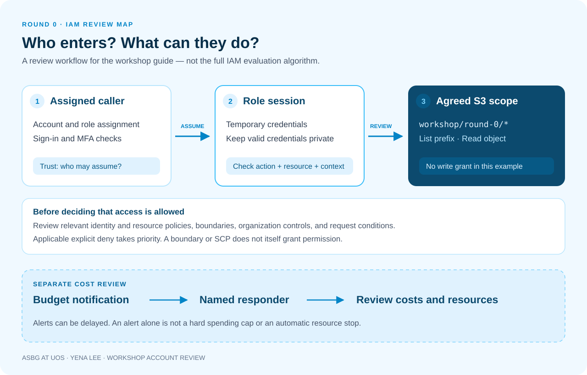

## The goal: read one file with the right access

Yena Lee led the second Round 0 presentation, covering account access and cost review from 19:25 to 20:40. The previous presentation introduced recording work with the terminal and Git. This one asked participants to explain which identity performs their AWS requests. A successful sign-in and a visible list of services are useful starting points, but they do not complete the preparation.

We started with a small requirement: a teammate needs to read a workshop guide. Does that require access to change the whole account? Success in this example means reading a file in an agreed S3 prefix while leaving reads outside that prefix and file uploads outside the permissions we grant. Writing down both expected successes and expected failures makes the scope easier to review.

The JSON below is a policy reading example. We reviewed actions and resource scope using the guide prepared by the organizer. Anyone repeating the exercise should verify the bucket and prefix for their assigned workshop environment.

## A 75-minute review plan

| Time | What we review together | What to record |
|---|---|---|
| 19:25–19:35 | Account, caller identity, MFA, and role session | The role used for the task |
| 19:35–19:50 | Trust policy versus permissions policy | Who can assume the role and what it can do |
| 19:50–20:05 | Reading within a restricted S3 prefix | Requests we expect to allow and deny |
| 20:05–20:15 | Comparing AccessDenied situations | Request, expectation, observation, and next check |
| 20:15–20:30 | Budget notifications and response ownership | Thresholds, recipients, and review schedule |
| 20:30–20:40 | Closing review with a teammate | Open items before the next workshop |

## Separate the person signing in from the role doing the work

An IAM role is an AWS identity with permissions for a purpose. It does not have a shared password or permanent access keys of its own. An authorized principal assumes it and uses temporary credentials for a role session. Session duration depends on the access method and configuration, so we do not teach a single expiration time as a universal rule. [AWS documentation on IAM roles](https://docs.aws.amazon.com/IAM/latest/UserGuide/id_roles.html)

The starting check covers the account, selected role, and intended resource. The team document records the role's purpose and owner; screenshots mask account identifiers and personal email addresses. Temporary credentials remain sensitive while valid. Our exercise rules exclude copying them into Git, sharing them in chat, or borrowing a teammate's values when a fresh sign-in is needed.

Instead of asking only whether someone can sign in, a teammate asks which role will send the request for the guide. Participants compare the name shown in their session with the documented role. If the names differ, there is a concrete reason to check the sign-in path before changing any policy.

## Two policy documents answer different questions

A **trust policy** defines which principals may assume a role and under which conditions. A **permissions policy** describes the actions and resources available through that role. Adding S3 read access does not automatically allow role assumption, and successfully assuming a role does not mean every S3 object can be read. [AWS explanation of role trust policies](https://aws.amazon.com/blogs/security/how-to-use-trust-policies-with-iam-roles/)

Our whiteboard separates entry from work. The first line says that the assigned caller assumes the workshop role. The second says that the role reads a guide from the agreed prefix. When role assumption fails, we examine the first line's caller and conditions. When a later object request fails, we examine the second line's action and resource. Actual evaluation also depends on the policy configuration and whether access crosses accounts, so no single policy is presented as an explanation for every scenario.

Opening trust to arbitrary callers is not a solution for this exercise. We first verify the assigned access method and role, then review any necessary change with its intended principal and reason. The first review milestone is being able to distinguish the two questions, not memorizing a JSON document.



## Do not stop at finding an Allow statement

IAM requests are denied by default without an applicable grant, and an applicable explicit `Deny` overrides an `Allow`. Details depend on the principal named in resource policies and on same-account versus cross-account access. The diagram therefore illustrates a review workflow; it is not the complete AWS enforcement algorithm. [AWS policy evaluation logic](https://docs.aws.amazon.com/IAM/latest/UserGuide/reference_policies_evaluation-logic_policy-eval-denyallow.html)

A permissions boundary limits what the attached identity policies can grant. Attaching a boundary does not itself grant access. An organization's SCP also does not grant permissions. In our example, organization administrators own those restrictions; participants review whether their request belongs in the exercise rather than trying to remove the controls. [IAM permissions boundaries](https://docs.aws.amazon.com/IAM/latest/UserGuide/access_policies_boundaries.html), [IAM security best practices](https://aws.amazon.com/iam/resources/best-practices/)

The diagnostic note begins with caller, action, resource, and conditions. It then identifies who can inspect the role's permissions, relevant resource policies, and applicable organizational restrictions or boundaries. “S3 does not work” gives the next reviewer little to use. “The workshop role cannot read the guide from the agreed prefix” identifies a request worth tracing.

## A small policy for reading the workshop prefix

`replace-with-your-workshop-bucket` below is a placeholder, not an actual workshop bucket. This example grants listing within `workshop/round-0/` and reading objects under that prefix. It does not grant general bucket browsing, upload, or deletion. It also does not remove permissions already granted elsewhere, so the full configuration still needs review.

```json
{
  "Version": "2012-10-17",
  "Statement": [
    {
      "Sid": "ListWorkshopPrefix",
      "Effect": "Allow",
      "Action": "s3:ListBucket",
      "Resource": "arn:aws:s3:::replace-with-your-workshop-bucket",
      "Condition": {
        "StringLike": {
          "s3:prefix": ["workshop/round-0/*"]
        }
      }
    },
    {
      "Sid": "ReadWorkshopObjects",
      "Effect": "Allow",
      "Action": "s3:GetObject",
      "Resource": "arn:aws:s3:::replace-with-your-workshop-bucket/workshop/round-0/*"
    }
  ]
}
```

Listing targets the bucket ARN, with `s3:prefix` narrowing the request. Reading an object targets an ARN that includes the object path. The aim is not to remove every wildcard: this wildcard covers objects beneath an agreed prefix, rather than every bucket or action. [S3 identity policy examples](https://docs.aws.amazon.com/AmazonS3/latest/userguide/example-policies-s3.html), [S3 prefix condition examples](https://docs.aws.amazon.com/AmazonS3/latest/userguide/amazon-s3-policy-keys.html)

We reviewed four requests: list with the prefix `workshop/round-0/`, read `guide.txt` inside it, read a guide under `workshop/round-1/`, and write a new file into the guide prefix. Assuming no other grants or separate denials in this example, the first two are within the grant and the latter two have no allowance. The note preserves the exact spelling and trailing slash of each requested prefix.

This is not a policy for navigating every S3 console screen. Console operations can need additional permissions, and other configurations, such as objects encrypted with a KMS key, can require separate checks. If an expected read fails, inspect the actual request and storage configuration before reviewing the specific missing access. [Considerations for writing S3 policies](https://docs.aws.amazon.com/AmazonS3/latest/userguide/example-policies-s3.html)

## AccessDenied in the workshop: different next checks

When we gathered the teams’ blocked requests, the same AccessDenied label led to different places to investigate. Participants recorded observations separately from hypotheses instead of treating the error label as a complete diagnosis.

| Observation | First fact established | What we established |
|---|---|---|
| Selecting the role fails | No S3 request has been made yet | Check caller, role assignment, and trust conditions |
| A direct object read works but listing fails | The list request used an empty prefix | Review the request with the agreed `workshop/round-0/` prefix |
| Reading another round's guide fails | The path was `workshop/round-1/guide.txt` | Record the result as expected for an out-of-scope path |
| Writing into the guide prefix fails | The requested action was a write | Keep the read-only scope; no permission addition is needed |

The team with a failed list request initially proposed allowing browsing across the whole bucket. The reviewer compared the purpose with the prefix actually sent. If the guide prefix is all that is needed, an empty-prefix request does not match that purpose. The team can correct the request without expanding access. If the guide itself was placed in the wrong location, the organizer may need to fix the exercise material instead.

We also changed what counted as a useful submission. A success screenshot alone is insufficient. The record has five fields: action and path, expected result, observed result, checks performed, and next action. Intended denials count as evidence that the scope is understood. For unresolved cases, participants record the facts established so far rather than prematurely labeling the cause as an SCP.

## Check MFA and budget notifications together

Root is kept out of routine exercises. The account owner verifies MFA and a safe recovery arrangement, and submissions exclude enrollment secrets and recovery information. Participants also check MFA through the assigned sign-in system; root MFA alone is not evidence that every sign-in path has been reviewed. [AWS root user best practices](https://docs.aws.amazon.com/IAM/latest/UserGuide/root-user-best-practices.html)

Budget alerts help a team respond as spending approaches or exceeds a target. Billing and notification delays mean spending can cross the threshold before the message arrives. Creating an alert alone does not establish a hard spending cap or automatically stop resources. [AWS Budgets tracking and notifications](https://docs.aws.amazon.com/cost-management/latest/userguide/budgets-managing-costs.html)

Our proposed operating plan alerts an owner at 50%, 80%, and 100% of the agreed monthly budget and records who checks what. Those are discussion thresholds for this presentation, not mandatory AWS settings. The account scope and included costs also need agreement. Automated budget actions are a separate configuration to review, distinct from registering notifications. [Configuring AWS Budgets actions](https://docs.aws.amazon.com/cost-management/latest/userguide/budgets-controls.html)

Next to the recipient, the team records a backup contact. An 80% alert can sit unanswered if nobody has agreed whether to inspect current costs that day or wait until the next meeting. Our review therefore focuses on ownership and response order rather than on the budget number alone.

## Explain the setup to a teammate before leaving

At the end, compare the list of materials and permissions changed during the exercise. We followed the organizer's cleanup process for work in separate environments and confirmed the resources and responsible person. Check ownership before mistaking a shared bucket or common role for a personal leftover. If there is nothing to clean up, record the scope that was checked.

The peer review used three explanations: why the caller can assume the role, why it can read the guide, and why another prefix is outside this grant. When an explanation does not match the policy, record an open item for the next review. The organizer used the records and open questions to plan the checks needed before the next round.

Use the [Workshop checklist (Korean)](files/workshop-checklist.pdf) to record sign-in, policy review, expected results, budget response, and closing checks in one place.

## Questions after the presentation

**Q. Can temporary credentials go into the repository because they expire?**

No. They are usable credentials while valid. Record the role's purpose and the result of the check instead. If exposure is suspected, notify the organizer and review the current session and access rather than leaving it unattended until expiration.

**Q. Is the exercise a failure if a file reads successfully but the bucket's first console screen does not open?**

This example is evaluated against specific requests within the agreed prefix. Identify the additional request that fails and decide whether navigating that screen is part of the learning goal. Review whether the request can match the existing scope before expanding permissions for convenience.

**Q. Does the 100% budget notification mean charges stop?**

Do not make that assumption. Review the notification's meaning, the response process, current costs, and remaining work. If an automated action was configured, review its target and behavior separately as well.

**Q. Should we add write access now for the next round?**

Review a change when the next task's actions and resources are defined, and record the reason. Keeping the criteria for this reading exercise and the next exercise separate makes it easier to explain when and why access changed.

## Before the next round

- Record the role's purpose, access owner, and budget response owner in the team document.
- Connect two allowed examples and two out-of-scope examples to the policy's actions, resources, and conditions.
- Preserve unresolved requests with sanitized paths and observed facts, then assign a reviewer.
- Describe the next workshop's required access as a change from this example and review it with the organizer before starting.

The next presentation applies this process to an actual workshop's requirements. The useful result of account preparation is a record in which teammates can explain their requests and scope of access.
